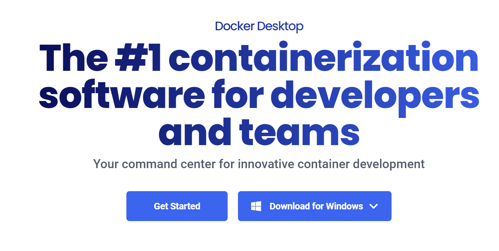
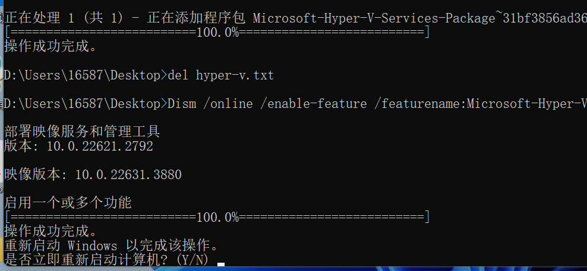
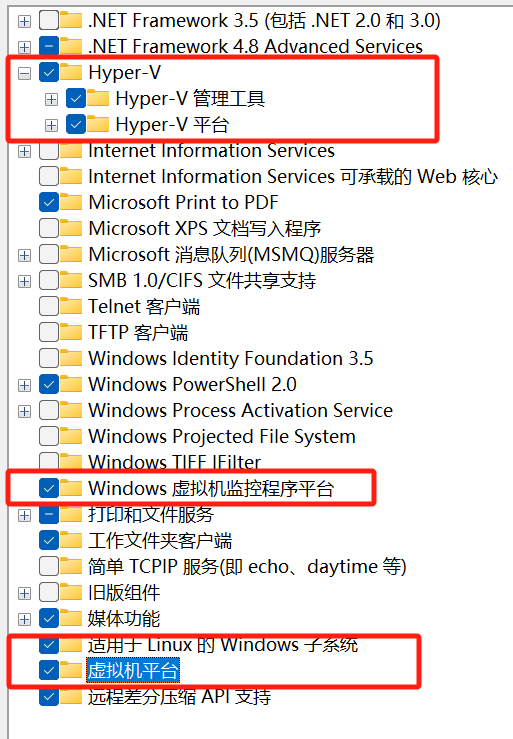
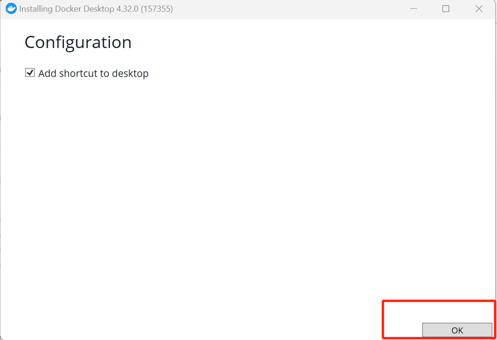
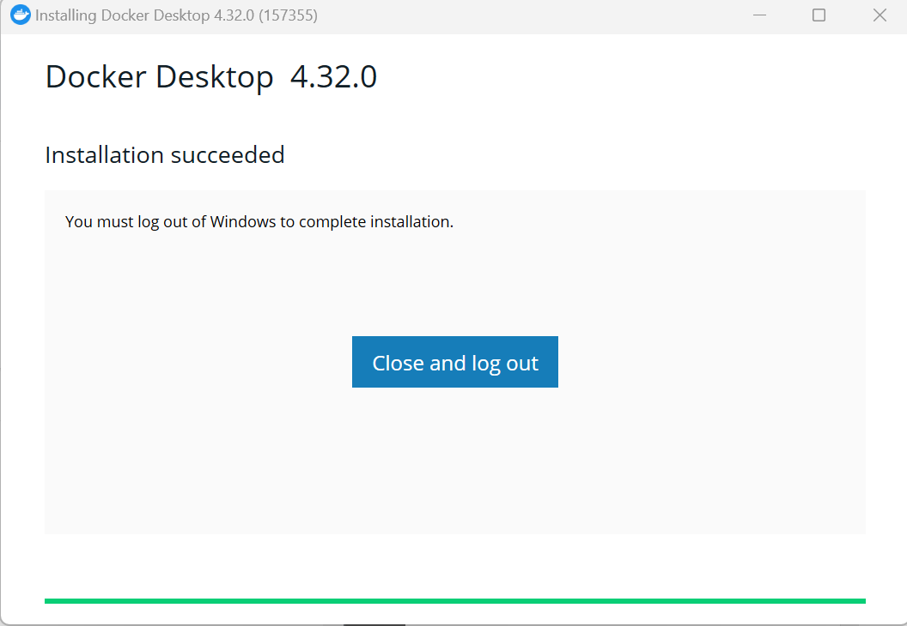
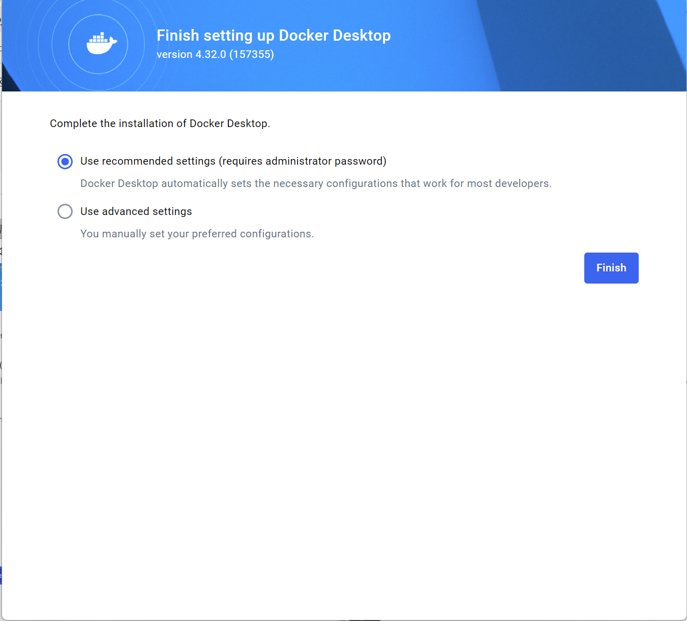
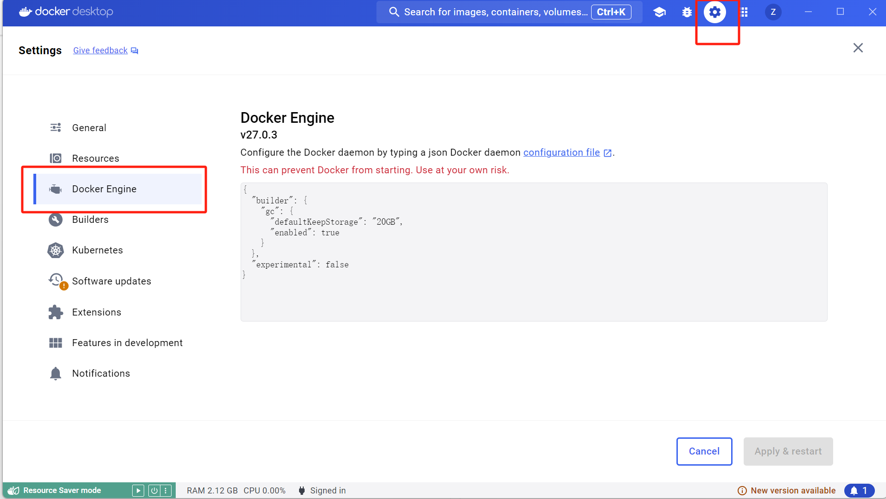
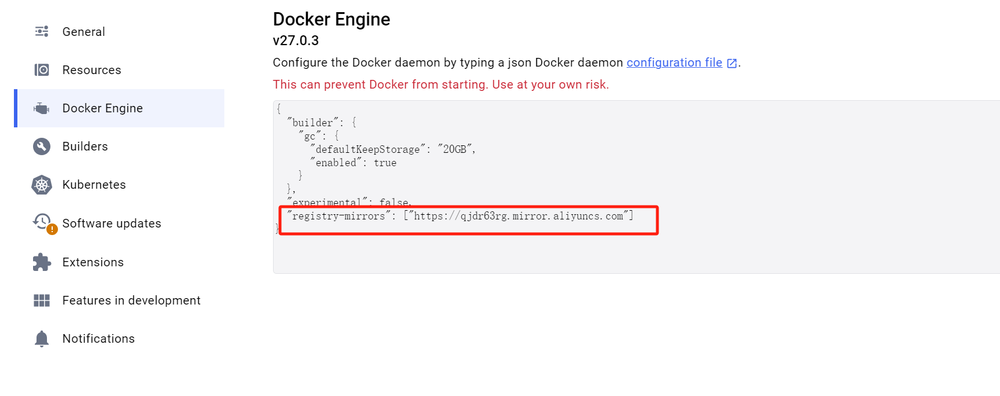

# Win11下Docker的安装

## Reference

- https://www.liuwg.com/archives/ubuntu24.04-an-zhuang-docker

- https://docker.easydoc.net/doc/81170005/cCewZWoN/lTKfePfP

- https://blog.csdn.net/joeyoj/article/details/136427362

- https://docs.docker.com/engine/install/ubuntu/

## 1 Docker 是什么
Docker 是一个应用打包、分发、部署的工具. 

打包：就是把你软件运行所需的依赖、第三方库、软件打包到一起，变成一个安装包.

分发：你可以把你打包好的“安装包”上传到一个镜像仓库，其他人可以非常方便的获取和安装.

部署：拿着“安装包”就可以一个命令运行起来你的应用，自动模拟出一摸一样的运行环境，不管是在 Windows/Mac/Linux.

## 2 Docker 部署的优势

常规应用开发部署方式：自己在 Windows 上开发、测试 --> 到 Linux 服务器配置运行环境部署.

问题：我机器上跑都没问题，怎么到服务器就各种问题了.

用 Docker 开发部署流程：自己在 Windows 上开发、测试 --> 打包为 Docker 镜像（可以理解为软件安装包） --> 各种服务器上只需要一个命令部署好.

优点：确保了不同机器上跑都是一致的运行环境，不会出现我机器上跑正常，你机器跑就有问题的情况.

## 3 重要概念：镜像、容器

镜像：可以理解为软件安装包，可以方便的进行传播和安装.

容器：软件安装后的状态，每个软件运行环境都是独立的、隔离的，称之为容器.

## 4 Win下docker-desktop安装

1. 下载[docker-desktop](https://www.docker.com/products/docker-desktop/)

    

2. 安装`Microsoft Hyper-V`

    参考：https://blog.csdn.net/lihuiyun184291/article/details/123224733

    由于我的电脑系统是家庭版本，所以需要先安装`Microsoft Hyper-V`

    1. 将如下代码添加到记事本中，并另存为Hyper-V.cmd文件。代码如下：

        ```bash
        pushd "%~dp0"
        dir /b %SystemRoot%\servicing\Packages\*Hyper-V*.mum >hyper-v.txt
        for /f %%i in ('findstr /i . hyper-v.txt 2^>nul') do dism /online /norestart /add-package:"%SystemRoot%\servicing\Packages\%%i"
        del hyper-v.txt
        Dism /online /enable-feature /featurename:Microsoft-Hyper-V-All /LimitAccess /ALL
        ```

    2. 右键点击【Hyper-V.cmd】文件图标，在右键菜单中点击：以管理员身份运行.

    3. 程序跑好后，输入`Y`，电脑自动重启，进行配置更新.

        
    
    <br>

3. 启动`Microsoft Hyper-V`

    在电脑上打开“控制面板”->“程序”-> “启动或关闭Windows功能”，勾选以下内容

    

4. 安装docker

    1. 双击`Docker Desktop Installer.exe`

    2. 点击`OK`

        

    3. 点击`Close and log out`

        

    4. 点击`Accept`

        

    5. 默认勾选，点击`Finish`

        
    <br>

5. 配置镜像加速器

    1. 进入[网址](https://cr.console.aliyun.com/cn-hangzhou/instances/mirrors)

    2. 复制以下代码
        ```json
        "registry-mirrors": ["https://qjdr63rg.mirror.aliyuncs.com"]
        ```

        

    3. 打开docker设置   

        

    4. 修改如下
        

    5. 点击`apply & restart`

## 5 Ubuntu下docker安装

1. 卸载老版本

    在安装Docker Engine之前，您需要卸载所有冲突的包.
    ubuntu在APT中提供了Docker软件包的非官方发行版，您必须卸载这些软件包才能安装正式版本的Docker Engine.  

    执行如下命令卸载所有冲突的包:

    ```bash
    for pkg in docker.io docker-doc docker-compose docker-compose-v2 podman-docker containerd runc; do sudo apt-get remove $pkg; done
    ```


2. 使用apt存储库进行安装

    在宿主机上首次安装Docker Engine之前，需要设置Docker存储库。之后，您可以从存储库安装和更新Docker. 

    1. 安装配置依赖

        ```bash
        sudo apt-get update
        sudo apt-get install ca-certificates curl
        sudo install -m 0755 -d /etc/apt/keyrings
        ```

    2. 下载密钥文件gpg，并将其另存为`/etc/apt/keyrings/docker.asc`，并配置文件权限

        ```bash
        sudo curl -fsSL http://mirrors.aliyun.com/docker-ce/linux/ubuntu/gpg -o /etc/apt/keyrings/docker.asc
        sudo chmod a+r /etc/apt/keyrings/docker.asc
        ```


    3. 将仓库添加到Apt源码中:
        ```bash
        echo \
            "deb [arch=$(dpkg --print-architecture) signed-by=/etc/apt/keyrings/docker.asc] http://mirrors.aliyun.com/docker-ce/linux/ubuntu \
            $(. /etc/os-release && echo "$VERSION_CODENAME") stable" | \
            sudo tee /etc/apt/sources.list.d/docker.list > /dev/null
        sudo apt-get update
        ```
    <br>

3. 安装docker

    ```bash
    sudo apt-get install docker-ce docker-ce-cli containerd.io docker-buildx-plugin docker-compose docker-compose-plugin
    ```

4. 配置代理

    参考：https://www.cnblogs.com/Chary/p/18096678

    docker pull 是在docker hub上面下载的，服务器在国外，所以需要配置代理加速拉取

    1. 修改conf文件
    ```bash
    sudo mkdir -p /etc/systemd/system/docker.service.d
    sudo touch /etc/systemd/system/docker.service.d/proxy.conf
    vim /etc/systemd/system/docker.service.d/proxy.conf
    ```

    proxy.conf添加以下内容：

    ```bash
    [Service]
    Environment="HTTP_PROXY=http://proxy.example.com:8080/"
    Environment="HTTPS_PROXY=http://proxy.example.com:8080/"
    Environment="NO_PROXY=localhost,127.0.0.1,proxy.example.com"
    ```

    `proxy.example.com`是ipv4地址

    2. 保存退出

    3. 重新加载服务

        ```bash
        systemctl daemon-reload
        ```
    4. 重新启动Docker

        ```bash
        systemctl restart docker 
        ```

5. 换源

    参考：https://cr.console.aliyun.com/cn-hangzhou/instances/mirrors?accounttraceid=8c9196dd4f79438d8102eceb60df7bf2rtmp

    如果配置代理不生效就换源

    1. 编辑镜像源文件

        ```bash
        vim /etc/docker/daemon.json
        ```
    2. 修改daemon.json 

        ```json
        sudo tee /etc/docker/daemon.json <<-'EOF'
        {
        "registry-mirrors": ["https://qjdr63rg.mirror.aliyuncs.com"]
        }
        EOF
        ```
    3. 保存退出

    4. 重新加载服务

        ```bash
        systemctl daemon-reload
        ```
    5. 重新启动Docker

        ```bash
        systemctl restart docker 
        ```

    6. 查看docker镜像源是否改变

        ```bash
        docker info
        ```

