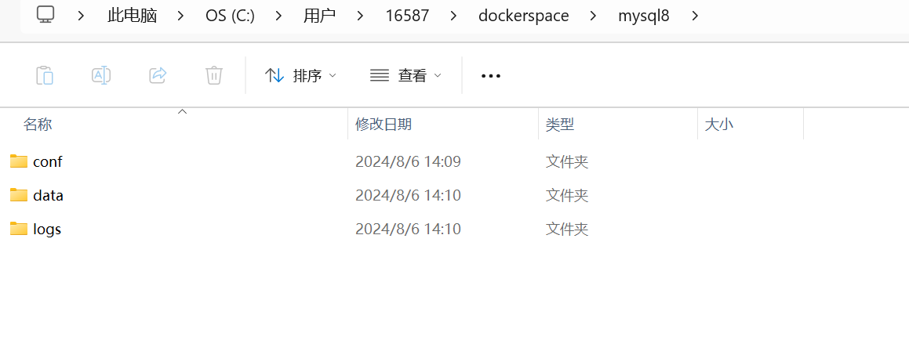
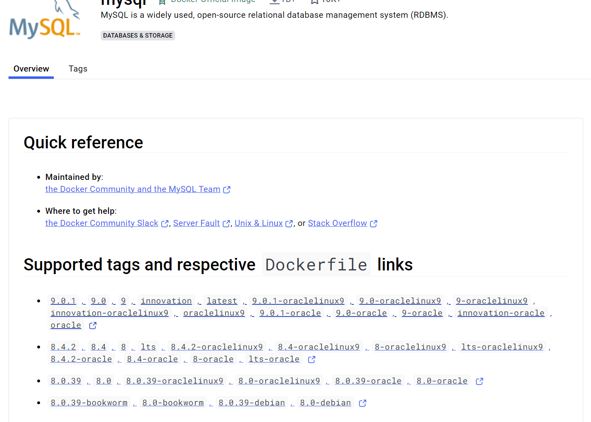
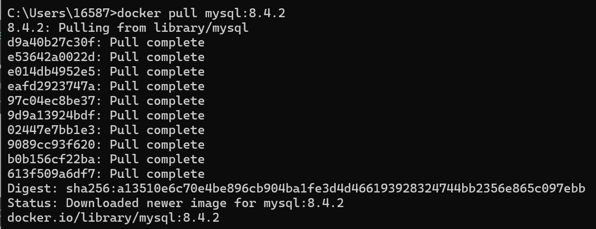
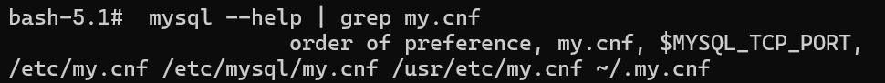
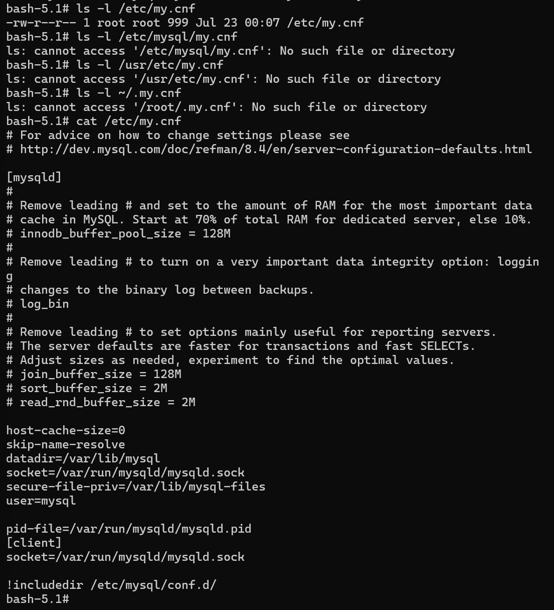
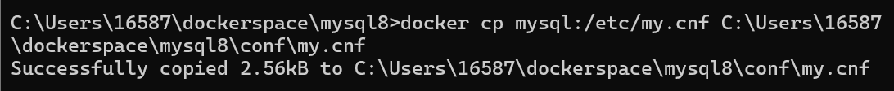
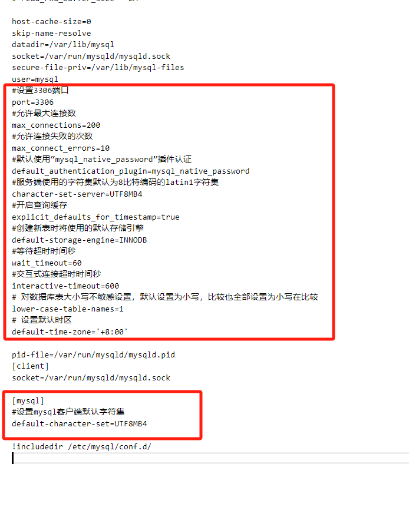
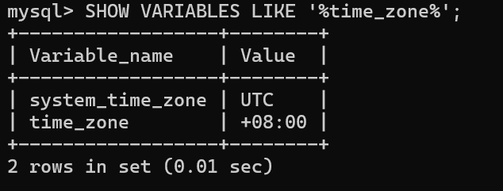

# Win11下利用docker安装mysql8

## Reference

- https://www.cnblogs.com/sheseido/p/12708864.html 

- https://blog.csdn.net/weixin_42197001/article/details/138184306 

- https://blog.csdn.net/qq_29907885/article/details/107692317

- https://liuyanzhao.com/1526792119954575361.html


- https://blog.csdn.net/u014282578/article/details/127920419


在这篇文章中我们选择windows11作为宿主机

## 1 新建挂载文件

1. 在C盘用户目录下新建以下文件夹

    


> ### 挂载 
> 在 Docker 中，挂载（mount）是指将宿主机上的目录或文件与 Docker 容器内的目录或文件进行连接。这种方式可以让容器访问宿主机上的数据，从而实现数据的持久化和共享。
> 
> 具体来说，Docker 支持两种挂载方式：
> 
> 1. 绑定挂载（bind mount）：将宿主机上的特定目录或文件直接挂载到容器内。这意味着容器内的文件会直接反映宿主机上的文件，反之亦然。使用绑定挂载时，你需要指定宿主机的路径和容器内的路径。
> 
>     例如：
> 
>     ```bash
>     docker run -v /宿主机路径:/容器路径 my_image
>     ```
> 2. 数据卷（volume）：Docker 管理的存储空间，可以在多个容器之间共享。数据卷存储在宿主机的特定位置，但不直接暴露给用户。使用数据卷可以更好地管理数据，便于备份和迁移。
> 
>     例如：
> 
>     ```bash
>     docker run -v my_volume:/容器路径 my_image
>     ```
> 
> 通过挂载，Docker 容器可以访问宿主机的数据，确保数据在容器重启或删除后仍然存在。

## 2 拉取mysql

1. 进入[docker hub](https://hub.docker.com/_/mysql)查看mysql可用版本

    

2. 打开cmd，输入以下命令拉取mysql8.4.2

    ```bash
    docker pull mysql:8.4.2
    ```

    

## 3 生成容器
1. 运行镜像生成容器，打开cmd运行以下命令

    ```bash
    docker run -p 3306:3306 --name mysql -e MYSQL_ROOT_PASSWORD=123456 -d mysql:8.4.2
    ```


## 4 处理mysql配置文件

1. 确定mysql配置文件路径
    ```bash
    #进入docker容器，mysql为刚安装的容器名称
    docker exec -it mysql bash

    # 查找Docker内，MySQL配置文件my.cnf的位置
    mysql --help | grep my.cnf

    ```

    

    使用`ls -l`命令逐一寻找，最终发现文件为`/etc/my.cnf`

    

2. 将容器的配置复制到宿主机

    ```bash
    docker cp mysql:/etc/my.cnf C:\Users\16587\dockerspace\mysql8\conf\my.cnf
    ```

    

## 5 重新生成容器并挂载文件

1. 删除旧容器

    ```bash
    docker rm -f mysql
    ```
2. 重新运行镜像生成容器

    ```bash
    docker run -p 3306:3306 --name mysql -v C:\Users\16587\dockerspace\mysql8\conf\my.cnf:/etc/my.cnf -v C:\Users\16587\dockerspace\mysql8\logs:/logs -v C:\Users\16587\dockerspace\mysql8\data:/var/lib/mysql -e MYSQL_ROOT_PASSWORD=123456 -d mysql:8.4.2 --lower-case-table-names=1
    ```

    <br>

    * `-p 3306:3306`：将容器的 3306 端口映射到主机的 3306 端口.
    * `-v ...\conf\my.conf:/etc/mysql/my.cnf`：将主机当前目录下的 conf/my.cnf 挂载到容器的 /etc/my.cnf.
    * `-v .../logs:/logs`：将主机当前目录下的 logs 目录挂载到容器的 /logs.
    *  `-v .../data:/var/lib/mysql` ：将主机当前目录下的data目录挂载到容器的 /var/lib/mysql.
    * `-e MYSQL_ROOT_PASSWORD=123456`：初始化 root 用户的密码.


## 6 修改配置文件

1. 在宿主机win下修改`my.cnf`文件

    ```bash
    [mysql]
    #设置mysql客户端默认字符集
    default-character-set=UTF8MB4
    [mysqld]
    #设置3306端口
    port=3306
    #允许最大连接数
    max_connections=200
    #允许连接失败的次数
    max_connect_errors=10
    #默认使用“mysql_native_password”插件认证
    default_authentication_plugin=mysql_native_password
    #服务端使用的字符集默认为8比特编码的latin1字符集
    character-set-server=UTF8MB4
    #开启查询缓存
    explicit_defaults_for_timestamp=true
    #创建新表时将使用的默认存储引擎
    default-storage-engine=INNODB
    #等待超时时间秒
    wait_timeout=60
    #交互式连接超时时间秒
    interactive-timeout=600
    # 对数据库表大小写不敏感设置，默认设置为小写，比较也全部设置为小写在比较
    lower-case-table-names=1
    ```

    

2. 重启容器

    ```bash
    docker restart mysql
    ```
    <br>

3. 进入终端MySQL，查看`my.conf`是否生效

    ```bash
    docker exec -it mysql /bin/bash
    mysql -u root -p123456
    ```

    输入
    ```bash
    SHOW VARIABLES LIKE '%time_zone%';
    ```

    `time-zone`显示`+08:00`，则表示配置生效

    

    <br>

    如果出现`my.cnf`配置不起效的情况，可能是文件的权限问题，可以使用命令`docker logs mysql`查看`.cnf`文件是否被忽略
    
    解决方法：
     
    1. 修改文件权限
     
        ```bash
        docker exec -it mysql /bin/bash

        # 查看权限
        ls -l /etc/my.cnf

        # 如果输出结果的第一个字段表示权限。
        # 如果权限是 -rwxrwxrwx，则表示该文件的权限是 777，修改权限为 644

        chmod 644 /etc/my.cnf
        ```
     
    2. 再次进入mysql
     
        ```bash
        mysql -u root -p123456
        ```
     
       	如果出现以下报错
     
        ```bash
        ERROR 2002 (HY000): Can't connect to local MySQL server through socket '/var/run/mysqld/mysqld.sock' (2)
        ```
        
        检查文件`/var/run/mysql/mysqld.sock`是否存在。若不存在，则进行手动创建：
            
        ```bash
        touch /var/run/mysqld/mysqld.sock
        ```
     
        更改文件权限，使得MySQL进程可以使用这个文件：
           
        ```bash
        chown mysql /var/run/mysqld/mysqld.sock
        ```
     
    3. 重启容器
     
        ```bash
        docker restart mysql
        ```

## 7 python连接docker mysql

