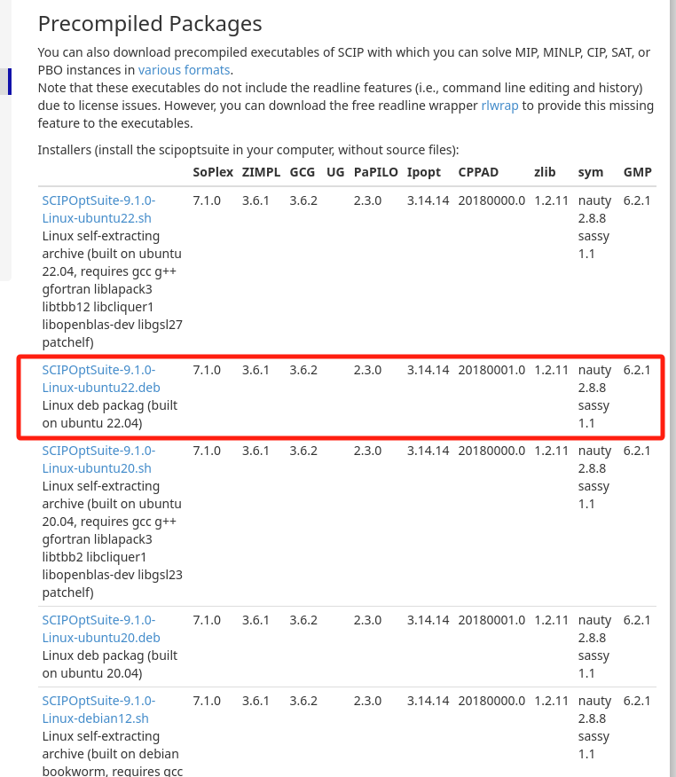

# Docker 安装SCIP, Python及PySCIPOpt

## Reference

- https://viktorsapozhok.github.io/docker-scip-pyscipopt/


网上有个大神已经写好dockerfile，我们直接拿来用，这里使用宿主机是Ubuntu22.04虚拟机

## 0 配置git并连接到github

1. 安装git

    ```bash
    sudo apt-get update
    sudo apt-get install git
    ```

2. 设置用户名和邮箱地址

    ```bash
    git config --global user.name "YOUR NAME" //user.name与"YOUR NAME"之间一定要有空格！！！下同
    git config --global user.email "YOUR EMAIL ADDRESS"
    ```
3. 创建SSH key

    ```bash
    ssh-keygen -t rsa -C "yourmail@example.com"
    ```

4. 复制`.ssh/id_rsa.pub`文件的内容

5. 登陆github网站，在“settings”中找到“SSH and GPG keys”选项，点击“new SSH key ”按钮，粘贴ip_rsa.pub中的内容：


## 1 克隆代码仓库


1. ubuntu下克隆仓库

    ```bash
    git clone git@github.com:viktorsapozhok/docker-scip.git
    ```

    


## 2 下载SCIP

1. ubuntu下[下载SCIP](https://www.scipopt.org/index.php#download)的`deb`文件，并放到`docker-scip`文件夹里

    


## 3 解读docker-compose.yml

```bash
version: '3.7'

services:
scip:
    image: scip:v0.1
    container_name: scip
#    user: user
    build:
    context: .
    dockerfile: Dockerfile
```

这个 `docker-compose.yml` 文件用于定义和管理一个 Docker 服务，具体是一个名为 `scip` 的服务。以下是对各部分的详细解释：

1. **版本**：
   ```yaml
   version: '3.7'
   ```
   指定使用的 Docker Compose 文件的版本，这里使用的是 3.7 版本。

2. **服务**：
   ```yaml
   services:
     scip:
   ```
   定义服务的部分，这里只有一个服务，名为 `scip`。

3. **镜像**：
   ```yaml
   image: scip:v0.1
   ```
   指定要使用的 Docker 镜像，名称为 `scip`，标签为 `v0.1`。这个镜像应该是根据 Dockerfile 构建的。

4. **容器名称**：
   ```yaml
   container_name: scip
   ```
   指定容器的名称为 `scip`，这样在 Docker 中可以通过这个名称来引用和管理该容器。

5. **构建配置**：
   ```yaml
   build:
     context: .
     dockerfile: Dockerfile
   ```
   - `context: .`：指定构建上下文为当前目录（`.`），这意味着 Docker 在构建镜像时会使用当前目录中的所有文件。
   - `dockerfile: Dockerfile`：指定要使用的 Dockerfile 文件名。如果 Dockerfile 的名称是默认的 `Dockerfile`，这一行可以省略。

总的来说，这个 `docker-compose.yml` 文件定义了一个名为 `scip` 的服务，它将使用指定的 Dockerfile 构建镜像并启动一个容器。通过 Docker Compose，可以方便地管理和运行这个服务。


## 4 解读Dockerfile

```bash
FROM python:3.9-slim

# install compilers and scip deps
RUN apt-get update \
    && DEBIAN_FRONTEND=noninteractive apt-get install -y --no-install-recommends \
        build-essential \
        libgfortran4 \
        libcliquer1 \
        libopenblas-dev \
        libgsl23 \
        libtbb2 \
        wget \
    && wget -O libboost.deb "http://archive.ubuntu.com/ubuntu/pool/main/b/boost1.65.1/libboost-program-options1.65.1_1.65.1+dfsg-0ubuntu5_amd64.deb" \
    && dpkg -i libboost.deb \
    && rm libboost.deb

# add scip installer inside container
ADD SCIPOptSuite-7.0.2-Linux-ubuntu.deb /

# install scip and remove installer
RUN dpkg -i SCIPOptSuite-7.0.2-Linux-ubuntu.deb \
    && rm SCIPOptSuite-7.0.2-Linux-ubuntu.deb

# create user
RUN groupadd --gid 1000 user \
    && useradd --uid 1000 --gid 1000 --create-home --shell /bin/bash user \
    && chown -R "1000:1000" /home/user

# move script inside the container
RUN mkdir /home/user/scripts
ADD knapsack.py /home/user/scripts

USER user

# install scip python api
RUN pip install pyscipopt

WORKDIR /home/user

CMD tail -f /dev/null

```

这个 Dockerfile 的主要目的是创建一个包含 Python 3.9 和 SCIP（一个用于解决组合优化问题的开源软件）环境的 Docker 镜像。以下是对每个部分的详细解读：

1. **基础镜像**：
   ```dockerfile
   FROM python:3.9-slim
   ```
   选择了一个轻量级的 Python 3.9 镜像作为基础。

2. **安装编译器和 SCIP 依赖**：
   ```dockerfile
   RUN apt-get update \
       && DEBIAN_FRONTEND=noninteractive apt-get install -y --no-install-recommends \
           build-essential \
           libgfortran4 \
           libcliquer1 \
           libopenblas-dev \
           libgsl23 \
           libtbb2 \
           wget \
       && wget -O libboost.deb "http://archive.ubuntu.com/ubuntu/pool/main/b/boost1.65.1/libboost-program-options1.65.1_1.65.1+dfsg-0ubuntu5_amd64.deb" \
       && dpkg -i libboost.deb \
       && rm libboost.deb
   ```
   - 更新包管理器的索引。
   - 安装一系列必要的库和工具，包括编译工具和科学计算库。
   - 下载并安装 Boost 库的特定版本。

3. **添加 SCIP 安装包**：
   ```dockerfile
   ADD SCIPOptSuite-7.0.2-Linux-ubuntu.deb /
   ```
   将 SCIP 的安装包添加到容器的根目录。

4. **安装 SCIP 并删除安装包**：
   ```dockerfile
   RUN dpkg -i SCIPOptSuite-7.0.2-Linux-ubuntu.deb \
       && rm SCIPOptSuite-7.0.2-Linux-ubuntu.deb
   ```
   安装 SCIP，并在安装后删除安装包以节省空间。

5. **创建用户**：
   ```dockerfile
   RUN groupadd --gid 1000 user \
       && useradd --uid 1000 --gid 1000 --create-home --shell /bin/bash user \
       && chown -R "1000:1000" /home/user
   ```
   - 创建一个新的用户组和用户，UID 和 GID 都为 1000。
   - 创建用户的主目录并设置权限。

6. **移动python脚本到容器内**：
   ```dockerfile
   RUN mkdir /home/user/scripts
   ADD knapsack.py /home/user/scripts
   ```
   - 创建一个目录用于存放脚本。
   - 将 `knapsack.py` 脚本添加到该目录。

7. **切换到新用户**：
   ```dockerfile
   USER user
   ```
   切换到刚创建的用户，以便后续操作在非特权模式下运行。

8. **安装 SCIP Python API**：
   ```dockerfile
   RUN pip install pyscipopt
   ```
   使用 pip 安装 SCIP 的 Python 接口库 `pyscipopt`。

9. **设置工作目录**：
   ```dockerfile
   WORKDIR /home/user
   ```
   设置容器的工作目录为用户的主目录。

10. **保持容器运行**：
    ```dockerfile
    CMD tail -f /dev/null
    ```
    使容器保持运行状态，防止容器在启动后立即退出。

总的来说，这个 Dockerfile 创建了一个适合运行 SCIP 相关 Python 脚本的环境，安装了必要的依赖并配置了用户权限。


## 5 设置代理

docker容器与宿主机的网络连接默认是桥接模式

1. docker pull 设置代理

    1. 修改conf文件
    ```bash
    sudo mkdir -p /etc/systemd/system/docker.service.d
    sudo touch /etc/systemd/system/docker.service.d/proxy.conf
    su
    gedit /etc/systemd/system/docker.service.d/proxy.conf
    ```

    proxy.conf添加以下内容：

    ```bash
    [Service]
    Environment="HTTP_PROXY=http://10.242.37.158:33210/"
    Environment="HTTPS_PROXY=http://10.242.37.158:33210/"
    Environment="NO_PROXY=localhost,127.0.0.1,10.242.37.158"
    ```

    <!-- `192.168.218.129`是Ubuntu虚拟机的inet（使用命令`ifconfig`查看） -->

    `10.242.37.158`是Ubuntu虚拟机与外部机无线网连接的ipv4地址，可以在外部机查询，如果外部机是win11，则可以通过cmd的`ipconfig`命令查询
    

    2. 保存退出

    3. 重新加载服务

        ```bash
        systemctl daemon-reload
        ```
    4. 重新启动Docker

        ```bash
        systemctl restart docker 
        ```

    5. 测试

        ```bash
        su
        docker pull docker.io/library/python:3.11-slim
        ```
        如果能拉取成功则说明代理配置成功

2. docker build 设置代理

    1. 修改文件
        ```bash
        sudo gedit /etc/default/docker
        ```
        修改proxy和DNS：

        ```bash
        # Use DOCKER_OPTS to modify the daemon startup options.
        DOCKER_OPTS="--dns 114.114.114.114"

        # If you need Docker to use an HTTP proxy, it can also be specified here.
        export http_proxy="https://10.242.37.158:33210"
    ```

    `114.114.114.114`是虚拟机在桥接模式下的DNS，可以参考[1 Linux 安装及配置](../../linux_c_cpp/1_linux_config/README.md)

    2. 测试

        在ubuntu中新建一个文件夹，然后在里面新建一个dockerfile，内容如下：

        ```bash
        FROM ubuntu:22.04

        RUN apt-get update && apt-get install -y \
            build-essential \
            && rm -rf /var/lib/apt/lists/*
        ```

        运行

        ```bash
        docker build -t ubuntu22.04 .
        ```

        如果镜像可以构建成功，则说明代理设置成功


3. docker container 设置代理

    1. 修改文件
        ```bash
        touch ~/.docker/config.json
        vim ~/.docker/config.json
        ```
        设置内容：
        ```json
            {
        "proxies":
        {
        "default":
        {
            "httpProxy": "http://10.242.37.158:33210",
            "httpsProxy": "http://10.242.37.158:33210",
            "noProxy": "localhost,127.0.0.1,10.242.37.158"
        }
        }
        }
        ```


## 6 修改文件目录结构与Dockerfile

1. 为了方便docker build，我重组了一下文件目录结构如下

    ```bash
    |+---docker-scip
    |   |   Dockerfile
    |   |   SCIPOptSuite-9.1.0-Linux-ubuntu22.deb
    |   +---src
    |       |   knapsack.py
    ```

2. 修改Dockerfile
    ```bash
    FROM ubuntu:22.04 AS builder
    ENV DEBIAN_FRONTEND=noninteractive
    ENV TZ=Asia/Shanghai

    COPY SCIPOptSuite-9.1.0-Linux-ubuntu22.deb ./

    # install compilers and scip deps
    RUN ln -snf /usr/share/zoneinfo/$TZ /etc/localtime && echo $TZ > /etc/timezone 
    RUN apt-get update &&\
        apt-get install -y build-essential &&\
        rm -rf /var/lib/apt/lists/*

    RUN apt-get install -y SCIPOptSuite-9.1.0-Linux-ubuntu22.deb &&\
        rm SCIPOptSuite-9.1.0-Linux-ubuntu22.deb

    FROM python:3.11-slim AS prod

    # install scip python api
    RUN pip install pyscipopt

    # create user
    RUN groupadd --gid 1000 user \
        && useradd --uid 1000 --gid 1000 --create-home --shell /bin/bash user \
        && chown -R "1000:1000" /home/user

    # move script inside the container
    RUN mkdir /home/user/src

    WORKDIR /home/user/src

    ```


## 7 构建镜像

1. 在文件夹`docker-scip`打开终端

    ```bash
    su
    docker build -t scip9.1.0_python3.11:1 .
    ```

## 8 生成容器并挂载文件夹

```bash
docker run --name scip_python_container -v /home/zp/Documents/scip_codes/docker-scip/src:/home/user/src -it scip9.1.0_python3.11:1 /bin/bash
exit
```

## 9 运行python文件

```bash
docker start scip_python_container
docker exec -it scip_python_container /bin/bash
python3 knapsack.py
```

## 10 退出容器并暂停容器

```bash
exit
docker stop scip_python_container
```

镜像构建成功后，以上8，9，10步在不同操作系统均适用. （第8步的挂载文件夹路径需要修改）