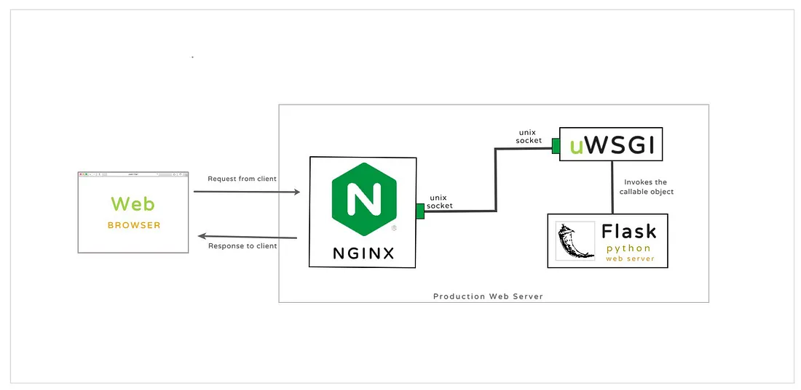

Last change: |today|

Docker+Nginx+uWSGI部署Flask项目
===============================

Reference
---------

-  https://docker.easydoc.net/doc/81170005/cCewZWoN/lTKfePfP
-  https://www.youtube.com/watch?v=dVEjSmKFUVI
-  https://www.bilibili.com/video/BV1s54y1n7Ev/?spm_id_from=333.337.search-card.all.click&vd_source=3d4b12fb4a4bfbc98942d43612ae2fb9

这一次部署使用的宿主机是ubuntu22.04虚拟机

1 WGSI和Nginx介绍
-----------------

   
WSGI 跟 Nginx 能让 Website
可以更加稳定及效率运行，对于非网路专家的多数工程师而言，是很陌生的名词，我们可以简单讲一下他们的功能：

-  Nginx：非同步 Web 服务器，可以作为反向代理、负载平衡器和 HTTP
   快取等的功能。简单来说就是做到静动分离提高效率。
-  WSGI (Web Server Gateway Interface)：负责代理服务器及 Flask
   的沟通，可以当成一个协议或规范。 简言之，Flask 是框架，Nginx
   是网路服务，WSGI 负责沟通，配合上面的架构图，我们可以这样想像：

   i. Web 客户端发出请求
   ii. Nginx 发现是动态请求，告诉 WSGI
   iii. WSGI 把请求发给 Flask，拿到结果后回传
   iv. Nginx 将结果回传客户端
   v. 呈现在客户端浏览器上

我们在 Flask 主要使用的是 uWSGI 协议，这也是 WSGI 的一种，若要快速把
Nginx、uWSGI 服务架起来，可以使用 Docker Container 的架构来部署整个
Flask项目.

2 Ubuntu（宿主机）构建项目
------------------------

1. 宿主机安装python，这里我是用编译源代码的方式安装python

   参考： https://phoenixnap.com/kb/how-to-install-python-3-ubuntu

   https://docs.vultr.com/install-the-latest-version-of-python-from-source-on-ubuntu-20-04

   i.  代理选择中国区域

   ii. 更换源

       ubuntu中选择\ ``software & update``

       .. figure:: image-1.png
          :alt: alt text
          :width: 70%
          :align: center

       点击\ ``Ubuntu Software``\ 选项卡，勾选\ ``source code``\ ，\ ``Download from:``\ 选择\ ``other``\ ，点击\ ``china``\ ，然后点击\ ``Select Best Server``\ ，测试完毕后，点击\ ``Choose Server``.

   iii.  更新包仓库 
   
         .. code:: bash
         
         sudo apt update && sudo apt upgrade``

   iv.  安装依赖

        .. code:: bash

          sudo apt install build-essential zlib1g-dev libncurses5-dev libgdbm-dev libnss3-dev libssl-dev libreadline-dev libffi-dev libsqlite3-dev wget

   v.  下载
       `python3.11.9源代码 <https://www.python.org/downloads/source/>`__
       的 ``Gzipped source tarball``

   vi.  在压缩包所在目录打开终端 
   
        .. code:: bash
         
         tar -xf Python-3.11.9.tgz``

   vii.  测试系统并优化python

         .. code:: bash

           cd Python-3.11.9
           ./configure --enable-optimizations

   viii.  编译代码（这里等待的时间比较长）

          .. code:: bash

            mkdir build
            make -s

   ix.  安装python

        .. code:: bash

           sudo make altinstall

   x. 测试

      .. code:: bash

         python3 -V

2. 配置flask项目

   i. 新建一个文件夹名为\ ``flaskapp``\ ，然后在里面新建两个文件夹\ ``flask``\ 和\ ``nginx``

      .. code:: bash

         |+---flaskapp
         |   |   flask
         |   |   nginx

   ii. 在文件夹\ ``flaskapp``\ 中打开终端，python虚拟环境，python设置代理可见https://zhiqiang.org/it/proxy-of-application-in-ubuntu.html

       .. code:: python

         cd flask/
         sudo apt-get update
         python3.11 -m ensurepip
         sudo apt-get install python3.11-venv
         sudo apt-get install python3.11-distutils

         sudo ln -fs /usr/local/bin/python3.11 /usr/bin/python3
         python3.11 -m venv myenv
         sudo ln -fs /usr/bin/python3.10 /usr/bin/python3
         source myenv/bin/activate

         # 如果使用代理运行，取消以下命令注释，并运行
         # unset all_proxy && unset ALL_PROXY # 取消所有 socks 代理
         # pip install pysocks

         pip install flask uwsgi --proxy=http://127.0.0.1:33210

   iii. 在文件夹\ ``flask``\ 中新建主执行文件\ ``run.py``\ ，并新建文件夹\ ``app``\ ，在文件夹\ ``app``\ 内新建py文件\ ``__init__.py``\ 和\ ``views.py``.

        .. code:: bash

            |+---flaskapp
            |   +---flask
            |   |   |   myenv
            |   |   |   run.py
            |   |   +---app
            |           |   __init__.py
            |           |   views.py
            |   |   nginx

        文件内容如下：

         -  ``__init.py``

            .. code:: bash

                  from flask import Flask

                  app = Flask(__name__)

                  from app import views

         -  ``views.py``

            .. code:: bash

                  from app import app

                  @app.route("/")
                  def index():
                     return "Hello from flask"

         -  ``run.py``

            .. code:: bash

                  from app import app

                  if __name__ == "__main__":
                     app.run()   

   iv. 输出\ ``requirements.txt``

       .. code:: bash

          pip freeze > requirements.txt

   v. 在文件夹\ ``flask``\ 中新建文件\ ``.dockerignore``\ ，内容如下
      
      .. code:: bash

          myenv/      
          __pycache__/

   vi. 在文件夹\ ``flask``\ 中新建文件\ ``Dockerfile``\ ，内容如下

       .. code:: bash

         # 指定基础镜像为 python:3.11-slim，这是一个包含 Python 3.11 的轻量级镜像
         FROM python:3.11-slim

         # 设置镜像的工作目录为 /app
         WORKDIR /app

         # 将当前上下文中的所有文件和目录（即 Dockerfile 所在的目录）添加到镜像的 /app 目录中
         ADD . /app

         # 在镜像中执行 pip install -r requirements.txt 命令，以安装项目所需的 Python 包
         RUN apt-get update && apt-get install -y libpq-dev build-essential && rm -rf /var/lib/apt/lists/*
         RUN pip install -r requirements.txt

         # 指定容器启动时执行的命令，这里是运行 uwsgi，并传递 app.ini 作为参数
         CMD ["uwsgi", "app.ini"]

   vi. 在文件夹\ ``flask``\ 中新建文件\ ``app.ini``\ ，内容如下

       .. code:: bash

         # 定义一个名为 uwsgi 的部分，表示接下来的配置项都是针对 uWSGI 的设置
         [uwsgi]
         # 指定 WSGI 应用程序的入口文件，这里是 run.py
         wsgi-file = run.py
         # uWSGI 会寻找 run.py 中名为 app 的对象作为 WSGI 应用
         callable = app
         # 客户端可以通过该端口与 uWSGI 进行通信
         socket = :8080
         # 通过多进程来处理并发请求，提高应用的性能
         processes = 4
         # 每个进程可以同时处理多个请求，进一步提高并发能力
         threads = 2
         # uWSGI 将启动一个主进程来管理工作进程，便于处理进程的重启和管理
         master = true
         # 设置 socket 文件的权限，这里是 660. 确保只有特定的用户和组可以访问该 socket，增加安全性
         chmod-socket = 660
         # 在 uWSGI 停止时，自动删除 socket 文件等临时文件，保持环境整洁
         vacuum = true
         # 确保 uWSGI 在接收到终止信号（如 SIGTERM）时能够正常关闭，释放资源
         die-on-term = true

   vii. 设置环境变量

        .. code:: bash

         export FLASK_APP = run.py
         export FLASK_ENV = development

        -  ``export FLASK_APP=run.py`` 

           作用：设置环境变量 FLASK_APP 的值为run.py。

           目的：告诉 Flask 框架要运行的主应用文件是
           run.py。这样，当你使用 flask run 命令时，Flask会自动加载并运行这个文件中的应用实例。
        
        -  ``export FLASK_ENV=development`` 

           作用：设置环境变量 FLASK_ENV的值为 development。

           目的：将 Flask应用的运行模式设置为开发模式。这会启用以下特性：
           
            调试模式：在代码更改后，Flask
            会自动重载应用，无需手动重启服务器。
           
            调试信息：如果发生错误，Flask 会提供详细的错误页面，方便调试

   ix. 运行Flask项目

       .. code:: bash

         flask run 

       .. figure:: image-2.png
         :alt: alt text
         :width: 70%
         :align: center

3 配置Nginx
----------------

1. 配置Nginx

   1. 进入文件夹\ ``nginx``\ ，新建文件\ ``nginx.conf``\ ，内容如下：

      .. code:: bash

         server {
             listen 80;
             location / {
                 include uwsgi_params;
                 uwsgi_pass flask:8080;
             }
         }

      这个 nginx.conf 配置的目的是将所有到达 Nginx 80
      端口的请求转发到名为 flask 的服务的 8080 端口，使用 uWSGI
      协议进行通信。通过这种方式，Nginx
      可以作为反向代理服务器，处理客户端请求并将其转发给后端的 Flask
      应用程序。这样可以提高性能和安全性，同时提供负载均衡和缓存等功能。

   2. 进入文件夹\ ``nginx``\ ，新建\ ``Dockerfile``\ 文件夹，内容如下：
      
      .. code:: bash

         FROM nginx

         RUN rm /etc/nginx/conf.d/default.conf

         COPY nginx.conf /etc/nginx/conf.d/

4 Docker部署
-------------
1. 配置docker-compose

   经过以上步骤，现在项目目录结构如下：

   .. code:: bash

      |+---flaskapp
      |   +---flask
      |   |   |   myenv
      |   |   |   run.py
      |   |   |   requirements.txt
      |   |   |   app.ini
      |   |   |   Dockerfile
      |   |   +---app
      |           |   __init__.py
      |           |   views.py
      |   +---nginx
      |   |   |   Dockerfile
      |   |   |   nginx.conf

   i. 在文件夹\ ``flaskapp``\ 中新建文件\ ``docker-compose.yml``\ ，内容如下：
      
      .. code:: bash

         version: '3.7'

         services: flask: 
            # Docker Compose 将在 ./flask 目录中查找 Dockerfile 来构建镜像 
            build: ./flask container_name: flask
            restart: always 
            # 将环境变量传递给 Flask 应用，以便在运行时使用。
            # APP_NAME=MyFlaskApp：设置应用名称为 MyFlaskApp。 
            # DB_USERNAME=example：设置数据库用户名为 example 
            environment: 
               - APP_NAME=MyFlaskApp 
               - DB_USERNAME=example 
            # 这里声明了容器内部的8080 端口，供其他服务（如 Nginx）访问，但不对外暴露。 
            expose: -8080

         nginx: 
            # Docker Compose 将在 ./nginx 目录中查找 Dockerfile来构建镜像。
            build: ./nginx 
            container_name: nginx 
            restart: always 
            # 将主机的80 端口映射到容器的 80 端口。 
            # “80:80”：表示将主机的 80端口映射到 Nginx 容器的 80 端口，使得外部请求可以通过主机的 80端口访问 Nginx。 
            ports: - "80:80"

      docker-compose.yml 文件定义了两个服务：一个是运行 Flask 应用的
      flask 服务，另一个是作为反向代理的 nginx 服务。Flask 应用将在
      Docker 容器中运行，并通过 Nginx 处理外部请求。Nginx 将监听主机的
      80 端口，将请求转发到 Flask 应用的 8080 端口

      注意： YAML
      对缩进非常敏感。确保使用空格而不是制表符（Tab），并且每一层的缩进一致。通常使用两个空格。

2. 构建镜像并启动容器

   i. 在文件夹\ ``flaskapp``\ 打开终端，输入

      .. code:: bash

         su
         docker-compose up --build

   ii. 打开网址\ ``http://127.0.0.1``\ ，成功访问

       .. figure:: image-3.png
         :alt: alt text
         :width: 70%
         :align: center

