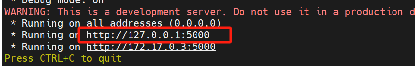

保护docker内部源代码
====================


Reference

---------


-  https://github.com/DaoCloud/secure-python-sample

-  https://segmentfault.com/a/1190000021229043

-  https://blog.csdn.net/this_is_id/article/details/121337597

-  https://blog.csdn.net/xkx_07_10/article/details/133802241

-  https://blog.csdn.net/icanflyingg/article/details/129200783


源代码加密

----------


项目结构:


-  ``src`` 为源码路径


   .. code:: bash


      project_name:

      ./Dockerfile

      ./compile.py

      ./src

      ./start.py


-  ``compile.py``\ 内容：


   .. code:: python


      # -*- coding: utf-8 -*-

      import os


      from Cython.Build import cythonize

      from setuptools import setup, Extension


      def c_compile(name, modules):

          """

          使用Cython进行编译

          :param str name: 项目名称

          :param list modules: [(module_name, source_file_path), (..., ...)]

          :return:

          """

          module_list = []

          for m in modules:

              module_list.append(

                  Extension(name=m[0], sources=[m[1]])

              )

          setup(

              name=name,

              ext_modules=cythonize(

                  module_list=module_list,

                  language_level=3,  # python3

              ),

              zip_safe=False,

              install_requires=[

                  'Cython',

              ]

          )


      modules = []

      # 遍历找到需要编译的py文件

      for root, dirs, files in os.walk('./src'):

          for file in files:

              if not file.endswith('.py'):

                  continue

              dir_list = root.split(os.path.sep)

              name = '.'.join(dir_list).lstrip('./')

              modules.append((name + '.' + os.path.splitext(file)[0], os.path.join(root, file)))


      print(modules)

      # 开始编译

      c_compile('compile', modules)

      # 删除py文件和c文件

      for root, dirs, files in os.walk('./src'):

          for file in files:

              if file.endswith('.so'):

                  continue

              file_path = os.path.join(root, file)

              os.remove(file_path)


-  ``dockerfile``\ 内容：


   .. code:: bash


      # 第一阶段：构建阶段

      FROM python:3.10-slim AS build


      # 安装必要的工具

      RUN apt-get update && apt-get install -y --no-install-recommends gcc && apt-get clean && rm -rf /var/lib/apt/lists/*


      # 安装 Python 依赖

      COPY requirements.txt ./

      RUN pip install --no-cache-dir -r requirements.txt


      # 安装 pyvrp

      COPY pyvrp-0.9.1-cp310-cp310-manylinux_2_17_x86_64.manylinux2014_x86_64.whl .

      RUN pip install --no-cache-dir pyvrp-0.9.1-cp310-cp310-manylinux_2_17_x86_64.manylinux2014_x86_64.whl


      # 第二阶段：运行阶段

      FROM python:3.10-slim


      # 暴露端口

      EXPOSE 5000


      # 复制构建阶段的依赖和应用程序

      WORKDIR /work

      COPY --from=build /usr/local/lib/python3.10/site-packages /usr/local/lib/python3.10/site-packages

      COPY src /work/src

      COPY start.py /work/

      # 拷贝编译后的结果


      # 配置环境变量和工作目录

      ENV PYTHONPATH=/work


      # 设置工作目录的权限

      # 安装 acl 工具

      RUN apt-get update && apt-get install -y acl

      # 设置 ACL，拒绝 root 用户访问

      RUN setfacl -m u:root:--- /work/src


      RUN chown -R root:root /work/src

      # 设置基本权限：所有者有读、写、执行权限；所属组和其他用户有读、执行权限

      RUN chmod -R 755 /work/src

      # 设置 ACL，禁止其他用户写入（复制需要写权限）

      RUN setfacl -R -m o::rx /work/

      RUN groupadd -r myuser && useradd -r -g myuser myuser

      # 更改文件的所有者和所属组

      RUN chown myuser:myuser /work/start.py

      # 设置文件权限

      RUN chmod 500 /work/start.py

      USER myuser


      # 启动 Flask 应用

      CMD ["python3", "src/start.py"]


打包镜像

--------


1. 保存源文件代码，将代码文件夹copy一个新的文件夹\ ``源代码-docker``


2. 执行以下代码：

   ``bash     cd junlebao-test-docker     # 编译so文件     python3 compile.py build_ext --inplace -j8     sudo docker build -t junlebao-test-slim .      sudo docker save -o junlebao-test-slim.tar junlebao-test-slim``


在测试环境加载镜像

------------------


在测试环境中，使用 ``docker load`` 命令加载镜像：


.. code:: bash


   sudo docker load -i /目标路径/junlebao-test-slim.tar


将 ``/目标路径/junlebao-test-slim.tar`` 替换为实际保存文件的路径。


查看加载的镜像

--------------


加载完成后，使用以下命令查看镜像：


.. code:: bash


   sudo docker images


运行容器

--------


使用 ``docker run`` 命令运行容器，示例：


.. code:: bash


   sudo docker run -p 5000:5000 --name junlebao-test-slim --read-only junlebao-test-slim


验证容器运行

------------


打开浏览器，访问 ``http://<测试环境IP>:5000``\ ，确保 Flask

应用正常响应请求。




   :alt: alt text


   alt text


查看日志

--------


查看容器日志的命令：


.. code:: bash


   sudo docker logs -f junlebao-test-slim


传json测试

----------


1. 新建一个\ ``docker_jsontest.py``\ ，内容如下：url和file_path按照自己的情况更改.

   \```python import os import requests import json


   # 获取当前文件所在目录的绝对路径 root_path =

   os.path.abspath(os.path.join(os.path.dirname(**file**), ““))


   # 设置目标请求 URL（根据需求取消注释对应 URL） url =

   ‘http://127.0.0.1:5000/process’


   # 设置要发送的文件路径（注意：需确保文件真实存在） file_path =

   f”{root_path}/input/test-2025-03-07.json” # 替换为实际的 JSON

   文件路径


   # 读取文件内容并发送 POST 请求 with open(file_path, ‘rb’) as file:

   json_data = json.load(file) response = requests.post(url,

   json=json_data) # 使用 json 参数发送 JSON 数据


   # 处理响应结果 if response.status_code == 200: response_data =

   response.json() print(“submitting succeed , JSON data:”,

   response_data) else: print(f”submitting failed, status code:

   {response.status_code}“) \``\`


2. 执行文件 ``python3 docker_jsontest.py``

