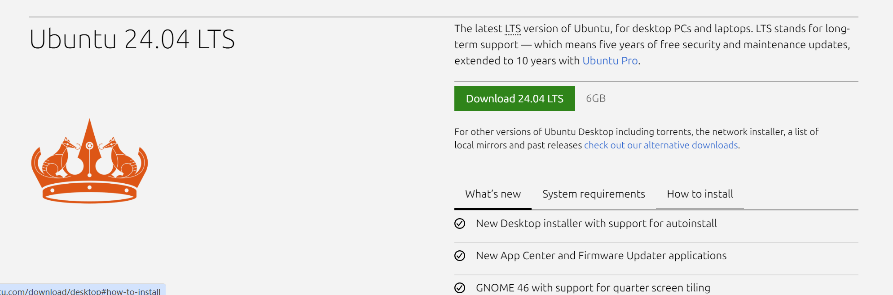
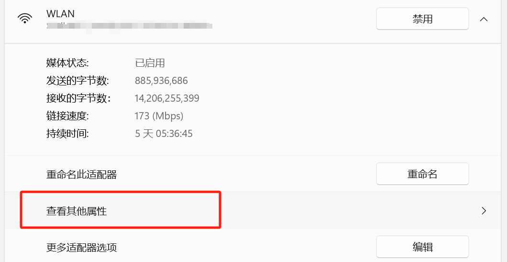

Last change: |today|


Linux 安装及配置
================

Reference
---------

-  https://www.bilibili.com/video/BV1A24y1f76Z/?spm_id_from=333.1007.top_right_bar_window_default_collection.content.click&vd_source=3d4b12fb4a4bfbc98942d43612ae2fb9

0 卸载VMwareWorkstation 
-------------------------

参考
`彻底卸载VMware虚拟机的详细步骤 <https://blog.csdn.net/weixin_55118477/article/details/121078890>`__

1 下载VMwareWorkstation
-----------------------

有一个 `github仓库 <https://github.com/201853910/VMwareWorkstation>`__
收集了各种版本的下载地址，我下载的是\ ``17.5.0``\ 的版本.

安装时修改安装路径，一直点击下一步即可.

2 下载Ubuntu
------------

可以在
`清华大学的镜像站 <https://mirrors.tuna.tsinghua.edu.cn/ubuntu-releases/>`__
里下载各个版本的\ ``Ubuntu``\ ，最新版本可以在
`官网 <https://ubuntu.com/download/desktop>`__
进行下载，我下载的是\ ``24.04 LTS``\ 版本



3 创建虚拟机
------------

1. 在本地电脑选择一个剩余容量大于20G的硬盘，新建一个文件夹\ ``Ubuntu24.04``.

2. 进入VMware Workstation，点击创建新的虚拟机.

   .. figure:: image.png
      :alt: alt text
      :width: 70%
      :align: center

3. 选择\ ``自定义(高级)``.

   .. figure:: image-52.png
      :alt: alt text
      :width: 70%
      :align: center

4. 点击\ ``下一步``.

   .. figure:: image-53.png
      :alt: alt text
      :width: 70%
      :align: center

5. 选择\ ``稍后安装操作系统``.

   .. figure:: image-3.png
      :alt: alt text
      :width: 70%
      :align: center 

6. 选择操作系统为\ ``Linux``\ ，版本为\ ``Ubuntu 64位``.

   .. figure:: image-4.png
      :alt: alt text
      :width: 70%
      :align: center

7. 修改虚拟机名称（可选），修改文件夹位置为在第1步创建的文件夹

   .. figure:: image-54.png
      :alt: alt text
      :width: 70%
      :align: center

8. 我的电脑是i7，内存是16GB，所以\ ``处理器数理``\ 我选择\ ``2``\ ，\ ``每个处理器的内核数理``\ 我选择\ ``2``\ ，\ ``虚拟机内存``\ 我选择\ ``4GB``.

   .. figure:: image-72.png
      :alt: alt text
      :width: 70%
      :align: center

   .. figure:: image-55.png
      :alt: alt text
      :width: 70%
      :align: center

9. ``网络连接``\ 选择\ ``NAT``

   .. figure:: image-78.png
      :alt: alt text
      :width: 70%
      :align: center

10. 使用\ ``推荐``\ 并选择\ ``下一步``

    .. figure:: image-9.png
      :alt: alt text
      :width: 70%
      :align: center

    .. figure:: image-10.png
      :alt: alt text
      :width: 70%
      :align: center

11. 选择\ ``创建新虚拟磁盘``

    .. figure:: image-11.png
      :alt: alt text
      :width: 70%
      :align: center

12. 最大磁盘大小选择\ ``20G``\ ，选择\ ``将虚拟磁盘存储为单个文件``

    .. figure:: image-12.png
      :alt: alt text
      :width: 70%
      :align: center

13. 点击\ ``下一步``

    .. figure:: image-56.png
      :alt: alt text
      :width: 70%
      :align: center

14. 点击\ ``完成``

    .. figure:: image-14.png
      :alt: alt text
      :width: 70%
      :align: center

4 给虚拟机配置系统
------------------

1. 单击\ ``CD/DVD``

   .. figure:: image-15.png
      :alt: alt text
      :width: 70%
      :align: center

2. ``连接``\ 选择\ ``使用iso映像文件``\ ，选择前面下载的\ ``iso``\ 文件，点击确定

   .. figure:: image-16.png
      :alt: alt text
      :width: 70%
      :align: center

3. 点击\ ``开启此虚拟机``

5 安装Ubuntu
------------

1. 选择\ ``English``\ ，选择\ ``Next``

   .. figure:: image-57.png
      :alt: alt text
      :width: 70%
      :align: center

2. 都不选择，点击\ ``Next``

   .. figure:: image-58.png
      :alt: alt text
      :width: 70%
      :align: center

3. 都选择\ ``English(US)``

   .. figure:: image-59.png
      :alt: alt text
      :width: 70%
      :align: center

4. 选择\ ``Use wired connection``

   .. figure:: image-60.png
      :alt: alt text
      :width: 70%
      :align: center

5. 选择\ ``Install Ubuntu``

   .. figure:: image-61.png
      :alt: alt text
      :width: 70%
      :align: center

6. 选择\ ``interactive installation``

   .. figure:: image-62.png
      :alt: alt text
      :width: 70%
      :align: center

7. 选择\ ``Default selection``

   .. figure:: image-63.png
      :alt: alt text
      :width: 70%
      :align: center

8. 选择\ ``Next``

   .. figure:: image-73.png
      :alt: alt text
      :width: 70%
      :align: center

9. 选择\ ``Erase disk and install Ubuntu``\ ，选择\ ``Next``

   .. figure:: image-66.png
      :alt: alt text
      :width: 70%
      :align: center

10. 设置信息

    .. figure:: image-74.png
      :alt: alt text
      :width: 70%
      :align: center

11. 选择\ ``Shanghai``

    .. figure:: image-68.png
      :alt: alt text
      :width: 70%
      :align: center 

12. 选择\ ``install``

    .. figure:: image-69.png
      :alt: alt text
      :width: 70%
      :align: center 

13. 点击\ ``restart now``\ ，后面重启之后，停住的地方就点击\ ``enter``

    .. figure:: image-70.png
      :alt: alt text
      :width: 70%
      :align: center

6 网络配置
----------

1. ``网络连接``\ 先选择\ ``NAT``

2. 进入网络设置界面，DNS填写win主机下通过\ ``ipconfig``\ 查看

   .. figure:: image-76.png
      :alt: alt text
      :width: 70%
      :align: center

3. 在ubuntu下运行命令

   .. code:: bash

      sudo apt install net-tools

.. raw:: html

   <ul>

.. raw:: html

   <li>

.. raw:: html

   <p>

如果没有网络图标： 删除NetworkManager缓存文件，重启网络后问题就解决了.

.. raw:: html

   </p>

.. raw:: html

   <pre>
   <code class="lang-bash">sudo service NetworkManager stop 
   sudo rm /var/lib/NetworkManager/NetworkManager.state 
   sudo service NetworkManager start</code>
   </pre>

.. raw:: html

   </li>

.. raw:: html

   <li>

选择桥接模式的话，win主机可能无法上网，设置的参数步骤：

.. raw:: html

   <ol type="i">

.. raw:: html

   <li>

.. raw:: html

   <p>

win主机上找到 管理网络适配器

.. raw:: html

   </p>

.. raw:: html

   </li>

.. raw:: html

   <li>

.. raw:: html

   <p>

找到WLAN，并查看其他属性，ubuntu网络设置界面Ipv4中选择manual，address和DNS就写这里面的信息，gateway和DNS的信息一致

.. raw:: html

   </p>



.. raw:: html

   </li>

.. raw:: html

   <li>

.. raw:: html

   <p>

子网掩码在win下通过cmd命令ipconfig查看

.. raw:: html

   </p>

.. raw:: html

   </li>

.. raw:: html

   </ol>

.. raw:: html

   </ul>

7 代理设置
----------

1. 点击\ ``Proxy``\ ，选择\ ``manual``

   .. figure:: image-77.png
      :alt: alt text
      :width: 70%
      :align: center

2. ``SOCKS Host`` 输入 ``windows主机无线局域网适配器WLAN的IPv4地址``
   和代理软件使用的端口.
   (IPv4地址可以通过win下cmd命令\ ``ipconfig``\ 获得)

.. raw:: html

   <!-- ## 6 网络配置

   适合16.04版本

   1. 在window主机的`设置`中搜索`设备管理器`，找到`网络适配器`，找到自己电脑目前使用的网络类型，我的电脑目前使用的是wifi
       

   2. 回到`VMware Workstation`，点击`编辑`，点击`虚拟网络编辑器`

       

   3. 选择`更改设置`

       

   4. 设置`VMnet0`的信息，选择`桥接模式`，选择第1步找到的网络类型，点击`确认`

        -->

8 虚拟机终端代理设置
--------------------

参考： - https://blog.pica.icu:4443/2024/05/368/ -
https://playlab.eu.org/archives/proxychains4

1. 修改\ ``.bashrc``\ 文件

   .. code:: bash

      vim ~/.bashrc

2. 在里面任意位置添加上如下两行代码：

   .. code:: bash

      export http_proxy='http://localhost:33210'
      export https_proxy='http://localhost:33210'

   其中的\ ``33210``\ 是代理的端口号，需要依据自己的端口号对应修改。添加好之后保存，然后在终端执行：

3. 使得修改生效

   .. code:: bash

      source ~/.bashrc

.. raw:: html

   <!-- 1. 安装proxychains4

       ```bash
       sudo apt-get install proxychains4
       ```

   2. 修改proxychains4配置文件

       ```bash
       sudo nano /etc/proxychains4.conf
       ```
       在文件末尾加入 socks5 本机所在局域网中的 IP 地址和端口号

   3. 在终端中使用代理，命令前面加上 proxychains4 即可，例如：

       ```bash
       proxychains git clone github.com/xxx

       ``` -->


8 VMware tools 安装
-------------------

1. 关闭虚拟机

2. 选择 ``CD/DVD`` ，选择 ``硬件`` 选择 ``使用物理驱动器``，选择 ``自动检测``
   
   .. figure:: image-29.png
      :alt: alt text
      :width: 70%
      :align: center

3. 开启虚拟机，点击\ ``否``\

   .. figure:: image-32.png
      :alt: alt text
      :width: 70%
      :align: center

4. 安装VMware tools，选择上方选择卡，选择\ ``虚拟机``\ ，选择\ ``安装VMware tools``\

5. copy gz文件到 unbutu desktop 

   .. figure:: image-33.png
      :alt: alt text
      :width: 70%
      :align: center

   .. figure:: image-34.png
      :alt: alt text
      :width: 70%
      :align: center

6. 设置超级管理员密码，右键选择\ ``open terminal``\ ，然后输入以下命令，并设置密码
   
   .. code:: bash

      sudo passwd

   .. figure:: image-35.png
      :alt: alt text
      :width: 70%
      :align: center 

7. 运行以下命令获得超级管理员权限,可以直接输入 ``exit`` 或者 ``logout`` 以返回到普通用户. 
    
   .. code:: bash

      su

8. 运行以下命令解压gz文件，并安装vmare-tools

   .. code:: bash

      cd home/zp/Desktop/
      tar -vxf VMwareTools-10/3/23-16594550.tar.gz
      cd vmware-tools-distrib/
      ./vmware-install.pl

9. 输入\ ``yes``\ ，开始安装，然后一路回车 

   .. figure:: image-36.png
      :alt: alt text
      :width: 70%
      :align: center 

10. 出现如下情况，表示安装成功，接着关闭虚拟机

    .. figure:: image-37.png
      :alt: alt text
      :width: 70%
      :align: center 

11. 重启后，检查：1、分辨率是否正常；2、虚拟机内外复制粘贴能不能使用；如果还不行的话，重新安装VMware Tools；这次使用指令来安装：

    .. code:: bash

      sudo apt-get autoremove open-vm-tools     
      sudo apt-get install open-vm-tools     
      sudo apt-get install open-vm-tools-desktop

    安装过程一路默认回车，如果问你是否继续执行，就输入Y，继续就好了。安装完成后重启虚拟机。
   
9 共享文件夹配置
----------------

1. 在win主机下找到之前建立的虚拟机文件夹，我是\ ``Ubuntu24.04``\ ，在文件夹内部新建一个\ ``share``\ 文件夹

2. 回到VMware
   Workstation，选择\ ``编辑虚拟机设置``\ ，选择\ ``选项``\ ，选择\ ``共享文件夹``\ ，选择\ ``总是启用``\ ，选择\ ``添加``\ ，然后找到第3步设置的\ ``share``\ 文件夹
   
   .. figure:: image-30.png
      :alt: alt text
      :width: 70%
      :align: center 

3. 选择下一步，选择完成  

   .. figure:: image-31.png
      :alt: alt text
      :width: 70%
      :align: center 

4. ubuntu内运行以下命令找到共享文件夹

   .. code:: bash

      ## 进入根目录
      cd /
      ## 进入挂载文件夹
      cd mnt
      cd hgfs/

   .. figure:: image-38.png
      :alt: alt text
      :width: 70%
      :align: center

5. 在本地win主机新建一个txt文件，并放到share文件夹内，切换回虚拟机的share文件夹则可以看到

   .. figure:: image-40.png
      :alt: alt text
      :width: 70%
      :align: center

   .. figure:: image-39.png
      :alt: alt text
      :width: 70%
      :align: center

10 主机和虚拟机复制粘贴互通
---------------------------

1. 选择\ ``编辑虚拟机设置``\ ，选择\ ``选项``\ ，选择\ ``客户机隔离``\ ，选择\ ``启用复制粘贴``

   .. figure:: image-71.png
      :alt: alt text
      :width: 70%
      :align: center

   .. figure:: image-41.png
      :alt: alt text
      :width: 70%
      :align: center

.. raw:: html

   <!-- ## 11 配置WSL的DNS

   1. 修改`/etc/wsl.config`文件

       ```bash
       sudo gedit /etc/wsl.config
       ```

   2. 在`/etc/wsl.config`中添加
       ```bash
       [network]
       generateResolvConf = false
       ``` -->

.. raw:: html

   <!-- ## 11 换源

   Linux配置的默认源并不是国内的服务器，下载更新软件都比较慢. 所以需要换源

   参考https://blog.csdn.net/weixin_42301220/article/details/127979124

   1. 备份源列表文件`sources.list`：

       ```bash
       cd /
       sudo cp /etc/apt/sources.list /etc/apt/sources.list_backup20240731 #备份源列表
       ```

   2. 修改源列表文件

       ```bash
       sudo gedit /etc/apt/sources.list ## 打开sources.list文件
       ```

   3. 复制[清华源网站](https://mirrors.tuna.tsinghua.edu.cn/help/ubuntu/)的代码（注意版本为16.04），编辑`/etc/apt/sources.list`文件，删除原内容，在文件最前面添加镜像源
       - 清华源
       ```bash
       ## 默认注释了源码镜像以提高 apt update 速度，如有需要可自行取消注释
       deb https://mirrors.tuna.tsinghua.edu.cn/ubuntu/ xenial main restricted universe multiverse
       ## deb-src https://mirrors.tuna.tsinghua.edu.cn/ubuntu/ xenial main restricted universe multiverse
       deb https://mirrors.tuna.tsinghua.edu.cn/ubuntu/ xenial-updates main restricted universe multiverse
       ## deb-src https://mirrors.tuna.tsinghua.edu.cn/ubuntu/ xenial-updates main restricted universe multiverse
       deb https://mirrors.tuna.tsinghua.edu.cn/ubuntu/ xenial-backports main restricted universe multiverse
       ## deb-src https://mirrors.tuna.tsinghua.edu.cn/ubuntu/ xenial-backports main restricted universe multiverse

       ## 以下安全更新软件源包含了官方源与镜像站配置，如有需要可自行修改注释切换
       deb http://security.ubuntu.com/ubuntu/ xenial-security main restricted universe multiverse
       ## deb-src http://security.ubuntu.com/ubuntu/ xenial-security main restricted universe multiverse

       ## 预发布软件源，不建议启用
       ## deb https://mirrors.tuna.tsinghua.edu.cn/ubuntu/ xenial-proposed main restricted universe multiverse
       ## deb-src https://mirrors.tuna.tsinghua.edu.cn/ubuntu/ xenial-proposed main restricted universe multiverse
       ```

   4. 换源完成后更新即可。
       ```bash
       sudo apt-get update
       ``` -->

11 VIM编辑器安装和配置
----------------------

1. 检查网络是否开启

   .. figure:: image-42.png
      :alt: alt text
      :width: 50%
      :align: center

2. 运行以下代码安装VIM

   .. code:: bash
   
      sudo apt-get update     
      sudo apt-get install vim


3. 设置用vim编辑时显示行号，首先进入vimrc文件

   .. code:: bash

      cd /
      vim /etc/vim/vimrc

   键盘点击\ ``a``\ ，进入编辑模式，在文件末尾输入

   .. code:: bash

      set number
      set ts=4

   点击\ ``esc``\ ，输入\ ``:w !sudo tee %``\ ，输入\ ``O``\ ，点击\ ``enter``\ ，输入\ ``:q!``\ ，点击\ ``enter``

4. 查看vimrc文件，

   .. code:: bash

      cat /etc/vim/vimrc

   发现编辑成功 

   .. figure:: image-43.png
      :alt: alt text
      :width: 70%
      :align: center

5. 用vim打开一个文件，行号出现了

   .. code:: bash

      vim /mnt/hgfs/share/test.txt

   .. figure:: image-44.png
      :alt: alt text
      :width: 70%
      :align: center

12 SSH控制台登录与文件传输
--------------------------

下面介绍一种不使用共享文件夹，但是也可以进行文件传输的方法

参考： -
https://www.bilibili.com/video/BV1A24y1f76Z?p=7&spm_id_from=pageDriver&vd_source=3d4b12fb4a4bfbc98942d43612ae2fb9

1. 在ubuntu安装\ ``openssh-server``

   .. code:: bash

      sudo apt-get update
      sudo apt-get install openssh-server

   如果出现报错：
   
   .. code:: bash
   
      E: Could not get lock /var/lib/dpkg/lock-frontend - open (11: Resource temporarily unavailable)   E: Unable to acquire the dpkg frontend lock (/var/lib/dpkg/lock-frontend), is another process using it?
   
   运行以下命令：

   .. code:: bash

      ps aux | grep apt

   杀掉对应的apt进程

   .. code:: bash

      kill -9 进程编号

   然后再运行安装命令

2. 配置\ ``sshd_config``\ 文件

   .. code:: bash

      cd /
      cd /etc/ssh/
      vim sshd_config

   输入小写\ ``a``\ ，进入\ ``insert``\ 状态

   进行如下修改：

   .. figure:: image-45.png
      :alt: alt text
      :width: 70%
      :align: center

   点击\ ``esc``\ ，输入\ ``:w !sudo tee %``\ ，输入\ ``O``\ ，点击\ ``enter``\ ，输入\ ``:q!``\ ，点击\ ``enter``

3. 启动ssh服务

   .. code:: bash

      service ssh restart

4. 进入
   `MobaXterm官网 <https://mobaxterm.mobatek.net/download.html>`__\ ，下载portable版本

5. 点击\ ``exe``\ 文件

   .. figure:: image-46.png
      :alt: alt text
      :width: 70%
      :align: center

6. 点击\ ``session``

   .. figure:: image-47.png
      :alt: alt text
      :width: 70%
      :align: center

7. 选择\ ``SSH``

   .. figure:: image-48.png
      :alt: alt text
      :width: 70%
      :align: center

8. 在ubuntu中输入\ ``ifconfig``\ ，找到\ ``inet``\ 对应的ip地址，并复制到mobaxterm里，其他配置如下图，然后选择\ ``ok``

   .. figure:: image-49.png
      :alt: alt text
      :width: 70%
      :align: center

9. 输入密码后，出现链接成功界面，可以通过左侧文件栏来进行文件传输

   .. figure:: image-51.png
      :alt: alt text
      :width: 70%
      :align: center
      


