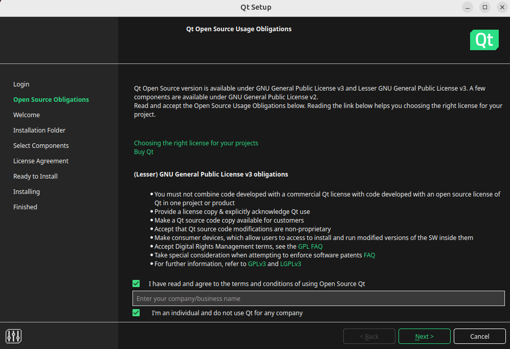

# Qt 安装及配置

## Reference

- https://web.stanford.edu/dept/cs_edu/resources/qt/install-linux
- https://blog.csdn.net/weixin_45962068/article/details/129851848

## 1 安装依赖

Ubuntu版本为`24.04 LTS`

1. 更新 package manager
    ```bash
    sudo apt-get update
    sudo apt-get upgrade
    ```

2. 安装Qt所需要的依赖和工具

    ```bash
    sudo apt-get -y install build-essential openssl libssl-dev libssl1.0 libgl1-mesa-dev libqt5x11extras5 '^libxcb.*-dev' libx11-xcb-dev libglu1-mesa-dev libxrender-dev libxi-dev libxkbcommon-dev libxkbcommon-x11-dev
    ```

## 2 安装Qt
1. 打开ubuntu的浏览器，打开网址 https://www.qt.io/download-qt-installer，选择`Linux x64`进行下载，文件会下载到`~/Downloads`目录下

    <div style="text-align: center;">
    </div>

2. 运行`.run`文件

    ```bash
    cd ~/Downloads
    chmod +x qt-online-installer-linux-x64-4.8.0.run
    sudo ./qt-online-installer-linux-x64-4.8.0.run
    ```

3. 登录账号

4. 打勾，选择`next`

    <div style="text-align: center;">
    </div>

5. 选择`next` 

    <div style="text-align: center;">
    </div>

6. 打勾，选择`next`

    <div style="text-align: center;">
    </div>

7. 不用改路径，选择 `Qt for desktop development`

    <div style="text-align: center;">
    </div>

8. 打勾，选择`next`

    <div style="text-align: center;">
    </div>

9. 选择`install`

    <div style="text-align: center;">
    </div>

## 3 配置环境变量

1. 打开终端，输入以下命令打开环境变量配置文件. 

    ```bash
    sudo vim /etc/profile
    ```

2. 在配置文件最后一行添加以下代码，以个人的qt安装路径为准：

    ```bash
    export PATH="/opt/Qt/Tools/QtCreator/bin:$PATH"

    export PATH="/opt/Qt/6.7.2/gcc_64/bin:$PATH"

    export LD_LIBRARY_PATH="/opt/Qt/6.7.2/gcc_64/lib:$LD_LIBRARY_PATH"

    export QT_PLUGIN_PATH="/opt/Qt/6.7.2/gcc_64/plugins:$QT_PLUGIN_PATH"

    export QML2_IMPORT_PATH="/opt/Qt/6.7.2/gcc_64/qml:$QML2_IMPORT_PATH"
    ```

3. 修改成功后，输入以下命令使其生效即可.
    ```bash
    sudo -s
    source /etc/profile
    ```
