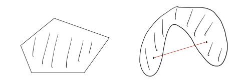

# 凸包和有效不等式

## Reference
- https://dabeenl.github.io/IE631_lecture3_note.pdf

## 1 凸包
对于集合 $ X \subseteq \mathbb{R}^d $，若对任意 $ u, v \in X $ 以及任意 $ \lambda \in [0, 1] $，均有 $ \lambda u + (1 - \lambda)v \in X $，则称 $ X $ 是 **凸的**.   

换句话说，连接集合内任意两点的线段完全包含于该集合. 下图展示了一个凸集和一个非凸集.   

**定义1.1** 给定 $ v^1, \dots, v^k \in \mathbb{R}^d $，若 $ \sum_{i=1}^k \lambda_i = 1 $ 且对 $ i = 1, \dots, k $ 有 $ \lambda_i \geq 0 $，则线性组合 $ \lambda_1 v^1 + \cdots + \lambda_k v^k $ 称为 $ v^1, \dots, v^k $ 的 **凸组合**.   

**定义1.2** 两个不同点 $ u, v $ 的凸组合是连接它们的线段 $ \{ \lambda u + (1 - \lambda)v : 0 \leq \lambda \leq 1 \} $.   

**定义1.3** 集合 $ S \subseteq \mathbb{R}^d $ 的 **凸包**，记为 $ \text{conv}(S) $，是 $ S $ 中所有点的凸组合构成的集合. 根据定义：  
$$
\text{conv}(S) = \left\{ \sum_{i=1}^n \lambda_i v^i : n \in \mathbb{N},\, v^1, \dots, v^n \in S,\, \sum_{i=1}^n \lambda_i = 1,\, \lambda_1, \dots, \lambda_n \geq 0 \right\}.
$$  

**定理1.4** 凸包$\text{conv}(S)$是包含$S$的最小凸集.

无论 $ S $ 本身是否为凸集，$ \text{conv}(S) $ 始终是凸的. 下图展示了对（非凸）集合取凸包的若干示例. 

对于整数规划问题  
$$
\begin{aligned}
\max \quad & c^{\top}x + h^{\top}y \\
\text{s.t.} \quad & Ax + Gy \leq b, \\
& x \in \mathbb{Z}^d,\ y \in \mathbb{R}^p,
\end{aligned} \quad (1.1)
$$  
我们记可行域集合为$S$，其凸包由下式给出：  
$$
\mathrm{conv}(S) = \mathrm{conv}\left( \left\{ (x, y) \in \mathbb{Z}^d \times \mathbb{R}^p : Ax + Gy \leq b \right\} \right).
$$  

**引理 1.5** 问题 (1.1) 满足：  
$$
\max\left\{ c^{\top}x + h^{\top}y : (x, y) \in S \right\} = \max\left\{ c^{\top}x + h^{\top}y : (x, y) \in \mathrm{conv}(S) \right\}.
$$  
此外，$ c^{\top}x + h^{\top}y $ 的上确界在 $ S $ 上取得，当且仅当它在 $ \mathrm{conv}(S) $ 上取得.   

**证明** 因为 $ S \subseteq \mathrm{conv}(S) $，显然有：  
$$
\max\left\{ c^{\top}x + h^{\top}y : (x, y) \in S \right\} \leq \max\left\{ c^{\top}x + h^{\top}y : (x, y) \in \mathrm{conv}(S) \right\}.
$$  
接下来证明：  
$$
\max\left\{ c^{\top}x + h^{\top}y : (x, y) \in S \right\} \geq \max\left\{ c^{\top}x + h^{\top}y : (x, y) \in \mathrm{conv}(S) \right\}
$$  
成立. 令 $ z^{*} = \max\left\{ c^{\top}x + h^{\top}y : (x, y) \in S \right\} $，不妨设 $ z^{*} $ 有限. 考虑集合：  
$$
H = \left\{ (x, y) \in \mathbb{R}^d \times \mathbb{R}^p : c^{\top}x + h^{\top}y \leq z^{*} \right\}.
$$  
根据定义，$ S \subseteq H $. 此外，由于 $ H $ 是凸集，故 $ \mathrm{conv}(S) \subseteq H $. 这意味着：  
$$
\max\left\{ c^{\top}x + h^{\top}y : (x, y) \in \mathrm{conv}(S) \right\} \leq z^{*} = \max\left\{ c^{\top}x + h^{\top}y : (x, y) \in S \right\},
$$  
从而证明了所需的不等式. 

假设 $c^\top x + h^\top y$ 的上确界在 $(\bar{x}, \bar{y}) \in S$ 处取得. 那么  
$$
\max \{c^\top x + h^\top y : (x, y) \in S\} = c^\top \bar{x} + h^\top \bar{y}.
$$  
注意到 $(\bar{x}, \bar{y}) \in \text{conv}(S)$，由第一部分可知  
$$
\max \{c^\top x + h^\top y : (x, y) \in \text{conv}(S)\} = c^\top \bar{x} + h^\top \bar{y}.
$$  
现在假设 $c^\top x + h^\top y$ 的上确界在点 $(\bar{x}, \bar{y}) \in \text{conv}(S)$ 处取得. 根据凸包的定义，该点可表示为 $S$ 中 $n$ 个点 $(x^1, y^1), \ldots, (x^n, y^n)$ 的凸组合. 由于这些点也属于 $\text{conv}(S)$，对所有 $i$ 有 $c^\top x^i + h^\top y^i \leq c^\top \bar{x} + h^\top \bar{y}$, 且  
$$
c^\top \bar{x} + h^\top \bar{y} = \sum_{i=1}^n \lambda_i (c^\top x^i + h^\top y^i)
$$  
其中 $\lambda_1, \ldots, \lambda_n \geq 0$ 且 $\sum_{i \in [n]} \lambda_i = 1$. 于是，  
$$
c^\top \bar{x} + h^\top \bar{y} = \sum_{i=1}^n \lambda_i (c^\top x^i + h^\top y^i) \leq \sum_{i=1}^n \lambda_i (c^\top \bar{x} + h^\top \bar{y}) = c^\top \bar{x} + h^\top \bar{y},
$$  
因此不等式取等，即对所有 $i \in [n]$，$c^\top x^i + h^\top y^i = c^\top \bar{x} + h^\top \bar{y}.\quad \square$  

根据引理 1.5，求解整数规划 $(1.1)$ 等价于在凸包 $\text{conv}(S)$ 上优化. 由迈耶定理，存在有理线性不等式组 $A'x + G'y \leq b'$，使得  
$$
\text{conv}(S) = \{ (x, y) \in \mathbb{R}^d \times \mathbb{R}^p : A'x + G'y \leq b' \}.
$$  
因此，整数规划 $\max \{c^\top x + h^\top y : (x, y) \in S\}$ 等价于线性规划  
$$
\max \{c^\top x + h^\top y : A'x + G'y \leq b'\}
$$  
（其中 $A', G', b'$ 为有理数矩阵）. 由此可见，整数规划可归结为线性规划. 但这与此前“整数规划是 NP 难，而线性规划不是”的讨论矛盾吗？答案是否定的. 原因是迈耶定理仅表明存在这样的线性系统，而实际计算$\text{conv}(S)$ 难度极大. 

## 2 有效不等式

**定义2.1（混合整数线性规划（MILP））** 给定矩阵 $ A \in \mathbb{R}^{m \times n} $，向量 $ b \in \mathbb{R}^m $、$ c \in \mathbb{R}^n $，以及子集 $ I \subseteq \{1, \dots, n\} $，混合整数线性规划 $ \text{MILP} = (A, b, c, I) $ 定义为：  
$$
z^* = \min\{ c^T x \mid A x \leq b,\, x \in \mathbb{R}^n_+,\, x_j \in \mathbb{Z}_+,\, \forall j \in I \}
$$  
集合 $ X_{\text{MILP}} = \{ x \in \mathbb{R}^n \mid A x \leq b,\, x \in \mathbb{R}^n_+,\, x_j \in \mathbb{Z},\, \forall j \in I \} $ 中的向量称为 MILP 的 **可行解**。若 MILP 的可行解 $ x^* \in X_{\text{MILP}} $ 满足目标函数值 $ c^T x^* = z^* $，则称 $ x^* $ 为 **最优解**。  
 

**定义2.2（MILP 的 LP 松弛）** MILP 的 LP 松弛定义为：  
$$
\tilde{z} = \min\{ c^T x \mid A x \leq b,\, x \in \mathbb{R}^n \}
$$

 
考虑由下式给出的混合整数线性集合：  
$$
S = \{ (x, y) \in \mathbb{Z} \times \mathbb{R}_+ : x - y \leq \beta \} \quad (2.1)
$$  
其中$\beta \in \mathbb{R}$. 注意到  
$$
P = \{ (x, y) \in \mathbb{R} \times \mathbb{R}_+ : x - y \leq \beta \}
$$  
对应于$S$的线性松弛，其由$y \geq 0$和$x - y \leq \beta$这两个不等式定义. 下图展示了混合整数线性集合$S$(红线部分)及其松弛$P$. 

下面我们刻画$S$的凸包.   
 
对于集合$C \subseteq \mathbb{R}^d$，我们称$a^\top x \leq b$（其中$a \in \mathbb{R}^d$且$b \in \mathbb{R}$）对$C$有效且是$C$的有效不等式，如果  
$$
C \subseteq \{ x \in \mathbb{R}^d : a^\top x \leq b \}.
$$  
换句话说，不等式$a^\top x \leq b$对$C$有效，当且仅当$C$中的每一个点$x$都满足该不等式. 这里，集合  
$$
\{ x \in \mathbb{R}^d : a^\top x \leq b \}
$$  
被称为半空间，而集合  
$$
\{ x \in \mathbb{R}^d : a^\top x = b \}
$$  
被称为超平面. 下图中左边为半空间，右边为超平面.   

 

**引理 2.1** 令$f = \beta - \lfloor \beta \rfloor$为$\beta$的小数部分. 那么，对于任意$(x, y) \in S$，不等式  
$$
x - \frac{1}{1 - f}y \leq \lfloor \beta \rfloor \quad (2.2)
$$  
成立. 换句话说，该不等式对$S$有效且是$S$的有效不等式. 

**证明**. 设 $(x, y) \in S$，则 $x \leq \lfloor \beta \rfloor$ 或 $x \geq \lfloor \beta \rfloor + 1$. 若 $x \leq \lfloor \beta \rfloor$，由于 $y \geq 0$，则(2.2)成立. 若 $x \geq \lfloor \beta \rfloor + 1$，则对某个整数 $k \geq 1$，有 $x = \lfloor \beta \rfloor + k$. 由 $x - y \leq \beta$ 可得 $y \geq k - f$，此时：  
$$
x - \frac{1}{1 - f}y \leq \lfloor \beta \rfloor + k - \frac{k - f}{1 - f} = \lfloor \beta \rfloor - \frac{(k - 1)f}{1 - f} \leq \lfloor \beta \rfloor. \quad\square
$$  
   

引理 2.1 中的不等式 (2.1) 在 $(x, y) = (\lfloor \beta \rfloor, 0)$、$(\lfloor \beta \rfloor + 1, 1 - f)$ 时取等号. 换句话说，由 $x - \frac{1}{1 - f}y = \lfloor \beta \rfloor$ 定义的直线经过点 $(\lfloor \beta \rfloor, 0)$ 和 $(\lfloor \beta \rfloor + 1, 1 - f)$，如下图所示：

我们之后会看到，由内姆豪泽和沃尔西 [NW90] 提出的 **混合整数舍入（MIR）割平面**，正是基于对混合整数线性集合 (2.1) 的有效不等式 (2.2) 得到的. 

事实上，不等式 (2.2) 连同 $y \geq 0$ 和 $x - y \leq \beta$ 描述了混合整数线性集合 (2.1) 的凸包.   

**命题2.2** 设 $S = \{ (x, y) \in \mathbb{Z} \times \mathbb{R}_+ : x - y \leq \beta \}$，则  
$$
\operatorname{conv}(S) = \left\{ (x, y) \in \mathbb{R} \times \mathbb{R}_+ : x - y \leq \beta,\, x - \frac{1}{1 - f}y \leq \lfloor \beta \rfloor \right\}.
$$  
**证明** 记 $Q$ 为右边的集合. 由引理 2.1 可知，不等式 (2.2) 对 $S$ 有效，则也对$\text{conv}(S)$有效, 进而 $\operatorname{conv}(S) \subseteq Q$.   
为证明 $Q \subseteq \operatorname{conv}(S)$，我们将论证 $Q$ 中任意点 $(\bar{x}, \bar{y})$ 可表示为 $S$ 中某两点的凸组合. 若 $\bar{x} \in \mathbb{Z}$，则 $(\bar{x}, \bar{y}) \in S \subseteq \operatorname{conv}(S)$. 因此，可假设 $\bar{x} \notin \mathbb{Z}$. 注意以下三种情况必居其一：(1) $\bar{x} < \lfloor \beta \rfloor$，(2) $\lfloor \beta \rfloor < \bar{x} < \lfloor \beta \rfloor + 1$，(3) $\bar{x} \geq \lfloor \beta \rfloor + 1$.   
首先，考虑 $\bar{x} < \lfloor \beta \rfloor$ 的情形，如下图所示. 此时 $\lfloor \bar{x} \rfloor$ 和 $\lceil \bar{x} \rceil$ 均小于或等于 $\lfloor \beta \rfloor$，故 $(\lfloor \bar{x} \rfloor, \bar{y})$ 和 $(\lceil \bar{x} \rceil, \bar{y})$ 属于 $S$. 此处，$(\bar{x}, \bar{y})$ 是 $(\lfloor \bar{x} \rfloor, \bar{y})$ 与 $(\lceil \bar{x} \rceil, \bar{y})$ 的凸组合. 

其次，考虑 $\lfloor \beta \rfloor < \bar{x} < \lfloor \beta \rfloor + 1$ 的情形，如下图所示，画一条经过 $(\bar{x}, \bar{y})$ 且与直线 $x - \frac{1}{1 - f}y = \lfloor \beta \rfloor$ 平行的线段. 该线段与 $x = \lfloor \beta \rfloor$ 和 $x = \lfloor \beta \rfloor + 1$ 相交，交点属于 $S$，且 $\bar{x}$ 是它们的凸组合.   

最后，考虑 $\lfloor \beta \rfloor + 1 < \bar{x}$ 的情形，如下图所示, 画一条经过 $(\bar{x}, \bar{y})$ 且与直线 $x - y = \beta$ 平行的线段. 该线段与 $x = \lfloor \bar{x} \rfloor$ 和 $x = \lceil \bar{x} \rceil$ 相交，交点属于 $S$，且 $\bar{x}$ 是它们的凸组合.   

可以从 [Michele Conforti, G´erard Cornu´ejols, and Giacomo Zambelli. Integer Programming.
Springer, 2014.,  命题 1.5] 中找到命题 2.2 的代数证明. 

**可见$\text{conv}(S)\subseteq P$**.

## 3 整数规划的求解方法  
求解整数规划最成功的算法框架是分支定界法和割平面法. 让我们讨论这些方法背后的概要与思想. 再次考虑混合整数线性规划  
$$
z^* = \max \{ c^\top x + h^\top y : (x, y) \in S \} \quad (\text{MILP}_0)
$$  
其中  
$$
S = \{ (x, y) \in \mathbb{Z}^d \times \mathbb{R}^p : Ax + Gy \leq b \}.
$$  
第一个常见步骤是求解$(\text{MILP}_0)$的线性规划松弛  
$$
z_0 = \max \{ c^\top x + h^\top y : (x, y) \in P_0 \} \quad (\text{LP}_0)
$$  

其中  
$$
P_0 = \{ (x, y) \in \mathbb{R}^d \times \mathbb{R}^p : Ax + Gy \leq b \}.  
$$  
设 $z_0$ 为线性规划松弛的最优值，且假设 $z_0$ 是有限的. $z_0$ 有限意味着最优值$z^*$也是有限的. 设 $(x^0, y^0)$ 是线性规划松弛的一个最优解. 如果 $x^0 \in \mathbb{Z}^d$，那么 $(x^0, y^0) \in S$. 这意味着  
$$
\begin{align*}
\max \{ c^\top x + h^\top y : (x, y) \in S \} &\leq \max \{ c^\top x + h^\top y : (x, y) \in P_0 \} \\
&= c^\top x^0 + h^\top y^0 \\
&\leq \max \{ c^\top x + h^\top y : (x, y) \in S \}.
\end{align*}
$$  
这里，左边和最右边相等，这意味着 $(x^0, y^0)$ 是整数规划的最优解！  
一般来说，线性规划松弛不一定返回整数解，并且 $x^0$ 可能有一些分数分量. 这里，分支定界法和割平面法提供了两种处理 $x^0$ 有分数分量情况的策略.   

#### 3.1 分支定界法  
假设对某个 $1 \leq j \leq d$，分量 $x^0_j$ 是分数, 则  
$$
x_j \geq \lceil x^0_j \rceil \quad \text{或} \quad x_j \leq \lfloor x^0_j \rfloor.
$$  
我们定义  
$$
S_1 = S \cap \{ (x, y) : x_j \geq \lceil x^0_j \rceil \} \quad \text{且} \quad S_2 = S \cap \{ (x, y) : x_j \leq \lfloor x^0_j \rfloor \},
$$  
事实上，$S = S_1 \cup S_2$. 此外，我们创建两个子问题  
$$
\begin{align*}
\max\ & \{ c^\top x + h^\top y : (x, y) \in S_1 \}, \quad (\text{MILP}_1) \\
\max\ & \{ c^\top x + h^\top y : (x, y) \in S_2 \}. \quad (\text{MILP}_2)
\end{align*}
$$  
这里，$(\text{MILP}_1)$ 和 $(\text{MILP}_2)$ 的最大值将是原始整数规划 $(\text{MILP}_0)$ 的最优值.   
注意从 $(\text{MILP}_0)$ 开始，我们生成了两个子问题 $(\text{MILP}_1)$ 和 $(\text{MILP}_2)$. 我们可以将此表示为一棵树结构，下图所示

对于 $(\text{MILP}_1)$ 和 $(\text{MILP}_2)$，我们求解它们的线性规划松弛  
$$
\begin{align*}
\max\ & \{ c^\top x + h^\top y : (x, y) \in P_1 \}, \quad (\text{LP}_1) \\
\max\ & \{ c^\top x + h^\top y : (x, y) \in P_2 \}, \quad (\text{LP}_2)
\end{align*}
$$  
其中  
$$
P_1 = P_0 \cap \{ (x, y) : x_j \geq \lceil x^0_j \rceil \} \quad \text{且} \quad P_2 = P_0 \cap \{ (x, y) : x_j \leq \lfloor x^0_j \rfloor \}.
$$  

- 若$(\text{LP}_1)$不可行，则意味着$(\text{MILP}_1)$不可行. 那么我们可将其从搜索树中移除（通过不可行性剪枝）.   
- 若$(\text{LP}_1)$返回整数解，则意味着$(\text{MILP}_1)$已求解. 然后我们保留该整数解，但将$(\text{MILP}_1)$从搜索树中移除（通过整数性剪枝）.   
- 若$(\text{LP}_1)$返回分数解，且$(\text{LP}_1)$的值小于或等于当前最佳整数解的值（可能通过求解$(\text{MILP}_2)$得到），则我们从搜索树中移除$(\text{MILP}_1)$（通过值剪枝）.   
- 若$(\text{LP}_1)$返回分数解，且$(\text{LP}_1)$的值大于当前最佳整数解的值，那么我们对分数分量应用分支过程.   

我们对$(\text{MILP}_2)$应用相同规则，并对树中剩余的其他子问题重复该过程. 此过程生成的树称为**分支定界树**.   

#### 3.2 割平面法  
回忆二维混合整数线性集合的例子. 不等式 (2.2) 对混合整数集有效，且(2.2)将$(\beta,0)$与混合整数集分离. 因此，如果我们取满足 (2.2) 的解集，$(\beta,0)$就被移出解集. 这里，我们称这样的不等式为**割平面**，它将点与混合整数集分离. 从这个意义上说，(2.2) 是一个割平面.   

同样，我们取线性规划松弛 $(\text{LP}_0)$ 的最优解 $(x^0, y^0)$，并找到一个割平面，将 $(x^0, y^0)$ 与 $S$ 分离. 这里，形如 $\alpha^\top x + \gamma^\top y \leq \beta$ 的不等式是一个割平面，满足：  
$$
\alpha^\top x + \gamma^\top y \leq \beta \quad \forall (x, y) \in S \quad \text{且} \quad \alpha^\top x^0 + \gamma^\top y^0 > \beta.
$$  
然后我们得到一个新的松弛：  
$$
\max \{ c^\top x + h^\top y : (x, y) \in P_1 \}
$$  
其中  
$$
P_1 = P_0 \cap \{ (x, y) : \alpha^\top x + \gamma^\top y \leq \beta \}.
$$

重复这个过程，我们得到以下割平面算法：  
- 设 $t = 0$.   
- $P_0 = \{ (x, y) \in \mathbb{R}^d \times \mathbb{R}^p : Ax + Gy \leq b \}$ 为线性规划松弛 $(\text{LP}_0)$ 的解集.   
- 重复以下步骤，直到找到整数解：  
  1. 求解并获得 $\max \{ c^\top x + h^\top y : (x, y) \in P_t \}$ 的最优解 $(x^t, y^t)$.   
  2. 若 $(x^t, y^t)$ 是整数解，则停止，$(x^t, y^t)$ 即为最优整数解.   
  3. 若 $(x^t, y^t)$ 不是整数解，则找到一个割平面 $\alpha^\top x + \gamma^\top y \leq \beta$ 将 $(x^t, y^t)$ 分离，然后设置  
  $$
  P_{t+1} = P_t \cap \{ (x, y) : \alpha^\top x + \gamma^\top y \leq \beta \}
  $$  
  并令 $t \leftarrow t + 1$.   

#### 3.3 分支切割法  
分支切割法本质上是将分支定界法与割平面算法相结合. 在运行分支定界过程时，我们可以找到并应用割平面，分离通过求解子问题得到的分数解.   

CPLEX和Gurobi等先进的整数规划软件都实现了分支切割法. 它们应用一些专门设计的分支规则和割平面生成策略.   

人们可能希望使用一些问题特定的割平面，例如针对旅行商问题（TSP）的子环游消除不等式，以及针对匹配问题的奇集不等式. 在这种情况下，我们可以使用CPLEX和Gurobi中的（割平面）回调功能来应用用户定义的割平面. 基本上，回调功能会在分支定界树中的某个节点调用并应用用户定义的割平面.   
- CPLEX：https://www.ibm.com/docs/en/icos/22.1.1?topic=legacy-cut-callback  
- Gurobi：https://www.gurobi.com/documentation/10.0/refman/cpp_cb_addcut.html  

通常，添加问题特定的割平面会显著缩短求解时间.   
如何找到问题特定的割平面？一种常见方法是使用软件PORTA. 
  
- PORTA，官网为https://porta.zib.de. 
  输入有限向量集时，可计算凸包；输入线性不等式组时，可计算"极点（extreme points）"和"极射线（extreme rays）". 
