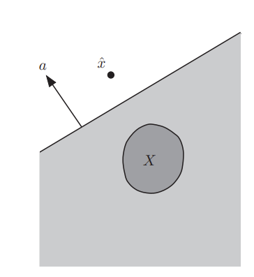

# 割平面法

## Reference

- https://www.cse.iitb.ac.in/~cs709/notes/readingAssignment/CuttingPlaneMethod.pdf
- https://web.stanford.edu/class/ee364b/lectures/localization_methods_notes.pdf
- https://www.math.cuhk.edu.hk/course_builder/1415/math3220/L5.pdf
- https://arxiv.org/pdf/2111.06257

在[凸包和有效不等式](..\IP_convex_hull_and_valid_ineq\README.md)
的内容里，我们已经介绍了割平面算法的思想，下面给出完整的算法框架形式.

## 1 算法概述  
考虑混合整数线性规划  
$$
z^* = \max \{ f(x) : x \in \mathcal{D} \} 
$$  
其中  
$$
f(x) = c^Tx, c\in\mathbb{R}^n\\
\mathcal{D} = \{ x \in \mathbb{R}^n_+\mid A x \leq b,\, ,\, x_j \in \mathbb{Z}_+,\, \forall j \in I \}.
$$

割平面算法通过构造逐渐收紧的凸多面体 $ \mathcal{S}_t $（包含真实可行集 $ \mathcal{D} $）来求解问题$\text{(P)}$，选择合适的割平面可以使$ \mathcal{S}_t $逐渐向$\text{conv}(\mathcal{D})$靠近.

**算法1 割平面法**  
1 **初始化**：$ t \leftarrow 0 $，$ \mathcal{S}_0 \supseteq \mathcal{D} $  
2 **循环**：$\\$
3 $\quad$ 令 $ \boldsymbol{x}_t \leftarrow \arg\min_{\boldsymbol{x} \in \mathcal{S}_t} f(\boldsymbol{x}) $  
4 $\quad$ 若 $ \boldsymbol{x}_t \in \mathcal{D} $，则终止；否则找到分离 $ \boldsymbol{x}_t $ 与 $ \mathcal{D} $ 的割平面 $ \langle \boldsymbol{a}, \boldsymbol{x} \rangle \leq \beta $  
5 $\quad$ $ \mathcal{S}_{t+1} \leftarrow \mathcal{S}_t \cap \{ \boldsymbol{x} \mid \langle \boldsymbol{a}, \boldsymbol{x} \rangle \leq \beta \} $  
6 $\quad$ $ t \leftarrow t + 1 $  
7 **结束循环**  

## 2 割平面如何选择？

### 1. 通用切割平面方法（General-purpose Cuts）  
- **Gomory方法**：  
  - Gomory分数切割用于求解纯整数线性规划，基于单纯形表，有限时间内收敛。后扩展出混合整数切割（GMI）处理MILP，是首个成功应用于MILP的通用切割平面法。但Gomory方法的数值问题限制了纯切割平面法的实际效果。  
- **其他通用切割**：  
  - **混合整数舍入（MIR）切割**：由Nemhauser和Wolsey提出，比GMI更通用，完整描述0-1多面体切割。  
  - **提升投影切割**：如Cook等提出的方法，将LP松弛提升到高维空间找有效切割，再投影回原空间。  

### 2. 问题特定切割（Problem-specific Cuts）  
- 针对问题结构设计更强不等式：  
  - **流覆盖切割**：Padberg等提出，基于节点流问题；Van Roy和Wolsey推广。  
  - **团切割**：Savelsbergh提出，用于冲突图（如Atamtürk等研究）。  
  - **背包覆盖切割**：Atamtürk提出，将约束视为分离背包问题，是首批融入商业MILP求解器的切割平面之一。  
  - **提升覆盖不等式**：van de Leensel等通过提升强化覆盖不等式，生成大量面定义不等式，用于通用分支切割算法。  

### 3. 现代求解器应用  
- 切割平面选择分阶段：先维持有效不等式，再提取切割收紧可行域。如CPLEX中，MIR切割最常用，其次是Gomory切割和背包覆盖切割。尽管通用切割平面受理论关注，但实际应用仍面临挑战，如Dey和Molinaro指出需解决切割平面选择与分析的理论问题。

<!-- ## 割平面法简介  
假设我们想要求解优化问题  
$$ \min \{ f(\boldsymbol{x}) \mid \boldsymbol{x} \in X \}\quad\text{(P)}, $$  
其中 $ X \subseteq \mathbb{R}^n $ 是凸集，$ f: \mathbb{R}^n \to \mathbb{R} $ 是凸函数，且假设最小值存在. 集合 $ X $ 只能通过即分离算法访问. 给定 $ \hat{\boldsymbol{x}} \in \mathbb{R}^n $，分离算法要么断言 $ \hat{\boldsymbol{x}} \in X $；要么返回一个超平面 $ \langle \boldsymbol{a}, \boldsymbol{x} \rangle \leq b $（称为割平面），将 $ \hat{\boldsymbol{x}} $ 与 $ X $ 分离，即 $ \langle \boldsymbol{a}, \hat{\boldsymbol{x}} \rangle > b $ 且对所有 $ \boldsymbol{x} \in X $ 有 $ \langle \boldsymbol{a}, \boldsymbol{x} \rangle \leq b $. 下图展示了这一过程: 割平面$ \langle \boldsymbol{a}, \boldsymbol{x} \rangle \leq b $将$ \hat{\boldsymbol{x}}$与$X$分离.
  

割平面算法通过构造逐渐收紧的凸多面体 $ X_t $（包含真实可行集 $ X $）来求解问题$\text{(P)}$，方法是从初始多面体 $ X_0 $ 中切割掉不可行部分（在一定容差范围内）. 当 $ \boldsymbol{x}_t \in X $ 时算法终止.    -->