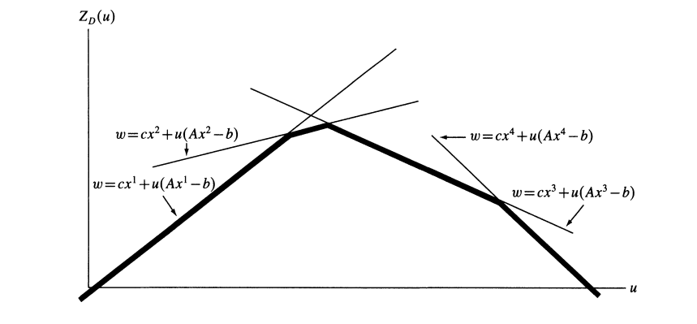

# 松弛

## Reference

- https://coral.ise.lehigh.edu/~ted/files/ie418/lectures/Lecture10.pdf
- https://my.ece.utah.edu/~kalla/phy_des/lagrange-relax-tutorial-fisher.pdf
- https://dabeenl.github.io/IE631_lecture19_note.pdf
- https://dabeenl.github.io/IE631_lecture20_note.pdf
  
 

## 1 松弛

我们考虑混合整数线性规划（MILP）：  
$$ 
z_{IP} = \max \{ c^{\top}x \mid x \in \mathcal{S} \}, 
$$（MILP）  
其中  
$$ 
\mathcal{P} = \{ x \in \mathbb{R}^n \mid Ax \leq b \} 
$$（FEAS-LP，可行线性规划）  
$$ 
\mathcal{S} = \mathcal{P} \cap (\mathbb{Z}_+^p \times \mathbb{R}_+^{n - p}) 
$$（FEAS-MIP，可行混合整数规划）  

**定义 1**：（MILP）的一个松弛是一个按如下方式定义的最大化问题：  
$$ z_R = \max \{ z_R(x) \mid x \in \mathcal{S}_R \} $$  
其具有以下两个性质：  
$$ \mathcal{S} \subseteq \mathcal{S}_R $$  
$$ c^{\top}x \leq z_R(x), \; \forall x \in \mathcal{S}. $$

对于最大化问题，松弛问题的最优值是原问题最优值的上界：
- **任取原问题可行解**：设 $x^*$ 是原问题 $P$ 的最优解，即 $x^* \in \mathcal{S}$，且 $c^\top x^* = \max \{ c^\top x \mid x \in \mathcal{S} \}$. 
- **验证松弛问题可行性**：由于 $\mathcal{S} \subseteq \mathcal{S}_R$，因此 $x^* \in \mathcal{S}_R$，即 $x^*$ 也是松弛问题 $R$ 的可行解. 
- **比较目标函数值**：根据松弛问题的性质，对任意 $x \in \mathcal{S}$，有 $c^\top x \leq z_R(x)$. 特别地，对 $x^*$ 有：  
  $$
  c^\top x^* \leq z_R(x^*)
  $$  
  而松弛问题的最优值 $z_R^*$ 满足 $z_R^* = \max \{ z_R(x) \mid x \in \mathcal{S}_R \} \geq z_R(x^*)$.   
  因此：  
  $$
  c^\top x^* \leq z_R(x^*) \leq z_R^*
  $$  
  即原问题最优解的目标函数值 $c^\top x^*$ 不超过松弛问题的最优值 $z_R^*$. 

## 获取和使用松弛问题
- **松弛问题的性质**
    - 如果混合整数线性规划（MILP）的松弛问题不可行，那么MILP本身也不可行. 
    - 如果$z_R(x)=c^{\top}x$， 那么对于$x^*\in\underset{x\in S_R}{\text{argmax}}z_R(x)$（即在$S_R$中使$z_R(x)$取得最大值的$x$），若$x^*\in\mathcal{S}$，则$x^*$是MILP的最优解. 
- 获得MILP松弛问题最简单的方法是放宽定义可行集$\mathcal{S}$的一些约束条件. 

## 2 LP松弛

### 一、定义  
LP松弛（线性规划松弛）是整数规划求解的关键技术. 针对整数规划（如混合整数线性规划MILP），其操作是移除变量的整数约束，将问题转化为普通线性规划（LP）. 例如，原问题要求变量$x \in \mathbb{Z}$（取整），LP松弛后允许$x \in \mathbb{R}$（取实数）. 

### 二、原理  
1. **可行域扩展**：去掉整数约束后，LP松弛的可行域包含原整数规划的可行域. 如整数规划中变量只能取整数值，松弛后可取对应区间内任意实数.   
2. **边界性质**：  
   - **最大化问题**：LP松弛的最优解是原整数规划最优解的上界（原问题最优值 ≤ 松弛解最优值）.   
   - **最小化问题**：LP松弛的最优解是原整数规划最优解的下界（原问题最优值 ≥ 松弛解最优值）. 

### 三、应用场景  
1. **分支定界算法**：  
   - 在分支定界算法中，LP 松弛常被用于计算子问题的边界. 当求解整数规划问题时，先求解其 LP 松弛问题，如果松弛问题的解恰好是整数解，那么很可能就是原整数规划的最优解；若不是整数解，则可以根据解的情况对问题进行分支，继续搜索最优解.   
2. **启发式算法辅助**：  
   - 松弛解的结构可启发构造整数可行解. 如车辆路径问题中，依松弛解的路径趋势构建初始路线.   
3. **问题分析**：  
   - 通过松弛解评估整数规划难度. 若松弛解与整数解差距小，说明问题约束紧密，整数解易逼近；反之则需更精细策略. 

### 四、示例  
**整数规划问题**：  
$$
\begin{align*}
\max &\quad 3x + 2y \\
\text{s.t.} &\quad x + y \leq 4 \\
&\quad 2x + y \leq 6 \\
&\quad x, y \geq 0, \; x, y \in \mathbb{Z}
\end{align*}
$$  
**LP松弛问题**：  
$$
\begin{align*}
\max &\quad 3x + 2y \\
\text{s.t.} &\quad x + y \leq 4 \\
&\quad 2x + y \leq 6 \\
&\quad x, y \geq 0
\end{align*}
$$  
求解LP松弛，得最优解$x=2, y=2$，目标值$10$. 此时解为整数，也是原整数规划的最优解. 若松弛解非整数，可据此对变量分支（如限定上下界）继续求解. 

## 3 Lagrainge 松弛

 
考虑如下混合整数规划问题：  
$$
\begin{aligned}
z_I = \max \quad & c^\top x \\
\text{s.t.} \quad & A x \leq b \\
& E x \leq f \\
& x \in \mathbb{Z}_+^d \times \mathbb{R}_+^p.
\end{aligned} \tag{MIP}
$$  
假设 $ E x \leq f $ 是“复杂约束”，即没有这些约束时优化问题更易求解. 更准确地说，假设如下形式的混合整数规划问题容易求解：  
$$
\begin{aligned}
\max \quad & c^\top x \\
\text{s.t.} \quad & A x \leq b \\
& x \in \mathbb{Z}_+^d \times \mathbb{R}_+^p.
\end{aligned}
$$  
定义集合$S$为：
$$
S = \left\{ x \in \mathbb{Z}_+^d \times \mathbb{R}_+^p : A x \leq b, Ex\leq f \right\}.
$$
定义集合 $ Q $ 为：  
$$
Q = \left\{ x \in \mathbb{Z}_+^d \times \mathbb{R}_+^p : A x \leq b \right\}.
$$  
假设 $ Q $ 非空，且 $ A, b $ 的元素为有理数. 设 $ E $ 的行数为 $ m $，取 $ \lambda \in \mathbb{R}_+^m $. 那么可定义（MIP）关于 $ \lambda $的拉格朗日松弛如下：  
$$
\begin{aligned}
z_{\text{LR}}(\lambda) = \max \quad & c^\top x + \lambda^\top (f - E x) \\
\text{s.t.} \quad & A x \leq b \\
& x \in \mathbb{Z}_+^d \times \mathbb{R}_+^p.
\end{aligned} \tag{LR}
$$  
**命题3.1** 对任意 $ \lambda \geq 0 $，有 $ z_{\text{LR}}(\lambda) \geq z_{\text{IP}} $.   
**证明** 设 $ x^* $ 是（MIP）的最优解，特别地，$ x^* $ 满足：  
$$
A x^* \leq b,\ E x^* \leq f,\ x^* \in \mathbb{Z}_+^d \times \mathbb{R}_+^p.
$$  
则 $ x^* $ 对拉格朗日松弛问题（LR）也可行. 此外，因 $ E x^* \leq f $ 且 $ \lambda \geq 0 $，有：  
$$
\lambda^\top (f - E x^*) \geq 0,
$$

这进而意味着  
$$
z_{\text{LR}}(\lambda) \geq c^\top x^* + \lambda^\top (f - E x^*) \geq c^\top x^* = z_I.
$$  
因此，对任意 $ \lambda \geq 0 $，均有 $ z_{\text{LR}}(\lambda) \geq z_{\text{IP}} $，得证. $\ \square$   

使用拉格朗日松弛的优势是什么？我们假设 $ E x \leq f $ 是复杂约束，那么求解 (LR) 比求解（MIP）更容易. 此外，命题19.1表明，拉格朗日松弛（LR）为（MIP）提供了有效的上界.   

接下来，定义混合整数规划（MIP）的拉格朗日对偶：  
$$
z_{\text{LD}} = \min \{ z_{\text{LR}}(\lambda) : \lambda \geq 0 \}. \tag{LD}
$$  
因此，$ z_{\text{LD}} $ 是通过拉格朗日松弛能得到的（MIP）的最佳/最紧上界.   

**定理3.2** $ z_{\text{LD}} $ 满足：  
$$
z_{LD} = \max \left\{ c^\top x : E x \leq f,\, x \in \text{conv}(Q) \right\}.
$$  
**证明** 由于 $ Q $ 是由 $ A x \leq b $（一个有理数线性不等式组）定义的混合整数集合，根据迈耶定理可得：  
$$
\text{conv}(Q) = \left\{ x \in \mathbb{R}^d \times \mathbb{R}^p : A' x \leq b' \right\},
$$  
其中 $ A', b' $ 元素为有理数. 首先，注意到：  
$$
\begin{aligned}
z_{\text{LR}}(\lambda) 
&= \max \left\{ c^\top x + \lambda^\top (f - E x) : x \in Q \right\} \\
&= \max \left\{ c^\top x + \lambda^\top (f - E x) : x \in \text{conv}(Q) \right\} \\
&= \max \left\{ c^\top x + \lambda^\top (f - E x) : A' x \leq b' \right\},
\end{aligned}
$$  
其中第二个等式由[凸包和有效不等式](..\IP_convex_hull_and_valid_ineq\README.md)的引理 1.5给出. 根据线性规划的强对偶性：  
$$
\begin{aligned}
z_{\text{LR}}(\lambda) 
&= \min \quad b'^\top \mu + f^\top \lambda \\
&\ \ \ \ \text{s.t.} \quad A'^\top \mu = c - E^\top \lambda \\
&\quad\quad\quad \mu \in \mathbb{R}_+^{m'},
\end{aligned}
$$  
其中 $ m' $ 是 $ A' $ 的行数. 
即使 $ z_{\text{LR}}(\lambda) $ 无界，此等式仍成立. 
> 引入对偶变量 $\mu \geq 0$，构造拉格朗日函数：  
>$$
L(x,\{\mu\}) =  c^\top x + \lambda^\top (f - E x)+\mu^T(b'-A'x).
$$   
>- 对 $x$求偏导：$\frac{\partial L}{\partial x}=c- E^T\lambda-A'\mu^T=0$.$\\$

> 因此，$\max_x L(x,\mu)=b'^T\mu+f^T\lambda$. 则

>对偶问题为 $\min_{\mu}\max_x L(x,\mu) = \min_{\mu}b'^T\mu+f^T\lambda\quad \text{s.t.}A'^\top \mu = c - E^\top \lambda, \mu\geq 0$.
 

于是有：  
$$
\begin{aligned}
z_{\text{LD}}=\min_{\lambda\geq 0}z_{\text{LR}}(\lambda) 
&= \min_{\lambda,\mu} \quad b'^\top \mu + f^\top \lambda \\
&\ \ \ \ \text{s.t.} \quad A'^\top \mu + E^\top \lambda = c \\
&\quad\quad\quad \mu \in \mathbb{R}_+^{m'},\, \lambda \in \mathbb{R}_+^m.
\end{aligned}
$$  

再次根据强线性规划对偶性：  
$$
\begin{aligned}
z_{\text{LD}} 
&= \max \quad c^\top x \\
&\ \ \ \ \text{s.t.} \quad A' x \leq b' \\
&\quad\quad\quad E x \leq f
\end{aligned}
$$

> 引入对偶变量 $x$，构造拉格朗日函数：  
>$$
L(\lambda,\mu,\{x\}) =  b'^\top \mu + f^\top \lambda+x^T(c- E^T\lambda-A'\mu^T)\\
=c^Tx-\mu^T(A'^Tx-b')-\lambda^T(Ex-f).
$$   

> 因此，当$A'^Tx\leq b'$以及$Ex\leq f$时，$\min_{\lambda\geq 0,\mu\geq 0} L(\lambda,\mu,\{x\})=c^Tx$，否则$\min_{\lambda\geq 0,\mu\geq 0} L(\lambda,\mu,\{x\})=-\infty$. 

>对偶问题为 $\max_{x}\min_{\lambda\geq 0,\mu\geq 0} L(\lambda,\mu,\{x\}) = c^Tx \quad \text{s.t.}A'^Tx\leq b', Ex\leq f$.

因此, $z_{LD} = \max \left\{ c^\top x : E x \leq f,\, x \in \text{conv}(Q) \right\}$. $\ \square$

根据 Minkowski-Weyl定理，$\text{conv}(Q)$ 可表示为  
$$
\text{conv}(Q) = \text{conv}\{v^1, \dots, v^n\} + \text{cone}\{r^1, \dots, r^t\},
$$  
其中 $v^1, \dots, v^n$ 是 $\text{conv}(Q)$ 的极点，$r^1, \dots, r^t$ 是 $\text{conv}(Q)$ 的极射线.   

**引理 3.3** $z_{\text{LR}}(\lambda)$ 的定义域为  
$$
\text{dom}(z_{\text{LR}}) = \left\{ \lambda \in \mathbb{R}_+^m : (c - E^\top \lambda)^\top r^j \leq 0,\ \forall j \in [t] \right\}.
$$  
**证明** 注意到 $z_{\text{LR}}(\lambda)$ 有限当且仅当对所有 $j \in [t]$，有 $(c - E^\top \lambda)^\top r^j \leq 0$.   

**定理 3.4** 在 $\text{dom}(z_{\text{LR}})$ 上，$z_{\text{LR}}$ 是关于 $\lambda$ 的凸分段线性函数.   
**证明** 设 $\lambda \in \text{dom}(z_{\text{LR}})$. 由于  
$$
z_{\text{LR}}(\lambda) = \max\left\{ c^\top x + \lambda^\top (f - Ex) : x \in \text{conv}(Q) \right\},
$$  
且对所有 $j \in [t]$，有 $(c - E^\top \lambda)^\top r^j \leq 0$，可得  
$$
z_{\text{LR}}(\lambda) = \max\left\{ f^\top \lambda + (c - E^\top \lambda)^\top v^j : j \in [n] \right\}.
$$  
因此，$z_{\text{LR}}(\lambda)$ 是线性函数 $c^\top v^j + (f - Ev^j)^\top \lambda$（$j \in [n]$）的最大值. 故 $z_{\text{LR}}(\lambda)$ 是凸分段线性函数.   

**定理 3.5** 设 $z_{\text{LP}}$ 为（MIP）的线性规划松弛最优值，则 $z_{\text{IP}}  \leq z_{\text{LD}} \leq z_{\text{LP}}$.   
**证明** 
由命题3.1，可得$z_{IP}\leq z_{LD}$.$\\$
设$X=\{x\in\mathbb{R}^m_+:Ax\leq b\},H=\{x\in\mathbb{R}^m_+:Ex\leq f\}$
$$
\begin{aligned}
z_{LD}&=\min_{\lambda} z_{LR}(\lambda)\leq \min_{\lambda}\max_{x\in Q} c^Tx+ \lambda^T(f-Ex)\\
&\leq \min_{\lambda}\max_{x\in X} c^Tx+\lambda^T(f-Ex)\\
&\leq \max_{x\in X\cap H}c^Tx=z_{LP}
\end{aligned}
$$ 
最后一个不等式是因为对于任意$x\in X$以及$\lambda\geq 0$，有$\lambda^T(Ex-f)$，如果$x\in H(Ex\leq f)$，那么$\lambda^T(f-Ex)\geq 0$.

**定理 3.6** 若 $\text{conv}(Q) = \left\{ x : Ax \leq b \, x \in \mathbb{R}_+^d \times \mathbb{R}_+^p\right\}$，则 $z_{\text{LD}} = z_{\text{LP}}$. 

<!-- 整数规划问题(P)的标准形式为：  
$$
\begin{array}{rlrl} 
Z = \min_x & c x & \\ 
\text{s.t.} & A x & = b, & \\ 
& D x & \leq e & \\ 
& x & \geq 0 \text{ 且为整数}. & (P) 
\end{array}
$$  
其中，$x$ 为决策变量向量，$A x = b$ 和 $D x \leq e$ 分别为等式与不等式约束. 通过对偶化等式约束 $A x = b$，构造拉格朗日松弛问题：  
$$
\begin{array}{ll} 
Z_D(u) = \min_x & c x + u^T(A x - b), \\ 
& D x \leq e, \\ 
& x \geq 0 \text{ 且为整数}, \quad (LR_u) 
\end{array}
$$  
其中 $u$ 为拉格朗日乘子向量. 松弛问题 $(LR_u)$ 的最优值 $Z_D(u)$ 是原问题最优值的下界（$Z_D(u) \leq Z$）. 设原问题最优解为 $x^*$，则$Ax^*=b$，$Dx^*\leq e$, $x\geq 0$且为整数，则有 
$$
Z_D(u) \leq c x^* + u^T(A x^* - b) = Z
$$  
若原约束包含不等式（如 $A x \leq b$），则要求$u \geq 0$ 以确保下界成立.   -->

### 确定拉格朗日乘子$\lambda$  

根据对偶理论，$\lambda$ 的最佳选择是对偶问题的一个最优解：  
$$
Z_{LD} = \min_{\lambda} Z_{LR}(\lambda)
$$  
 
假设可行解集$Q$是有限的，可表示为$Q = \{x^t \mid t = 1, \ldots, T\}$

由于$Q$有限，$\max_x$操作等价于在所有$x^t \in X$中取最大值. 因此，对偶问题可重新表述为：  
   $$
   \begin{aligned}
   Z_{LD} &=\min_{\lambda} \max_x \{c^T x + \lambda^T(Ex - f)\}\\
   &=\min_{\lambda} \> w,\,\text{s.t.}\ w \geq c^Tx^t + \lambda^T(Ex^t - f),\ t = 1, \dots, T.\quad （\overline{\text{LD}}）
   \end{aligned}
   $$  
   其中$w$是新引入的变量，约束条件确保$w$不超过每个$x^t$对应的目标函数值. 这将问题转化为具有$T$个约束的线性规划，其最优解$w^*$即为原对偶问题的最优值$z_{LD}$. 这种转化利用了$X$的有限性，将非光滑的对偶函数优化问题转化为线性规划问题.

 问题（$\overline{\text{LD}}$）表明，$Z_{LR}(\lambda)$是有限个线性函数族的下包络. 下图展示了$m = 1$且$T = 4$时$Z_{LR}(\lambda)$的形式. 函数$Z_{LR}(\lambda)$具备连续性和凹性等优良性质，这些性质让爬山算法易于应用，除了一个例外——可微性. 尽管$Z_{LR}(\lambda)$几乎处处可微，但在最优点处通常不可微.  

<!-- （$\bar{\text{D}}$）的线性规划对偶问题是一个有许多列的线性规划：  
$$
\begin{aligned}
Z_D &= \min \sum_{t=1}^T \lambda_t c x^t, \\
&\sum_{t=1}^T \lambda_t A x^t = b, \\
&\sum_{t=1}^T \lambda_t = 1, \\
&\lambda_t \geq 0,\quad t = 1, \dots, T. \quad (\bar{\text{P}})
\end{aligned}
$$  
> 引入对偶变量 $\lambda_t \geq 0$（对应每个约束 $t$），构造拉格朗日函数：  
>$$
L(u, w, \{\lambda_t\}) = w + \sum_{t=1}^T \lambda_t \big(-w + cx^{t} + u^T(Ax^{t} - b)\big).
$$   
>- 对 $w$求偏导：$\frac{\partial L}{\partial w}=1- \sum_{t=1}^T \lambda_t$.   
>- 对 $u$求偏导：$\frac{\partial L}{\partial u}=\sum_{t=1}^T \lambda_t (Ax^{t} - b) = 0$.    -->

**确定拉格朗日乘子$\lambda$方法总结**：
以下是三类主要方法：  

1. **使用次梯度法求解(D)的最优解**  
   - **迭代公式**：  
     $$
     u^{k+1} = u^k + t_k (A x^k - b)
     $$  
     其中$x^k$是当前乘子$u^k$下松弛问题的最优解，$t_k$为步长.   
   - **步长选择**：  
     $$
     t_k = \frac{\lambda_k (Z^* - Z_D(u^k))}{\|A x^k - b\|^2}
     $$  
     $Z^*$为原问题上界，$\lambda_k$通常取2并逐步减半以平衡收敛速度与稳定性.   
   - **特点**：易实现且广泛应用，但无法保证最优性，需通过迭代次数限制终止.   

2. **使用单纯形法（列生成技术）求解问题(D)的最优解**  
   - 将对偶问题转化为线性规划形式$(\overline{\text{LD}})$，通过列生成技术求解.   
   - 包括对偶单纯形法、原始-对偶法及BOXSTEP方法，需结合松弛问题的结构特性设计.   
   - 计算复杂度较高，但可与次梯度法结合用于优化后期阶段.   

3. **乘数调整法**  
   - 针对特定问题设计调整方向（如单变量调整），利用结构信息加速收敛.   
   - 例如，广义分配问题中每次调整一个乘子，显著提升算法效率.   
   - 需根据问题特性选择调整方向集$S$，平衡搜索空间与计算成本.   