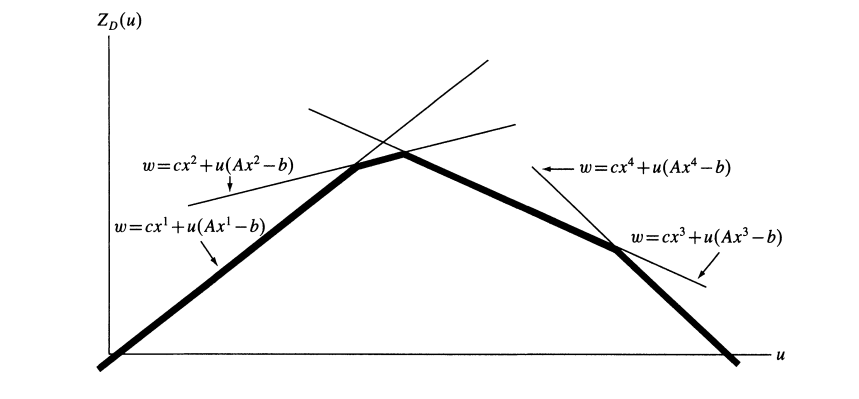

松弛
====

Reference

---------

-  https://coral.ise.lehigh.edu/~ted/files/ie418/lectures/Lecture10.pdf

-  https://my.ece.utah.edu/~kalla/phy_des/lagrange-relax-tutorial-fisher.pdf

-  https://dabeenl.github.io/IE631_lecture19_note.pdf

-  https://dabeenl.github.io/IE631_lecture20_note.pdf

.. _松弛-1:

1 松弛

------

| 我们考虑混合整数线性规划（MILP）：

| 

  .. math::

      

     z_{IP} = \max \{ c^{\top}x \mid x \in \mathcal{S} \}, 

  \ （MILP）

| 其中

| 

  .. math::

      

     \mathcal{P} = \{ x \in \mathbb{R}^n \mid Ax \leq b \} 

  \ （FEAS-LP，可行线性规划）

| 

  .. math::

      

     \mathcal{S} = \mathcal{P} \cap (\mathbb{Z}_+^p \times \mathbb{R}_+^{n - p}) 

  \ （FEAS-MIP，可行混合整数规划）

| **定义 1**\ ：（MILP）的一个松弛是一个按如下方式定义的最大化问题：

| 

  .. math::  z_R = \max \{ z_R(x) \mid x \in \mathcal{S}_R \} 

| 其具有以下两个性质：

| 

  .. math::  \mathcal{S} \subseteq \mathcal{S}_R 

| 

  .. math::  c^{\top}x \leq z_R(x), \; \forall x \in \mathcal{S}. 

| 对于最大化问题，松弛问题的最优值是原问题最优值的上界： -

  **任取原问题可行解**\ ：设 :math:`x^*` 是原问题 :math:`P` 的最优解，即

  :math:`x^* \in \mathcal{S}`\ ，且

  :math:`c^\top x^* = \max \{ c^\top x \mid x \in \mathcal{S} \}`. -

  **验证松弛问题可行性**\ ：由于

  :math:`\mathcal{S} \subseteq \mathcal{S}_R`\ ，因此

  :math:`x^* \in \mathcal{S}_R`\ ，即 :math:`x^*` 也是松弛问题 :math:`R`

  的可行解. - **比较目标函数值**\ ：根据松弛问题的性质，对任意

  :math:`x \in \mathcal{S}`\ ，有 :math:`c^\top x \leq z_R(x)`.

  特别地，对 :math:`x^*` 有：

| 

  .. math::

       c^\top x^* \leq z_R(x^*)

       

| 而松弛问题的最优值 :math:`z_R^*` 满足

  :math:`z_R^* = \max \{ z_R(x) \mid x \in \mathcal{S}_R \} \geq z_R(x^*)`.

| 因此：

| 

  .. math::

       c^\top x^* \leq z_R(x^*) \leq z_R^*

       

| 即原问题最优解的目标函数值 :math:`c^\top x^*` 不超过松弛问题的最优值

  :math:`z_R^*`.

获取和使用松弛问题

------------------

-  **松弛问题的性质**

   -  如果混合整数线性规划（MILP）的松弛问题不可行，那么MILP本身也不可行.

   -  如果\ :math:`z_R(x)=c^{\top}x`\ ，

      那么对于\ :math:`x^*\in\underset{x\in S_R}{\text{argmax}}z_R(x)`\ （即在\ :math:`S_R`\ 中使\ :math:`z_R(x)`\ 取得最大值的\ :math:`x`\ ），若\ :math:`x^*\in\mathcal{S}`\ ，则\ :math:`x^*`\ 是MILP的最优解.

-  获得MILP松弛问题最简单的方法是放宽定义可行集\ :math:`\mathcal{S}`\ 的一些约束条件.

2 LP松弛

--------

一、定义

~~~~~~~~

LP松弛（线性规划松弛）是整数规划求解的关键技术.

针对整数规划（如混合整数线性规划MILP），其操作是移除变量的整数约束，将问题转化为普通线性规划（LP）.

例如，原问题要求变量\ :math:`x \in \mathbb{Z}`\ （取整），LP松弛后允许\ :math:`x \in \mathbb{R}`\ （取实数）.

二、原理

~~~~~~~~

1. **可行域扩展**\ ：去掉整数约束后，LP松弛的可行域包含原整数规划的可行域.

   如整数规划中变量只能取整数值，松弛后可取对应区间内任意实数.

2. **边界性质**\ ：

   -  **最大化问题**\ ：LP松弛的最优解是原整数规划最优解的上界（原问题最优值

      ≤ 松弛解最优值）.

   -  **最小化问题**\ ：LP松弛的最优解是原整数规划最优解的下界（原问题最优值

      ≥ 松弛解最优值）.

三、应用场景

~~~~~~~~~~~~

1. **分支定界算法**\ ：

   -  在分支定界算法中，LP 松弛常被用于计算子问题的边界.

      当求解整数规划问题时，先求解其 LP

      松弛问题，如果松弛问题的解恰好是整数解，那么很可能就是原整数规划的最优解；若不是整数解，则可以根据解的情况对问题进行分支，继续搜索最优解.

2. **启发式算法辅助**\ ：

   -  松弛解的结构可启发构造整数可行解.

      如车辆路径问题中，依松弛解的路径趋势构建初始路线.

3. **问题分析**\ ：

   -  通过松弛解评估整数规划难度.

      若松弛解与整数解差距小，说明问题约束紧密，整数解易逼近；反之则需更精细策略.

四、示例

~~~~~~~~

| **整数规划问题**\ ：

| 

  .. math::

     \begin{align*}

     \max &\quad 3x + 2y \\

     \text{s.t.} &\quad x + y \leq 4 \\

     &\quad 2x + y \leq 6 \\

     &\quad x, y \geq 0, \; x, y \in \mathbb{Z}

     \end{align*}

| **LP松弛问题**\ ：

| 

  .. math::

     \begin{align*}

     \max &\quad 3x + 2y \\

     \text{s.t.} &\quad x + y \leq 4 \\

     &\quad 2x + y \leq 6 \\

     &\quad x, y \geq 0

     \end{align*}

| 求解LP松弛，得最优解\ :math:`x=2, y=2`\ ，目标值\ :math:`10`.

  此时解为整数，也是原整数规划的最优解.

  若松弛解非整数，可据此对变量分支（如限定上下界）继续求解.

3 Lagrainge 松弛

----------------

考虑如下混合整数规划问题：

.. math::

   \begin{aligned}

   z_I = \max \quad & c^\top x \\

   \text{s.t.} \quad & A x \leq b \\

   & E x \leq f \\

   & x \in \mathbb{Z}_+^d \times \mathbb{R}_+^p.

   \end{aligned} \tag{MIP}

假设 $ E x :raw-latex:`\leq `f $

是“复杂约束”，即没有这些约束时优化问题更易求解.

更准确地说，假设如下形式的混合整数规划问题容易求解：

.. math::

   \begin{aligned}

   \max \quad & c^\top x \\

   \text{s.t.} \quad & A x \leq b \\

   & x \in \mathbb{Z}_+^d \times \mathbb{R}_+^p.

   \end{aligned}

定义集合\ :math:`S`\ 为：

.. math::

   S = \left\{ x \in \mathbb{Z}_+^d \times \mathbb{R}_+^p : A x \leq b, Ex\leq f \right\}.

定义集合 $ Q $ 为：

.. math::

   Q = \left\{ x \in \mathbb{Z}_+^d \times \mathbb{R}_+^p : A x \leq b \right\}.

假设 $ Q $ 非空，且 $ A, b $ 的元素为有理数. 设 $ E $ 的行数为 $ m $，取

$ :raw-latex:`\lambda `:raw-latex:`\in `:raw-latex:`\mathbb{R}`\_+^m $.

那么可定义（MIP）关于 $

:raw-latex:`\lambda `\ :math:`的拉格朗日松弛如下：`\ $

.. raw:: latex

   \begin{aligned}

   z_{\text{LR}}(\lambda) = \max \quad & c^\top x + \lambda^\top (f - E x) \\

   \text{s.t.} \quad & A x \leq b \\

   & x \in \mathbb{Z}_+^d \times \mathbb{R}_+^p.

   \end{aligned} \tag{LR}

.. math::

     

   **命题3.1** 对任意 $ \lambda \geq 0 $，有 $ z_{\text{LR}}(\lambda) \geq z_{\text{IP}} $.   

   **证明** 设 $ x^* $ 是（MIP）的最优解，特别地，$ x^* $ 满足：  

A x^\* :raw-latex:`\leq `b, E x\ :sup:`\* :raw-latex:`\leq `f, x`\ \*

:raw-latex:`\in `:raw-latex:`\mathbb{Z}`\ *+^d

:raw-latex:`\times `:raw-latex:`\mathbb{R}`*\ +^p.

.. math::

     

   则 $ x^* $ 对拉格朗日松弛问题（LR）也可行. 此外，因 $ E x^* \leq f $ 且 $ \lambda \geq 0 $，有：  

:raw-latex:`\lambda`^:raw-latex:`\top `(f - E x^\*) :raw-latex:`\geq 0`,

$$

| 这进而意味着

| 

  .. math::

     z_{\text{LR}}(\lambda) \geq c^\top x^* + \lambda^\top (f - E x^*) \geq c^\top x^* = z_I.

| 因此，对任意 $ :raw-latex:`\lambda `:raw-latex:`\geq 0` $，均有 $

  z\_{:raw-latex:`\text{LR}`}(:raw-latex:`\lambda`)

  :raw-latex:`\geq `z\_{:raw-latex:`\text{IP}`} $，得证.

  :math:`\ \square`

使用拉格朗日松弛的优势是什么？我们假设 $ E x :raw-latex:`\leq `f $

是复杂约束，那么求解 (LR) 比求解（MIP）更容易.

此外，命题19.1表明，拉格朗日松弛（LR）为（MIP）提供了有效的上界.

| 接下来，定义混合整数规划（MIP）的拉格朗日对偶：

| 

  .. math::

     z_{\text{LD}} = \min \{ z_{\text{LR}}(\lambda) : \lambda \geq 0 \}. \tag{LD}

| 因此，$ z\_{:raw-latex:`\text{LD}`} $

  是通过拉格朗日松弛能得到的（MIP）的最佳/最紧上界.

**定理3.2** $ z\_{:raw-latex:`\text{LD}`} $ 满足：

.. math::

   z_{LD} = \max \left\{ c^\top x : E x \leq f,\, x \in \text{conv}(Q) \right\}.

**证明** 由于 $ Q $ 是由 $ A x :raw-latex:`\leq `b

:math:`（一个有理数线性不等式组）定义的混合整数集合，根据迈耶定理可得：`\ $

:raw-latex:`\text{conv}`(Q) = :raw-latex:`\left`{ x

:raw-latex:`\in `:raw-latex:`\mathbb{R}`^d

:raw-latex:`\times `:raw-latex:`\mathbb{R}`^p : A’ x

:raw-latex:`\leq `b’ :raw-latex:`\right`},

.. math::

     

   其中 $ A', b' $ 元素为有理数. 首先，注意到：  

.. raw:: latex

   \begin{aligned}

   z_{\text{LR}}(\lambda) 

   &= \max \left\{ c^\top x + \lambda^\top (f - E x) : x \in Q \right\} \\

   &= \max \left\{ c^\top x + \lambda^\top (f - E x) : x \in \text{conv}(Q) \right\} \\

   &= \max \left\{ c^\top x + \lambda^\top (f - E x) : A' x \leq b' \right\},

   \end{aligned}

.. math::

     

   其中第二个等式由[凸包和有效不等式](..\IP_convex_hull_and_valid_ineq\README.md)的引理 1.5给出. 根据线性规划的强对偶性：  

.. raw:: latex

   \begin{aligned}

   z_{\text{LR}}(\lambda) 

   &= \min \quad b'^\top \mu + f^\top \lambda \\

   &\ \ \ \ \text{s.t.} \quad A'^\top \mu = c - E^\top \lambda \\

   &\quad\quad\quad \mu \in \mathbb{R}_+^{m'},

   \end{aligned}

| 

  .. math::

       

     其中 $ m' $ 是 $ A' $ 的行数. 

     即使 $ z_{\text{LR}}(\lambda) $ 无界，此等式仍成立. 

     > 引入对偶变量 $\mu \geq 0$，构造拉格朗日函数：  

     >

  L(x,{:raw-latex:`\mu`}) = c^:raw-latex:`\top `x +

  :raw-latex:`\lambda`^:raw-latex:`\top `(f - E

  x)+:raw-latex:`\mu`^T(b’-A’x). $$

| >- 对

  :math:`x`\ 求偏导：\ :math:`\frac{\partial L}{\partial x}=c- E^T\lambda-A'\mu^T=0`.\ :math:`\\`

   因此，\ :math:`\max_x L(x,\mu)=b'^T\mu+f^T\lambda`. 则

..

   对偶问题为

   :math:`\min_{\mu}\max_x L(x,\mu) = \min_{\mu}b'^T\mu+f^T\lambda\quad \text{s.t.}A'^\top \mu = c - E^\top \lambda, \mu\geq 0`.

| 于是有：

| 

  .. math::

     \begin{aligned}

     z_{\text{LD}}=\min_{\lambda\geq 0}z_{\text{LR}}(\lambda) 

     &= \min_{\lambda,\mu} \quad b'^\top \mu + f^\top \lambda \\

     &\ \ \ \ \text{s.t.} \quad A'^\top \mu + E^\top \lambda = c \\

     &\quad\quad\quad \mu \in \mathbb{R}_+^{m'},\, \lambda \in \mathbb{R}_+^m.

     \end{aligned}

| 再次根据强线性规划对偶性：

| 

  .. math::

     \begin{aligned}

     z_{\text{LD}} 

     &= \max \quad c^\top x \\

     &\ \ \ \ \text{s.t.} \quad A' x \leq b' \\

     &\quad\quad\quad E x \leq f

     \end{aligned}

   | 引入对偶变量 :math:`x`\ ，构造拉格朗日函数：

   | 

     .. math::

        L(\lambda,\mu,\{x\}) =  b'^\top \mu + f^\top \lambda+x^T(c- E^T\lambda-A'\mu^T)\\

        =c^Tx-\mu^T(A'^Tx-b')-\lambda^T(Ex-f).

..

   因此，当\ :math:`A'^Tx\leq b'`\ 以及\ :math:`Ex\leq f`\ 时，\ :math:`\min_{\lambda\geq 0,\mu\geq 0} L(\lambda,\mu,\{x\})=c^Tx`\ ，否则\ :math:`\min_{\lambda\geq 0,\mu\geq 0} L(\lambda,\mu,\{x\})=-\infty`.

   对偶问题为

   :math:`\max_{x}\min_{\lambda\geq 0,\mu\geq 0} L(\lambda,\mu,\{x\}) = c^Tx \quad \text{s.t.}A'^Tx\leq b', Ex\leq f`.

因此,

:math:`z_{LD} = \max \left\{ c^\top x : E x \leq f,\, x \in \text{conv}(Q) \right\}`.

:math:`\ \square`

| 根据 Minkowski-Weyl定理，\ :math:`\text{conv}(Q)` 可表示为

| 

  .. math::

     \text{conv}(Q) = \text{conv}\{v^1, \dots, v^n\} + \text{cone}\{r^1, \dots, r^t\},

| 其中 :math:`v^1, \dots, v^n` 是 :math:`\text{conv}(Q)`

  的极点，\ :math:`r^1, \dots, r^t` 是 :math:`\text{conv}(Q)` 的极射线.

| **引理 3.3** :math:`z_{\text{LR}}(\lambda)` 的定义域为

| 

  .. math::

     \text{dom}(z_{\text{LR}}) = \left\{ \lambda \in \mathbb{R}_+^m : (c - E^\top \lambda)^\top r^j \leq 0,\ \forall j \in [t] \right\}.

| **证明** 注意到 :math:`z_{\text{LR}}(\lambda)` 有限当且仅当对所有

  :math:`j \in [t]`\ ，有 :math:`(c - E^\top \lambda)^\top r^j \leq 0`.

| **定理 3.4** 在 :math:`\text{dom}(z_{\text{LR}})`

  上，\ :math:`z_{\text{LR}}` 是关于 :math:`\lambda` 的凸分段线性函数.

| **证明** 设 :math:`\lambda \in \text{dom}(z_{\text{LR}})`. 由于

| 

  .. math::

     z_{\text{LR}}(\lambda) = \max\left\{ c^\top x + \lambda^\top (f - Ex) : x \in \text{conv}(Q) \right\},

| 且对所有 :math:`j \in [t]`\ ，有

  :math:`(c - E^\top \lambda)^\top r^j \leq 0`\ ，可得

| 

  .. math::

     z_{\text{LR}}(\lambda) = \max\left\{ f^\top \lambda + (c - E^\top \lambda)^\top v^j : j \in [n] \right\}.

| 因此，\ :math:`z_{\text{LR}}(\lambda)` 是线性函数

  :math:`c^\top v^j + (f - Ev^j)^\top \lambda`\ （\ :math:`j \in [n]`\ ）的最大值.

  故 :math:`z_{\text{LR}}(\lambda)` 是凸分段线性函数.

| **定理 3.5** 设 :math:`z_{\text{LP}}`

  为（MIP）的线性规划松弛最优值，则

  :math:`z_{\text{IP}}  \leq z_{\text{LD}} \leq z_{\text{LP}}`.

| **证明** 由命题3.1，可得\ :math:`z_{IP}\leq z_{LD}`.\ :math:`\\`

  设\ :math:`X=\{x\in\mathbb{R}^m_+:Ax\leq b\},H=\{x\in\mathbb{R}^m_+:Ex\leq f\}`

  .. math::

     \begin{aligned}

     z_{LD}&=\min_{\lambda} z_{LR}(\lambda)\leq \min_{\lambda}\max_{x\in Q} c^Tx+ \lambda^T(f-Ex)\\

     &\leq \min_{\lambda}\max_{x\in X} c^Tx+\lambda^T(f-Ex)\\

     &\leq \max_{x\in X\cap H}c^Tx=z_{LP}

     \end{aligned}

  最后一个不等式是因为对于任意\ :math:`x\in X`\ 以及\ :math:`\lambda\geq 0`\ ，有\ :math:`\lambda^T(Ex-f)`\ ，如果\ :math:`x\in H(Ex\leq f)`\ ，那么\ :math:`\lambda^T(f-Ex)\geq 0`.

**定理 3.6** 若

:math:`\text{conv}(Q) = \left\{ x : Ax \leq b \, x \in \mathbb{R}_+^d \times \mathbb{R}_+^p\right\}`\ ，则

:math:`z_{\text{LD}} = z_{\text{LP}}`.

.. raw:: html

   <!-- 整数规划问题(P)的标准形式为：  

   $$

   \begin{array}{rlrl} 

   Z = \min_x & c x & \\ 

   \text{s.t.} & A x & = b, & \\ 

   & D x & \leq e & \\ 

   & x & \geq 0 \text{ 且为整数}. & (P) 

   \end{array}

   $$  

   其中，$x$ 为决策变量向量，$A x = b$ 和 $D x \leq e$ 分别为等式与不等式约束. 通过对偶化等式约束 $A x = b$，构造拉格朗日松弛问题：  

   $$

   \begin{array}{ll} 

   Z_D(u) = \min_x & c x + u^T(A x - b), \\ 

   & D x \leq e, \\ 

   & x \geq 0 \text{ 且为整数}, \quad (LR_u) 

   \end{array}

   $$  

   其中 $u$ 为拉格朗日乘子向量. 松弛问题 $(LR_u)$ 的最优值 $Z_D(u)$ 是原问题最优值的下界（$Z_D(u) \leq Z$）. 设原问题最优解为 $x^*$，则$Ax^*=b$，$Dx^*\leq e$, $x\geq 0$且为整数，则有 

   $$

   Z_D(u) \leq c x^* + u^T(A x^* - b) = Z

   $$  

   若原约束包含不等式（如 $A x \leq b$），则要求$u \geq 0$ 以确保下界成立.   -->

确定拉格朗日乘子\ :math:`\lambda`

~~~~~~~~~~~~~~~~~~~~~~~~~~~~~~~~~

| 根据对偶理论，\ :math:`\lambda` 的最佳选择是对偶问题的一个最优解：

| 

  .. math::

     Z_{LD} = \min_{\lambda} Z_{LR}(\lambda)

假设可行解集\ :math:`Q`\ 是有限的，可表示为\ :math:`Q = \{x^t \mid t = 1, \ldots, T\}`

| 由于\ :math:`Q`\ 有限，\ :math:`\max_x`\ 操作等价于在所有\ :math:`x^t \in X`\ 中取最大值.

  因此，对偶问题可重新表述为：

| 

  .. math::

        \begin{aligned}

        Z_{LD} &=\min_{\lambda} \max_x \{c^T x + \lambda^T(Ex - f)\}\\

        &=\min_{\lambda} \> w,\,\text{s.t.}\ w \geq c^Tx^t + \lambda^T(Ex^t - f),\ t = 1, \dots, T.\quad （\overline{\text{LD}}）

        \end{aligned}

        

| 其中\ :math:`w`\ 是新引入的变量，约束条件确保\ :math:`w`\ 不超过每个\ :math:`x^t`\ 对应的目标函数值.

  这将问题转化为具有\ :math:`T`\ 个约束的线性规划，其最优解\ :math:`w^*`\ 即为原对偶问题的最优值\ :math:`z_{LD}`.

  这种转化利用了\ :math:`X`\ 的有限性，将非光滑的对偶函数优化问题转化为线性规划问题.

| 问题（\ :math:`\overline{\text{LD}}`\ ）表明，\ :math:`Z_{LR}(\lambda)`\ 是有限个线性函数族的下包络.

  下图展示了\ :math:`m = 1`\ 且\ :math:`T = 4`\ 时\ :math:`Z_{LR}(\lambda)`\ 的形式.

  函数\ :math:`Z_{LR}(\lambda)`\ 具备连续性和凹性等优良性质，这些性质让爬山算法易于应用，除了一个例外——可微性.

  尽管\ :math:`Z_{LR}(\lambda)`\ 几乎处处可微，但在最优点处通常不可微.

| |alt text|

.. raw:: html

   <!-- （$\bar{\text{D}}$）的线性规划对偶问题是一个有许多列的线性规划：  

   $$

   \begin{aligned}

   Z_D &= \min \sum_{t=1}^T \lambda_t c x^t, \\

   &\sum_{t=1}^T \lambda_t A x^t = b, \\

   &\sum_{t=1}^T \lambda_t = 1, \\

   &\lambda_t \geq 0,\quad t = 1, \dots, T. \quad (\bar{\text{P}})

   \end{aligned}

   $$  

   > 引入对偶变量 $\lambda_t \geq 0$（对应每个约束 $t$），构造拉格朗日函数：  

   >$$

   L(u, w, \{\lambda_t\}) = w + \sum_{t=1}^T \lambda_t \big(-w + cx^{t} + u^T(Ax^{t} - b)\big).

   $$   

   >- 对 $w$求偏导：$\frac{\partial L}{\partial w}=1- \sum_{t=1}^T \lambda_t$.   

   >- 对 $u$求偏导：$\frac{\partial L}{\partial u}=\sum_{t=1}^T \lambda_t (Ax^{t} - b) = 0$.    -->

**确定拉格朗日乘子\ :math:`\lambda`\ 方法总结**\ ： 以下是三类主要方法：

1. **使用次梯度法求解(D)的最优解**

   -  **迭代公式**\ ：

      .. math::

         u^{k+1} = u^k + t_k (A x^k - b)

      其中\ :math:`x^k`\ 是当前乘子\ :math:`u^k`\ 下松弛问题的最优解，\ :math:`t_k`\ 为步长.

   -  **步长选择**\ ：

      .. math::

         t_k = \frac{\lambda_k (Z^* - Z_D(u^k))}{\|A x^k - b\|^2}

      :math:`Z^*`\ 为原问题上界，\ :math:`\lambda_k`\ 通常取2并逐步减半以平衡收敛速度与稳定性.

   -  **特点**\ ：易实现且广泛应用，但无法保证最优性，需通过迭代次数限制终止.

2. **使用单纯形法（列生成技术）求解问题(D)的最优解**

   -  将对偶问题转化为线性规划形式\ :math:`(\overline{\text{LD}})`\ ，通过列生成技术求解.

   -  包括对偶单纯形法、原始-对偶法及BOXSTEP方法，需结合松弛问题的结构特性设计.

   -  计算复杂度较高，但可与次梯度法结合用于优化后期阶段.

3. **乘数调整法**

   -  针对特定问题设计调整方向（如单变量调整），利用结构信息加速收敛.

   -  例如，广义分配问题中每次调整一个乘子，显著提升算法效率.

   -  需根据问题特性选择调整方向集\ :math:`S`\ ，平衡搜索空间与计算成本.

