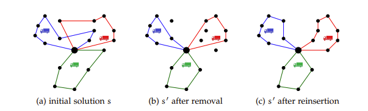
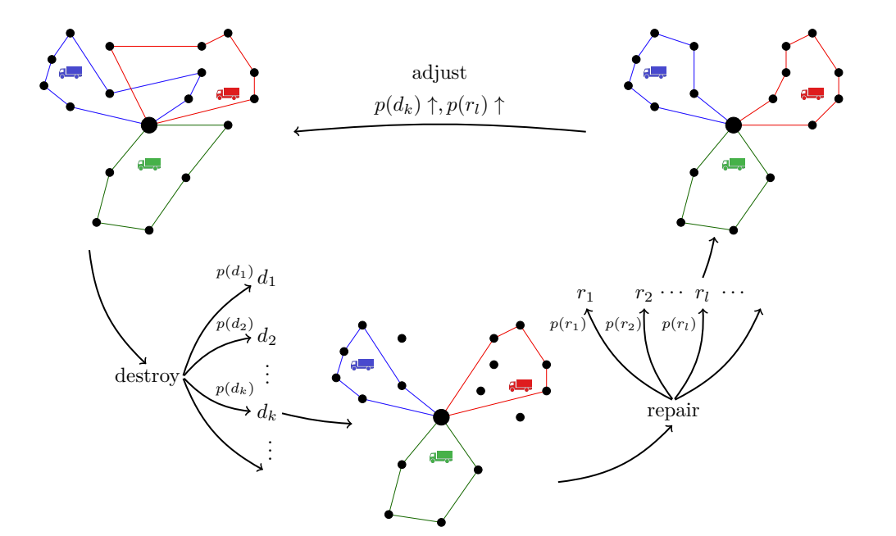

# 自适应大邻域搜索算法

## Reference

- https://d-nb.info/1072464683/34

在[变邻域搜索](../vns/README.md)介绍了如何用变邻域搜索算法. 变邻域搜索算法指的是在若干个不同的邻域中进行搜索，最终得到问题的解. 变邻域搜索中的每个邻域规则都是提前设计好的，即在给定一个解的条件下，使用某个邻域规则得到的邻域结构是确定的.   

以求解TSP为例，虽然VNS在搜索过程中使用若干个不同的邻域以扩大搜索范围，但是当TSP中城市数目增多时，VNS搜索范围有限这一缺点就会暴露出来. 

假设TSP中的城市数目为4，初始路线为1234，现在分别使用交换操作、逆转操作和插入操作求出初始解1234对应的邻域  

首先来回顾这3个操作：  
1. 交换操作为交换当前解两个位置上的城市.   
2. 逆转操作为逆转当前解两个位置之间的城市序列.   
3. 插入操作为将当前解一个位置上的城市插入另一个位置上的城市后面.   

现在对初始解1234使用交换操作，得到下表的邻域：  

| 序号 | 交换点1 | 交换点2 | 邻域解 |  
| ---- | ---- | ---- | ---- |  
| 1    | 1      | 2      | 2134 |  
| 2    | 1      | 3      | 3214 |  
| 3    | 1      | 4      | 4231 |  
| 4    | 2      | 3      | 1324 |  
| 5    | 2      | 4      | 1432 |  
| 6    | 3      | 4      | 1243 |  

对初始解1234使用逆转操作，得到表下表的邻域：  

| 序号 | 逆转点1 | 逆转点2 | 邻域解 |  
| ---- | ---- | ---- | ---- |  
| 1    | 1      | 2      | 2134 |  
| 2    | 1      | 3      | 3214 |   
| 3    | 1      | 4      | 4321 |  
| 4    | 2      | 3      | 1324 |  
| 5    | 2      | 4      | 1432 |  
| 6    | 3      | 4      | 1243 |  

对初始解1234使用插入操作，得到下表的邻域：

| 序号 | 插入点1 | 插入点2 | 邻域解 |  
| ---- | ---- | ---- | ---- |  
| 1    | 1      | 2      | 2134 |  
| 2    | 1      | 3      | 2314 |  
| 3    | 1      | 4      | 2341 |  
| 4    | 2      | 1      | 1234 |  
| 5    | 2      | 3      | 1324 |  
| 6    | 2      | 4      | 1342 |  
| 7    | 3      | 1      | 1324 |  
| 8    | 3      | 2      | 1234 |  
| 9    | 3      | 4      | 1243 |  

上述三个操作得到的邻域解中含有重复解，现将初始解与重复解删除，共有10种不同的邻域解，如下表所示： 

| 序号 | 邻域解| 对应3种操作中邻域解的序号 ||         |  
| ---- | ---- | ---- | ---- | ---- | 
|      |      | 交换操作 | 逆转操作 | 插入操作 |  
| 1    | 1243 | 6    | 6    | 9      |  
| 2    | 1432 | 5    | 5    | 无     |  
| 3    | 1342 | 无    | 无    | 6      |  
| 4    | 1324 | 4    | 4    | 5,7    |  
| 5    | 2134 | 1    | 1    | 1      |  
| 6    | 2314 | 无    | 无    | 2      |  
| 7    | 2341 | 无    | 无    | 3      |  
| 8    | 3214 | 2    | 2    | 无     |  
| 9    | 4231 | 3    | 无    | 无     |  
| 10   | 4321 | 无    | 3    | 无     |  

因为城市数目为4，所以一共有 $ A_4^4 = 24 $ 种排序方式，如下表所示. 

| 序号 | 可能解 | 序号 | 可能解 |  
| ---- | ------ | ---- | ------ |  
| 1    | 1234   | 13   | 3124   |  
| 2    | 1243   | 14   | 3142   |  
| 3    | 1324   | 15   | 3214   |  
| 4    | 1342   | 16   | 3241   |  
| 5    | 1423   | 17   | 3412   |  
| 6    | 1432   | 18   | 3421   |  
| 7    | 2134   | 19   | 4123   |  
| 8    | 2143   | 20   | 4132   |  
| 9    | 2314   | 21   | 4213   |  
| 10   | 2341   | 22   | 4231   |  
| 11   | 2413   | 23   | 4312   |  
| 12   | 2431   | 24   | 4321   |  

使用3种操作一共得到10种不同邻域解. 因此，除去初始解1234外，还有13种可能解并没有通过上述3种操作获得. 由此可见，VNS在使用这3种邻域操作时搜索范围的局限性. 

为了能够进一步扩大搜索范围，本文介绍自适应大邻域搜索算法（Adaptive Large Neighborhood Search，ALNS）. ALNS的思想是先“破坏”解，然后将破坏后的解进行“修复”，最终获得更高质量的解. 

## **基本思想**
ALNS通过逐步破坏当前解的部分结构，并利用多种修复策略生成新解，同时通过反馈机制动态调整破坏和修复策略的使用概率，以平衡全局搜索（探索新区域）和局部搜索（优化当前区域）的能力. 

  
1. **邻域定义**：针对组合优化问题实例 $ I $，其可行解集合为 $ S(I) $. 引入成本函数 $ c: S(I) \to \mathbb{R}^+ $ 衡量解质量. 对最小化问题，目标为找到 $ s^* $ 使 $ c(s^*) \leq c(s), \forall s \in S(I) $. 邻域 $ N(s) \subseteq S(I) $ 指解 $ s $ 的邻居解集合，通过改变 $ s $ 的部分内容生成，邻居解与 $ s $ 在搜索空间中距离较近（如汉明距离）.   
2. **邻域搜索算法**：算法基于邻域操作，从初始解开始搜索其邻域，不断用在邻域找到的最佳解重复该过程（如算法1所示）. 邻域大小是关键因素：邻域大小是关键因素，更大的邻域搜索虽耗时，但能扩大搜索范围、避免算法陷入局部最优. 实际应用中，需单独确定邻域大小，以在合理时间内获取最佳结果. 

   - **算法1：邻域搜索**  
      - **输入**：问题实例 *I*  
      - 创建初始解 $ s_{\text{min}} \in S(I) $  
      - **循环执行（当未满足停止准则时）**：  
         - $ s' = \underset{s \in N(s_{\text{min}})}{\text{arg min}} \{ c(s) \} $（在 $ s \in N(s_{\text{min}}) $ 中，寻找使 $ c(s) $ 最小的解 $ s' $）  
         - **若** $ c(s') < c(s_{\text{min}}) $ **则**：$ s_{\text{min}} = s' $  
      - **返回** $ s_{\text{min}} $

3. **大规模邻域搜索（Large Neighborhood Search, LNS）**: LNS由Shaw提出，属于超大规模邻域搜索（VLNS）启发式算法，核心是采用“大邻域”方法，其最大挑战是高效搜索邻域以控制算法总运行时间.   
   - **算法2：大规模邻域搜索**：
      - 输入问题实例，创建初始解 $ s_{\text{min}} $；
      - 循环执行“破坏-修复”操作（$ s' = r(d(s)) $），
         -  若新解 $ s' $ 被接受则替换当前解 $ s $；
            - 若 $ s $ 优于 $ s_{\text{min}} $，则更新 $ s_{\text{min}} $，直至满足停止条件，最终返回最优解 $ s_{\text{min}} $.   
   - **核心函数**：依赖"破坏函数"$ d $和"修复函数"$ r $生成新解，算法不局限于搜索当前最优解 $ s_{\text{min}} $ 的邻域，而是对初始解 $ s $ 的邻域进行搜索. .   
   - **示例说明**：以车辆路径问题为例，通过破坏函数移除部分客户服务路径，再用修复函数重新插入未服务客户来改进解.

   

4. **自适应大规模邻域搜索（Adaptive Large Neighborhood Search, ALNS**： ALNS是大规模邻域搜索（LNS）的扩展，由Ropke和Pisinger提出. 针对不同问题实例或同一问题的不同解，需用不同破坏与修复启发式处理，而ALNS允许用户选择多种启发式，算法通过分配权重反映其历史成功度，以动态优化启发式选择.   
   - **核心机制**：基于历史表现周期性调整启发式权重. 设定更新周期为 $ p_u $ 次迭代，每次迭代根据权重计算概率 $ p(r_i)、p(d_i) $，选择破坏启发式集合 $ D $ 中的 $ d_i $ 和修复启发式集合 $ R $ 中的 $ r_i $.   
   - **算法3：自适应大规模邻域搜索**  
      - **输入**：问题实例 $ I $  
      - 创建初始解 $ s_{\text{min}} = s \in S(I) $  
      - **while** 未满足停止准则 **do**：  
         - **for** $ i = 1, \dots, p_u $ **do**：  
            - 按概率 $ p(r_i)、p(d_i)  $ 从集合 $ R $ 中选择修复启发式 $ r $，从集合 $ D $ 中选择破坏启发式 $ d $  
            - $ s' = r(d(s)) $（通过破坏-修复操作生成新解）  
            - **if**  $s'$被接受，则：  
               - $ s = s' $  
               - **if** $ c(s) < c(s_{\text{min}}) $，则：  
                  - $ s_{\text{min}} = s $（更新最优解）  
         - 调整启发式方法的权重 $ w(r_i)、w(d_i) $ 和选择概率 $ p(r_i)、p(d_i) $  
      - **return** $ s_{\text{min}} $（返回最优解）

 
   - **与LNS的关系**：除破坏/修复启发式选择、每 $ p_u $ 次迭代的权重更新外，ALNS基本结构与LNS一致. 
   - **图片说明**：初始解需经历破坏与修复过程，破坏启发式与修复启发式均从启发式集合中选取，其选择概率基于各自的历史成效. 经过若干次迭代后，算法会根据启发式的成功表现调整选择概率. 
 
   

### **接受准则**

接受准则用于决定保留原解 $ s $ 还是接受新解 $ s' $，所有准则的共同点是接受改进解，差异在于对非改进解的接受策略.   

| 方法                     | 描述                                                         |
|--------------------------|--------------------------------------------------------------|
| 随机游走（Random Walk, RW） | 接受每一个新生成的解 $ s' $.                                  |
| 贪婪接受（Greedy Acceptance, GRE） | 仅当新解 $ s' $ 的成本相比当前解 $ s $ 降低时，才接受 $ s' $，这与算法1类似.  |
| 模拟退火（Simulated Annealing, SA） | 接受所有改进解 $ s' $. 若 $ c(s') > c(s) $，则以概率 $ \exp(\frac{c(s)-c(s')}{T}) $ 接受 $ s' $，其中 $ T $ 为“温度”，且温度在每次迭代中按因子 $ \phi $ 递减.  |
| 阈值接受（Threshold Accepting, TA） | 若 $ c(s') - c(s) < T $（$ T $ 为阈值），则接受解 $ s' $，阈值 $ T $ 在每次迭代中按因子 $ \phi $ 递减.  |
| 老单身汉接受（Old Bachelor Acceptance, OBA） | 若 $ c(s') - c(s) < T $（$ T $ 为阈值），则接受解 $ s' $. 接受解后，阈值 $ T $ 按因子 $ \phi $ 递减；拒绝解后，阈值 $ T $ 按因子 $ \psi $ 递增.  |
| 大洪水算法（Great Deluge Algorithm, GDA） | 若 $ c(s') < L $（$ L $ 为水平值），则接受解 $ s' $. 仅当解被接受时，水平值 $ L $ 才会按因子 $ \phi $ 递减.  |
 

**方法对比与特点**  
- **贪婪接受**：Shaw曾使用，因不接受差解限制搜索，尤其对初期无前景邻域友好的解.   
- **模拟退火与阈值接受**：通过单调递减参数（温度/阈值）控制接受差解的概率，避免算法过早陷入局部最优，但可能抑制解的提升变化.   
- **老单身汉接受**：因不参考历史决策，可能导致算法在局部最优停滞.   
- **大洪水算法**：通过动态调整水平值，适应算法成功或失败情况，平衡搜索策略. 

### **破坏算子**

破坏函数的目标是为修复函数创造优化空间. 

**破坏启发式**

在对一个解应用破坏启发式之前，我们必须确定破坏程度 $ d $. 顾名思义，大规模邻域搜索（LNS）具有相对较高的破坏程度. 这在搜索空间受严格限制时尤其有用，因为这样可以扩展修复函数的搜索空间. 确定破坏程度有以下不同策略：  
- 设置固定破坏程度.   
- 从最小破坏程度 $ d_{\text{min}} $ 到最大破坏程度 $ d_{\text{max}} $ 逐渐增加破坏程度.   
- 从最大破坏程度 $ d_{\text{max}} $ 到最小破坏程度 $ d_{\text{min}} $ 逐渐降低破坏程度.   
- 每次迭代从 $[d_{\text{min/max}}]$ 中随机选择一个破坏程度.   
- 基于历史信息（即不同破坏程度值此前的效果），从 $[d_{\text{min/max}}]$ 中确定破坏程度.   

尽管破坏程度是每个破坏启发式最重要的输入参数，但需注意，这些启发式适用于各种可能的破坏程度. 以下启发式方法较为通用. 对于具体优化问题，还可应用更多针对问题的启发式方法. 
 
- **随机移除（Random Removal）**：均匀随机删除请求，虽可能移除解中适配部分，但能增加解的多样性. 单独使用效率有限，在多启发式结合的ALNS中更具价值.   
- **最差移除（Worst Removal）**：移除解中导致成本最高的部分，期望修复函数消除高成本. 通过计算解包含某部分与不含该部分的成本差，确定移除对象.   
- **相关移除（Related Removal）**：由Shaw提出，利用解各部分的关联性，假设相关部分易交换，通过移除相似部分，为修复函数提供更高效重新插入的机会. 挑战在于设计快速可验证的关联性度量.   
- **基于历史的移除（History-based Removal）**：高度依赖具体问题，利用解所有部分的历史信息，判断某部分是否有优化潜力，进而决定是否移除，后续章节将结合具体问题（如RPDPTW）深入分析. 

### **修复算子**

与破坏启发式类似，包含简单及复杂（耗时）的策略，由Ropke和Pisinger提出. 复杂方法如分支定界，虽计算耗时（如Shaw的方法），但单次迭代结果优.   
- **基本贪婪插入（Basic Greedy Insertion）**：  
  - 计算解中每个待插入部分的最小插入成本，通过“解的总成本−插入部分后的成本”确定插入部分的成本差.   
  - 选择成本差最小的部分插入（$\arg\min_{p \in P, l \in IP} c(s_{p,l})$，$P$为剩余部分，$IP$为插入位置，$s_{p,l}$为插入后的解）.   
  - 重复该过程直至所有部分插入. 此策略因延迟处理高成本部分，可能导致流程后期成本上升.   
- **后悔启发式（Regret Heuristics）**：  
  - 不仅考虑最小插入成本，还纳入次低成本、第三低成本等. 通过计算“最便宜插入与第$n-1$便宜插入的成本差”，选择成本差最大的部分插入（$\arg\max_{p \in P} \sum_{i=2}^{n} (c(s_i(p)) - c(s_1(p)))$，$s_i(p)$为第$i$便宜插入解）.   
  - 提升成本预测准确性，减少后期插入成本剧增问题. $n$越大，计算时间越长，但能更早发现部分无有利插入位置的情况. 

### **权重调整** 

本文围绕自适应大规模邻域搜索（ALNS）的**权重调整机制**展开，核心内容如下：  

1. 权重调整的目的  
通过调整启发式权重，提高成功启发式在特定问题实例中的使用概率，因启发式的成功表现会随问题实例、初始解等变化（如随机移除启发式两次执行结果可能差异大），动态调整权重可确保算法高效性.   

2. 权重调整方法: 有以下两种策略   
   - 每次迭代调整：权重实时更新，但需计算下次迭代概率，耗时较长.   
   - 每 $ p_u $ 次迭代调整：执行 $ p_u $ 次迭代后调整权重，保存当前权重与启发式成功记录，平衡计算成本与更新需求.   

3. 关键参数定义  
- $ w(h) $：启发式 $ h $ 的权重.   
- $ u(h) $：一个更新周期（$ p_u $ 次迭代）内启发式 $ h $ 的使用次数.   
- $ \delta_1/\delta_2/\delta_3 $：根据新解效果的权重增量：  
  - $ \delta_1 $：新解为当前最优解时的增量；  
  - $ \delta_2 $：新解改进当前解但非最优时的增量；  
  - $ \delta_3 $：新解未改进但被接受时的增量.   

4. 权重计算公式  
通过公式 $ w(h) = \begin{cases} (1-\rho)w(h) + \rho \frac{s(h)}{u(h)}, & \text{if } u(h) > 0 \\ (1-\rho)w(h), & \text{if } u(h) = 0 \end{cases} $ 调整权重，其中 $ \rho $ 为关键参数：  
   - $ \rho = 0 $：权重不变，选择概率固定；  
   - $ \rho = 1 $：仅考虑近期成功；  
   - $ 0 < \rho < 1 $：兼顾近期成功与历史表现.   
此外，引入反应因子控制权重衰减，通过 $ w(h) \approx w_{\text{init}}(1-\rho)^{\lfloor k/p_u \rfloor} $ 近似描述低频、低效启发式的权重指数级下降，用户可通过设置 $ \rho $ 控制无效启发式的权重占比.   

### **算法扩展**
介绍自适应大规模邻域搜索（ALNS）的扩展与调整方法，主要内容如下：  

1. 时间密集型启发式的惩罚  
   - **问题**：ALNS中耗时的启发式常更成功，导致其权重维持，而快速启发式权重降低，且多次快速迭代的小改进可能比单次耗时迭代的大改进更有价值.   
   - **解决**：对耗时启发式施加惩罚，如通过公式 $ s(h)' = s(h) \cdot \frac{t_{\text{min}}^{\text{exec}}}{t_h^{\text{exec}}} $ 归一化其成功度（$ t_{\text{min}}^{\text{exec}} $ 为最小执行时间）；或采用恒定因子（如给最耗时启发式权重乘 $ 0.5 $），避免其过度影响算法.   

2. 启发式中的噪声与随机化  
   - **作用**：通过在启发式中加入随机化（如噪声项）保留多样化. 例如，在基本贪婪插入法中添加随机值，使算法不总选最优解，而是次优或第三优选项，既改进结果，又探索搜索新区域.   
   - **关键**：合理选择噪声间隔，过小无影响，过大干扰流程，需平衡设置.   

3. 特殊启发式  
   - 为每个破坏启发式分配专属的修复启发式子集，限制其组合范围.   
   - 使用同时执行破坏与修复的启发式（如仅交换解部分的2-Opt、3-Opt等交换启发式），适用于已知在特定问题中表现好但无法拆分破坏-修复阶段的启发式. 

## **与其他算法的区别**
- **遗传算法（GA）**：依赖交叉和变异操作，群体进化；ALNS更注重单解的邻域搜索.   
- **模拟退火（SA）**：通过温度参数控制接受概率；ALNS通过策略自适应实现类似效果.   
- **传统邻域搜索**：邻域范围固定，易陷入局部最优；ALNS通过动态调整邻域大小（破坏程度）增强探索能力. 

