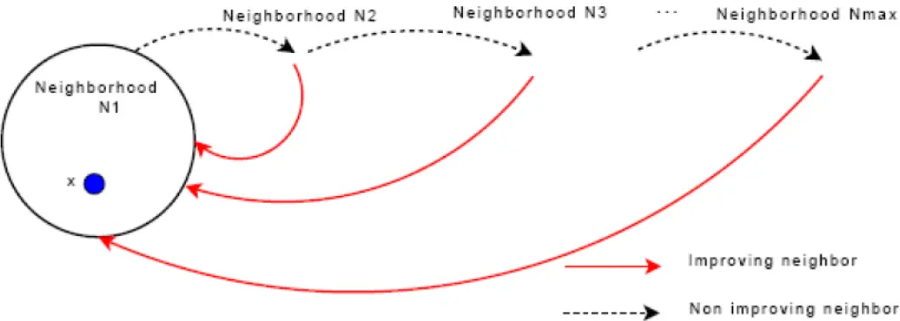

变邻域搜索
==========

Reference

---------

-  https://en.wikipedia.org/wiki/Variable_neighborhood_search

-  https://www.cs.uleth.ca/~benkoczi/OR/read/vns-tutorial.pdf

VNS（变邻域搜索，Variable Neighborhood

Search）是一种元启发式算法，旨在通过系统地改变邻域结构来探索解空间，从而避免陷入局部最优.

以下是其核心内容的简明解释：

**核心思想**

------------

1. **邻域多样化**\ ：

   定义多个不同的邻域结构（如简单交换、插入、反转等），按一定顺序依次尝试.

2. **逃离局部最优**\ ：

   当在当前邻域无法找到更优解时，切换到更大或更复杂的邻域继续搜索，强制跳出局部最优.

   :alt: alt text

   alt text

当在本邻域搜索找不出一个比当前解更优的解的时候，我们就跳到下一个邻域继续进行搜索.

如图中虚黑线所示.

当在本邻域搜索找到了一个比当前解更优的解的时候，我们就跳回第一个邻域重新开始搜索.

如图中红线所示

**算法步骤**

------------

VNS算法求解组合优化问题（最小化）的流程文字描述如下：

初始化

~~~~~~

选择邻域结构集合\ :math:`\mathcal{N}_k`\ （\ :math:`k = 1, \ldots, k_{\max}`\ ），用于抖动阶段；选择邻域结构集合\ :math:`N_{\ell}`\ （\ :math:`\ell = 1, \ldots, \ell_{\max}`\ ），用于局部搜索.

找到一个初始解\ :math:`x`\ ，并使用随机变邻域搜索（RVNS）对其进行改进.

选择一个停止条件.

重复以下步骤，直到满足停止条件： 1. 令\ :math:`k \leftarrow 1`\ ； 2.

重复以下步骤，直到\ :math:`k = k_{\max}`\ ： -

**抖动**\ ：从\ :math:`x`\ 的第\ :math:`k`\ 个邻域\ :math:`\mathcal{N}_k(x)`\ 中随机生成一个点\ :math:`x'`\ ；

- **通过变邻域下降法（VND）进行局部搜索**\ ： -

令\ :math:`\ell \leftarrow 1`\ ； -

重复以下步骤，直到\ :math:`\ell = \ell_{\max}`\ ： -

**邻域探索**\ ：在\ :math:`N_{\ell}(x')`\ 中找到\ :math:`x'`\ 的最优邻域解\ :math:`x''`\ ；

-

**是否变换邻域**\ ：如果\ :math:`f(x'') < f(x')`\ ，则令\ :math:`x' \leftarrow x''`\ 且\ :math:`\ell \leftarrow 1`\ ；否则令\ :math:`\ell \leftarrow \ell + 1`\ ；

-

**是否变换邻域**\ ：如果这个局部最优解优于当前解，则移动到该解（\ :math:`x \leftarrow x''`\ ），并从\ :math:`\mathcal{N}_1`\ 开始继续搜索（\ :math:`k \leftarrow 1`\ ）；否则，令\ :math:`k \leftarrow k + 1`.

**关键特点**

------------

-  **灵活性**\ ：邻域结构可根据问题定制（如TSP中的2-opt、3-opt）.

-  **鲁棒性**\ ：通过多邻域切换增强全局搜索能力.

-  **高效性**\ ：在中等规模问题中表现优异.

**优缺点**

----------

-  **优点**\ ：实现简单、参数少、易于结合其他算法.

-  **缺点**\ ：邻域设计依赖经验，大规模问题可能需优化策略.

VNS通过动态调整搜索方向，在局部开发与全局探索间取得平衡，是解决复杂组合优化问题的有效工具.

VNS算法求解CVRPTW问题

---------------------

VNS算法设计

~~~~~~~~~~~

1. **解的表示**

   如果解仅包含顾客编号时，难以区分各顾客具体分配的配送路线.

   因此，将配送中心以大于5的数字形式插入解中.

   若配送中心最多允许K辆车服务N个顾客，则插入K个代表配送中心的数字.

   解的表现形式示例：

   -  解表示：1263475

      -  配送路线：配送中心6和7将12345分割成3条配送路线

      -  第1条：0 → 1 → 2 → 0

      -  第2条：0 → 3 → 4 → 0

      -  第3条：0 → 5 → 0

   -  解表示：1267345

      -  配送路线：配送中心6和7将12345分割成2条配送路线

      -  第1条：0 → 1 → 2 → 0

      -  第2条：0 → 3 → 4 → 5 → 0

   -  解表示：6712345

      -  配送路线：配送中心6和7将12345分割成1条配送路线，即0 → 1 → 2 → 3

         → 4 → 5 → 0

   -  解表示：1234567

      -  配送路线：配送中心6和7将12345分割成1条配送路线，即0 → 1 → 2 → 3

         → 4 → 5 → 0

   -  解表示：6123457

      -  配送路线：配送中心6和7将12345分割成1条配送路线，即0 → 1 → 2 → 3

         → 4 → 5 → 0

   SA求解CVRPTW问题中的解可表示为1 - (N + K -

   1)的随机排列，上述5种情况涵盖了将解转换为配送方案时会遇到的情形.

2. **目标函数**

   第1点中的表示解的方式，无法保证分割出的各条配送路线都满足装载量约束.

   为解决违反约束的问题，对违反约束的配送路线施加惩罚，以使分割出的配送路线满足装载量约束.

   配送方案的总成本通过以下公式计算：

   .. math:: f(s) = c(s) + \alpha \times q(s) + \beta \times w(s)

   其中：

   -  违反装载量约束之和\ :math:`q(s)`\ 的计算公式为：

      .. math:: q(s)=\sum_{k = 1}^{K}\max\left\{\left(\sum_{i\in N}d_{i}\sum_{j\in\Delta^{+}(i)}x_{ijk}-C\right),0\right\}

   -  所有顾客违反的时间窗约束之和\ :math:`w(s)`\ 的计算公式为：

      .. math:: w(s)=\sum_{i = 1}^{n}\max\left\{\left(l_{i}-b_{i}\right),0\right\}

   式中各符号含义如下：

   -  :math:`s`\ 为配送方案；

   -  :math:`f(s)`\ 为当前配送方案的总成本；

   -  :math:`c(s)`\ 为车辆总行驶距离；

   -  :math:`q(s)`\ 为各条路径违反的装载量约束之和；

   -  :math:`w(s)`\ 为所有顾客违反的时间窗约束之和；

   -  :math:`\alpha`\ 为违反装载量约束的惩罚因子；

   -  :math:`\beta`\ 为违反时间窗约束的惩罚因子；

   -  :math:`K`\ 为配送车辆集合；

   -  :math:`N = V\setminus\{0, n + 1\}`\ 为顾客集合；

   -  :math:`\Delta^{+}(i)`\ 为从节点\ :math:`i`\ 出发的弧的集合；

   -  :math:`d_{i}`\ 为顾客\ :math:`i`\ 的需求量；

   -  :math:`x_{ijk}`\ 为货车\ :math:`k`\ 是否从节点\ :math:`i`\ 出发前往节点\ :math:`j`\ ；

   -  :math:`C`\ 为货车最大装载量；

   -  :math:`n`\ 为顾客数目；

   -  :math:`l_{i}`\ 为货车到达顾客\ :math:`i`\ 的时间；

   -  :math:`b_{i}`\ 为顾客\ :math:`i`\ 的右时间窗.

3. **初始解生成**

   -  可以使用贪心算法等启发式方法生成一个初始可行解.

      例如，按照客户需求和距离配送中心的远近，依次将客户分配给不同的车辆，形成初始的车辆路径方案.

4. **邻域结构定义**

   假设顾客数目为\ :math:`N`\ ，配送中心最多允许\ :math:`K`\ 辆车进行配送，那么当前解可表示为：

   .. math:: R = [R(1),R(2),\cdots R(i),\cdots,R(j),\cdots R(N + K - 2),R(N + K - 1)]

   -  **交换操作**

      -  若选择的交换位置为\ :math:`i`\ 和\ :math:`j`\ （\ :math:`i \neq j`\ ，\ :math:`1 \leq i,j \leq N + K - 1`\ ），交换第\ :math:`i`\ 个和第\ :math:`j`\ 个位置上的元素后的解表示为：

         .. math:: R = [R(1),R(2),\cdots R(j),\cdots,R(i),\cdots R(N + K - 2),R(N + K - 1)]

      -  以5个顾客且最多允许使用3辆货车为例：

         -  **初始解情况**\ ：假设当前解为1263745，该解表示3条配送路线：

            -  第1条：\ :math:`0 \to 1 \to 2 \to 0`

            -  第2条：\ :math:`0 \to 3 \to 0`

            -  第3条：\ :math:`0 \to 4 \to 5 \to 0`

         -  **交换后情况**\ ：若交换位置为\ :math:`i = 3`\ 和\ :math:`j = 4`\ ，交换后的解为1236745，此时表示2条配送路线：

            -  第1条：\ :math:`0 \to 1 \to 2 \to 3 \to 0`

            -  第2条：\ :math:`0 \to 4 \to 5 \to 0`

   -  **逆转操作**

      逆转操作指的是将两个位置之间所有元素的排序进行反转.

      -  若选择的逆转位置为\ :math:`i`\ 和\ :math:`j`\ （\ :math:`i \neq j`\ ，\ :math:`1 \leq i,j \leq N`\ ）

         ，逆转第\ :math:`i`\ 个和第\ :math:`j`\ 个位置之间所有元素的排序后，解可表示为：

         .. math:: R = [R(1),R(2),\cdots R(j),R(j - 1),\cdots,R(i + 1),R(i),\cdots R(N + K - 2),R(N + K - 1)]

      -  以5个顾客且最多允许使用3辆货车为例：

         -  **初始解情况**\ ：假设当前解为1263745，该解表示3条配送路线：

            -  第1条：\ :math:`0 \to 1 \to 2 \to 0`

            -  第2条：\ :math:`0 \to 3 \to 0`

            -  第3条：\ :math:`0 \to 4 \to 5 \to 0`

         -  **逆转后情况**\ ：若逆转位置为\ :math:`i = 3`\ 和\ :math:`j = 7`\ ，逆转后的解为1254736，此时表示2条配送路线：

            -  第1条：\ :math:`0 \to 1 \to 2 \to 5 \to 4 \to 0`

            -  第2条：\ :math:`0 \to 3 \to 0`

   -  **插入操作**

      插入操作是将在第一个位置上选择的元素，插入到第二个位置上选择的元素后面.

      -  若选择的插入位置为\ :math:`i`\ 和\ :math:`j`\ （\ :math:`i \neq j`\ ，\ :math:`1 \leq i,j \leq N`\ ），将第\ :math:`i`\ 个位置上的元素插入第\ :math:`j`\ 个位置上的元素后，解可表示为：

         .. math:: R = [R(1),\cdots R(i - 1),R(i + 1),\cdots R(j - 1),R(j),R(i),R(j + 1),\cdots R(N + K - 1)]

      -  以5个顾客且最多允许使用3辆货车为例：

         -  **初始解情况**\ ：假设当前解为1263745，该解表示3条配送路线：

            -  第1条：\ :math:`0 \to 1 \to 2 \to 0`

            -  第2条：\ :math:`0 \to 3 \to 0`

            -  第3条：\ :math:`0 \to 4 \to 5 \to 0`

         -  **插入后情况**\ ：若插入位置为\ :math:`i = 3`\ 和\ :math:`j = 7`\ ，插入后的解为1237456，此时表示2条配送路线：

            -  第1条：\ :math:`0 \to 1 \to 2 \to 3 \to 0`

            -  第2条：\ :math:`0 \to 4 \to 5 \to 0`

5. **扰动操作**

   -  在第3点已经介绍交换操作、逆转操作和插入操作这3个邻域操作，利用这3种操作能得到3个不同的邻域集合.

   -  在使用邻域操作获取一条路线的邻域集合前，还有一个重要步骤，即扰动操作.

      其目的是进一步扩大搜索范围，找到更多的解.

   -  扰动操作是对当前解进行“适当的调整”，具体方式如下：在使用某个邻域操作前，先对当前解进行操作以得到一个“扰动解”，再用该邻域操作获取这个“扰动解”的邻域集合，从而进行后续一系列操作.

   -  示例

      假设当前解为1263745，

      -  **交换操作的扰动**\ ：若准备使用交换操作，随机生成1 -

         7中的两个不同数字（如2和5），交换这两个位置上的城市，得到“扰动解”1763245.

      -  **逆转操作的扰动**\ ：若准备使用逆转操作，同样随机生成1 -

         6中的两个不同数字（如2和5），逆转这两个位置之间所有城市的排序，得到“扰动解”1736245.

      -  **插入操作的扰动**\ ：若准备使用插入操作，随机生成1 -

         6中的两个不同数字（如2和5），将第2个位置上的城市插入第5个位置上的城市后面，得到“扰动解”1637245

         .

6. **局部搜索策略**

   当对当前解\ :math:`S_{curr}`\ 使用某个邻域操作得到其邻域集合后，如何处理该邻域集合，才能让\ :math:`S_{curr}`\ 向“更好”的方向变化呢？

   -  首先计算邻域集合中所有解的总距离.

   -  接着找到总距离最短的解\ :math:`S_{min}`\ ，并用它替换当前解\ :math:`S_{curr}`\ ，即令\ :math:`S_{curr} = S_{min}`.

   -  然后求出新\ :math:`S_{curr}`\ 的邻域集合以及其中所有解的总距离，再次找到总距离最短的解替换当前解.

   -  按照上述方式迭代，直至迭代\ :math:`\ell_{\max}`\ 次后，停止对\ :math:`S_{curr}`\ 在当前邻域的搜索.

7. **邻域变换策略**

   局部搜索策略介绍了针对当前解\ :math:`S_{curr}`\ 在一个邻域中的搜索方法.

   由于有交换、逆转、插入3个邻域操作，对应产生3个不同结构的邻域，分别编号为\ :math:`k = 1`\ （交换操作邻域）、\ :math:`k = 2`\ （逆转操作邻域）、\ :math:`k = 3`\ （插入操作邻域）

   . 在一个邻域搜索结束后，要在另一个邻域继续搜索，具体步骤如下：

   STEP1: 设\ :math:`k = 1`.

   STEP2:

   根据\ :math:`k`\ 的值跳转：若\ :math:`k = 1`\ ，转至STEP3；若\ :math:`k = 2`\ ，转至STEP4；若\ :math:`k = 3`\ ，转至STEP5；否则，转至STEP7.

   STEP3:

   **针对交换操作邻域**\ ：对\ :math:`S_{curr}`\ 的交换操作邻域进行局部搜索得到最优解\ :math:`S_{swap}`\ ，计算\ :math:`S_{swap}`\ 的总距离\ :math:`L_{swap}`\ ，令\ :math:`L_{curr} = L_{swap}`.

   若\ :math:`L_{curr}<L_{best}`\ （\ :math:`L_{best}`\ 为最优路线总距离），则更新\ :math:`S_{best} = S_{curr} = S_{swap}`\ ，\ :math:`L_{best} = L_{curr}`\ ，\ :math:`k = 0`\ ，转至STEP6

   .

   STEP4:

   **针对逆转操作邻域**\ ：对\ :math:`S_{curr}`\ 的逆转操作邻域进行局部搜索得到最优解\ :math:`S_{reversion}`\ ，计算其总距离\ :math:`L_{reversion}`\ ，令\ :math:`L_{curr} = L_{reversion}`.

   若\ :math:`L_{curr}<L_{best}`\ ，则更新\ :math:`S_{best} = S_{curr} = S_{reversion}`\ ，\ :math:`L_{best} = L_{curr}`\ ，\ :math:`k=0`\ ，转至STEP6.

   STEP5:

   **针对插入操作邻域**\ ：对\ :math:`S_{curr}`\ 的插入操作邻域进行局部搜索得到最优解\ :math:`S_{insertion}`\ ，计算其总距离\ :math:`L_{insertion}`\ ，令\ :math:`L_{curr} = L_{insertion}`.

   若\ :math:`L_{curr}<L_{best}`\ ，则更新\ :math:`S_{best} = S_{curr} = S_{insertion}`\ ，\ :math:`L_{best} = L_{curr}`\ ，\ :math:`k=0`\ ，转至STEP6.

   STEP6: :math:`k=k+1`\ ，转至STEP2.

   STEP7:

   终止循环，输出当前解\ :math:`S_{curr}`\ 、最优解\ :math:`S_{best}`\ 、当前解的总距离\ :math:`L_{curr}`\ 和最优解的总距离\ :math:`L_{best}`

   .

..

   **采用路径编码方式的原因**:

   在模拟退火算法求解CVRPTW问题中，采用路径编码方式（如\ ``[1,2,6,3,7,4,5]``\ ）主要基于以下原因：

   1. **直观性与易理解性** -

   **直接对应实际路径**\ ：编码中的每个子序列（如\ ``[1,2,6]``\ ）

   明确表示一辆车的完整路径（从配送中心出发，访问客户，返回配送中心）. -

   **可读性强**\ ：无需复杂解码即可直接观察车辆的行驶顺序和客户分配情况.

..

   2. **邻域操作的便利性**

   -  **支持灵活的交换/插入操作**\ ：

      -  **交换操作**\ ：直接交换不同路径中的客户节点（如交换\ ``1``\ 和\ ``3``\ ），无需额外处理车辆划分.

      -  **插入操作**\ ：将客户节点从一个路径插入到另一个路径的任意位置，操作简单.

   -  **约束检查简化**\ ：邻域操作生成的新路径可直接检查容量和时间窗约束，无需重新划分车辆.

   3. **天然支持多车辆场景**

   -  **显式区分车辆**\ ：每个子序列对应一辆车，车辆数量和路径独立.

   -  **动态调整车辆数**\ ：通过邻域操作可隐式调整车辆数量（例如合并或拆分路径）.

..

   4. **与问题特征匹配**

   -  **时间窗和容量约束的处理**\ ：

      -  路径编码便于按顺序计算每个客户的到达时间和车辆负载.

      -  直接检查每个子路径的约束（如总负载不超过车辆容量，时间窗不违反）.

   5. **对比其他编码方式的优势**

   -  **避免复杂解码**\ ：

      -  与“节点序列编码”（如\ ``[1,3,2,4]``\ ，需算法自动划分路径）相比，路径编码无需动态划分车辆，减少计算开销.

   -  **减少无效解**\ ：

      -  与“染色体编码”（如二进制表示客户是否被访问）相比，路径编码直接生成有效路径，降低不可行解的概率.

..

   6. **算法实现的高效性**

   -  **目标函数计算简单**\ ：直接遍历每个子路径的节点，累加距离即可.

   -  **代码实现直观**\ ：生成初始解、邻域操作、约束检查等模块可独立设计，代码结构清晰.

   路径编码是CVRPTW问题中最直观且高效的编码方式之一，其显式的车辆路径划分和灵活的操作特性，能够有效支持模拟邻域搜索和约束处理，最终在解质量和计算效率之间取得平衡.

