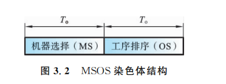
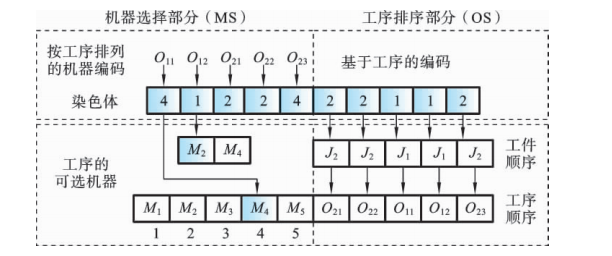
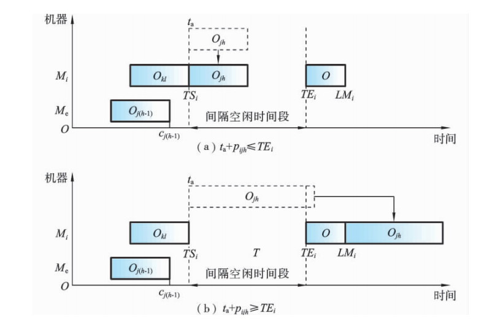
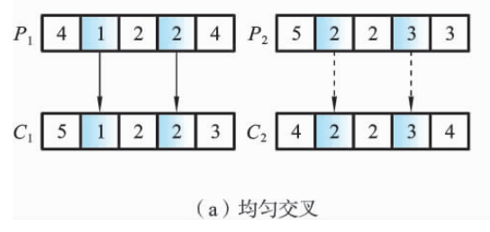
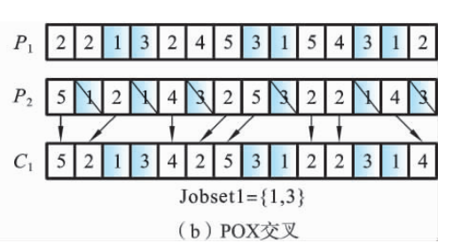
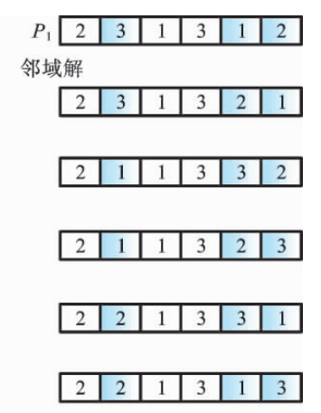

# 遗传算法求解柔性作业车间调度问题

## Reference

- 《柔性作业车间调度智能算法及其应用》高亮 张国辉 王晓娟 著

## FJSP的染色体编码 
1. **染色体编码的意义**  
   染色体编码是遗传算法关键，需确保合法性、可行性等，直接影响遗传操作效率、求解速度与精度. 差的编码需修补，降低执行效率.   

2. **FJSP编码对象**  
   针对FJSP的两个子问题：机器选择（确定工序加工机器）和工序排序（确定机器上工序加工顺序及时序）进行编码.   

3. **现有编码方法**  
   - **集成编码**：基因位$(h,j,i)$表示工序任务，总长为工序总数$T_a$. 易表达，但遗传操作易产非法解，改进困难.   
   - **分段编码**：染色体分两部分（如$A/B$）对应机器选择和工序排序，长度均为$T_a$. 部分方法易产非法解需修补，改进后效果提升但求解效率受影响.   

4. **MSOS整数编码**  
    - **结构**：分机器选择（MS）和工序排序（OS），适用于T-FJSP和P-FJSP.   
        
    - **机器选择部分**：长度$T_a$，基因用整数表示工序所选机器在可选集中的顺序编号，保证可行解，无需因问题类型转换编码.    
    - **工序排序部分**：基于工序编码，长度$T_a$，基因用工件号表示加工顺序. 
    - 示例说明：
        - P-FJSP 实例 
            | 工件 | 工序  | $M_1$ | $M_2$ | $M_3$ | $M_4$ | $M_5$ |  
            |------|-------|---------|---------|---------|---------|---------|  
            | $J_1$ | $O_{11}$ | 2       | 6       | 5       | 3       | 4       |  
            | $J_1$ | $O_{12}$ | —       | 8       | —       | 4       | —       |  
            | $J_2$ | $O_{21}$ | 3       | —       | 6       | —       | 5       |  
            | $J_2$ | $O_{22}$ | 4       | 6       | 5       | —       | —       |  
            | $J_2$ | $O_{23}$ | —       | 7       | 11      | 5       | 8       |  

        - 机器选择部分：  
            - 工件 $ J_1 $的工序 $ O_{11} $ 有 5 台机器可选，对应的“4”表示在可选机器集中选择第 4 台机器，即在机器 $ M_4 $ 上加工.   
            - 工件 $ J_1 $的工序 $ O_{12} $ 有 2 台机器可选（机器 $ M_2 $ 和 $ M_4 $），图中对应的“1”表示选择可选机器集中的第 1 台机器，即在机器 $ M_2 $ 上加工. 
        - 工序排序部分：
            - 第一个“2”表示工件 $ J_2 $ 的工序 $ O_{21} $；  
            - 第二个“2”表示工件 $ J_2 $ 的工序 $ O_{22} $；  
            依此类推，转换成各工件工序的加工顺序为 $ O_{21} \to O_{22} \to O_{11} \to O_{12} \to O_{23} $. 

        
    

## FJSP的染色体解码
1. **调度类型**  
   - **活动调度**：不推迟其他操作或破坏优先顺序，无闲置操作可提前加工.   
   - **半活动调度**：不改变机器加工顺序，无操作可提前加工.   
   - **非延迟调度**：存在工件等待加工时，对应机器不闲置.   
   - 关系：活动调度包含于半活动调度，非延迟调度包含于活动调度. 对正规性能指标（如最大完工时间），优化算法搜索活动调度集可保证最优解存在且提升效率；非正规指标（如提前/拖期惩罚），最优解可能在半活动调度集.   

2. **染色体解码步骤（以MSOS编码为例）**  
   - **步骤1：机器选择部分解码**  
     转换机器选择部分为机器顺序矩阵 $ J_M $ 和时间顺序矩阵 $ T $. $ J_M(j,h) $ 表示工件 $ J_j $ 工序 $ O_{jh} $ 的机器号，$ T(j,h) $ 表示对应加工时间.   
     - 示例：P-FJSP染色体机器选择部分[4 1 2 2 4]，转换为 $ J_M = \begin{bmatrix}4 & 2 \\ 3 & 2 & 5\end{bmatrix} $，$ T = \begin{bmatrix}3 & 8 \\ 6 & 6 & 8\end{bmatrix} $，即 $ J_1 $ 的 $ O_{12} $ 在 $ M_2 $ 加工，时间为8.   
   - **步骤2：工序排序部分解码（工序插入法）**  
  
        (1) **读取基因转换工序**  
        读取工序排序部分的一个基因，转换成相应工序 $ O_{jk} $.   

        (2) **获取加工机器和时间**  
        通过机器顺序矩阵 $ \boldsymbol{J_M} $ 和时间顺序矩阵 $ \boldsymbol{T} $，得到工序 $ O_{jk} $ 的加工机器 $ M_i = J_M(j,h) $ 和加工时间 $ p_{jk} = T(j,h) $.   

        (3) **确定加工开始时间**  
        - 若工序 $ O_{jk} $ 是机器 $ M_i $ 上第一道加工工序，或为工件 $ J_j $ 的第 1 道工序：  
            - 若是工件 $ J_j $ 第 1 道工序，直接从机器 $ M_i $ 的零时刻加工.   
            - 若是机器 $ M_i $ 首工序，直接从上道工序 $ O_{j(k-1)} $ 结束时间开始加工.   
        - 否则，找到机器 $ M_i $ 上所有间隔空闲时间段 $[TS_i, TE_i]$，按式 $ t_a = \max(c_{j(k-1)}, TS_i) $ 计算工序 $ O_{jk} $ 最早开始加工时间 $ t_a $，确保满足工件加工工序的顺序约束.  $TS_i$ 表示间隔时间段的开始时间，$TE_i$ 表示间隔空闲时间段的结束时间 

        (4) **判断插入条件**  
        - 按是否有 $ t_a + p_{jk} \leq TE_i $ 判断间隔空闲时间段是否满足插入条件：  
            - 若满足，插入当前空闲时间段（如图(a) 所示）.   
            - 若不满足，按式 $ t_b = \max(c_{j(k-1)}, LM_i) $ 在机器 $ M_i $ 上进行加工（$ LM_i $ 表示当前机器 $ M_i $ 最后一道工序的结束时间，如图(b) 所示）. 

              

        (5) **循环判断**  
        - 判断工序排序部分的染色体是否读取完毕; 若满足，结束; 否则，转回步骤（1）继续. 

## FJSP的初始化
 
1. **初始化的重要性与现有问题**  
   种群初始化是进化算法的关键环节，直接影响遗传算法的求解速度与质量. FJSP需处理机器选择和工序排序，现有随机初始化方法生成的初始解质量低，机器负荷不均衡；其他方法（如AL）存在资源消耗大、算法复杂等问题.   

2. **GLR机器选择方法**  
   - **全局选择（GS）**  
     - **目标**：平衡机器负荷，确保最短加工机器优先被选.   
     - **步骤**：设置机器负荷数组并初始化为零→随机选工件及首道工序→计算可选机器加工时间与数组值总和→选时间最短机器，更新数组→重复直至所有工件工序选择完毕. 

        

   - **局部选择（LS）**  
     - **目标**：保证单个工件工序优先选择加工时间最短或机器负荷最小的机器.   
     - **步骤**：初始化机器负荷数组→选首个工件及首道工序→计算时间和（不更新数组）→选机器并更新数组→完成工件所有工序后重置数组为零→循环处理剩余工件.   

        
   - **随机选择（RS）**  
     - **目标**：保证初始种群多样性，使种群分散于解空间.   
     - **步骤**：选工件及首道工序→在可选机器集中随机生成顺序号，设置为基因位值→循环处理工件所有工序→重复直至所有工件完成. 

## 交叉操作
 
1. **交叉操作的目的与原则**  
   交叉操作旨在通过父代个体生成新个体，高效搜索解空间，降低有效模式破坏概率. 设计时需满足可行性、特征有效继承性等，避免冗余信息，单点点交叉等特征是关键保证.   

2. **机器选择部分（均匀交叉）**  
   - **步骤**：  
    (1) 在区间$[1, T_a]$内随机生成整数$r$；  
    (2) 再随机生成$r$个互不相等的整数；  
    (3) 按整数位置，将父代染色体$P_1$和$P_2$对应基因复制到子代$C_1$和$C_2$，保持位置与顺序；  
    (4) 将$P_1$和$P_2$剩余基因依次复制到$C_2$和$C_1$.   
   - **示例**：
        

3. **工序排序部分（改进POX交叉）**  
   - **步骤**：  
    (1) 随机划分工件集$\{J_1, J_2, \cdots, J_n\}$为Jobset1和Jobset2；  
    (2) 复制父代$P_1$、$P_2$中属于Jobset1\Jobset2的工件到子代$C_1$\ $C_2$，保持位置与顺序；  
    (3) 将$P_1$、$P_2$中不属于Jobset1\Jobset2的工件复制到$C_2$\ $C_1$，保持顺序.   
   - **示例**：5个工件中划分包含$J_1$、$J_3$的工件集，通过复制对应部分生成新个体，继承父代优良特征. 
        

## 变异操作
 
1. **变异操作的目的**  
   变异操作通过随机改变染色体基因生成新个体，增加种群多样性，同时影响遗传算法（GA）的局部搜索能力，对解空间进行小范围扰动探索

2. **机器选择部分的变异**  
为保留个体信息与机器顺序，采用以下方式：  
    - **步骤 1**：在变异染色体中随机选择 $ r $ 个位置.   
    - **步骤 2**：依次选择每一个位置，将该位置的机器设置为当前工序可选机器集中加工时间最短的机器.   

3. **工序排序部分的变异（邻域搜索变异）**  
机器选择部分（MS）不变时，通过邻域搜索优化工序排序：  
    - **步骤 1**：在变异染色体中随机选择 $ r $ 个不同基因，并生成其排序的所有邻域.   
    - **步骤 2**：评价所有邻域的适应值，选出最佳个体作为子代. 
     

## 选择操作  
- **作用**：让高性能个体以更高概率生存，避免有效基因丢失，保持种群规模，加快全局收敛性与计算效率。  
- **常用方法**：轮盘赌选择、种子选择、锦标赛选择等。  
- **锦标赛选择流程**：  
  从种群中选择 $ k $ 个个体进行适应度比较，将适应度高的个体插入交叉池，重复此过程直至填满交叉池。该方法收敛性和计算复杂性表现更优。  

### 3.2.7 改进遗传算法的求解步骤  
1. **参数设置**：  
   设置种群规模 $ P_s $、迭代次数 $ P_{num} $、变异概率 $ G_{ps} $，以及全局选择（GS）、局部选择（LS）、随机选择（RS）的种群比例 $ P_{GS}、P_{LS}、P_{RS} $。  
2. **种群初始化**：  
   按 GS、LS、RS 比例，利用 GLR 初始化方法生成初始种群，确保初始解质量。  
3. **适应度评价**：  
   计算种群中每个染色体个体的适应度值（目标值），判断是否满足终止条件（如达到目标值、迭代次数或计算时间），满足则输出最优解，否则继续。  
4. **选择操作**：  
   执行锦标赛选择操作，选取下一代个体。  
5. **交叉操作**：  
   对选中个体按交叉策略进行交叉（如机器选择部分均匀交叉，工序排序部分改进 POX 交叉）。  
6. **变异操作**：  
   对满足变异概率的个体，按变异策略处理（机器选择部分选最短加工时间机器，工序排序部分基于邻域搜索变异）。  
7. **循环迭代**：  
   返回步骤 3，重复评价、选择、交叉、变异过程，直至满足终止条件。

