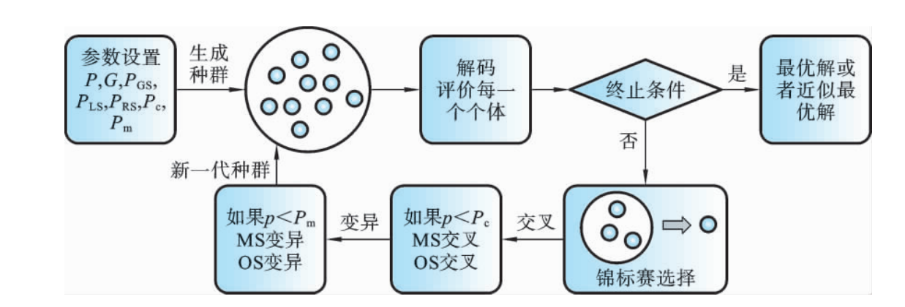
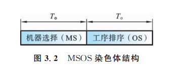
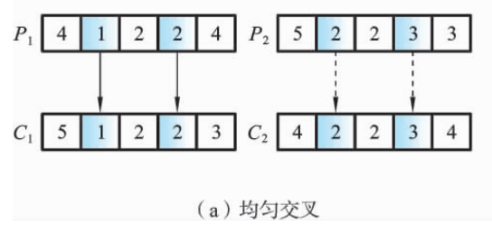
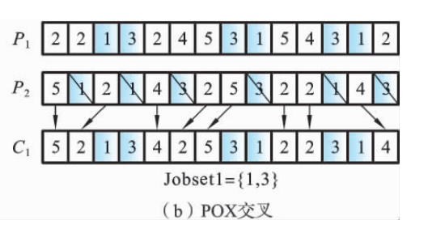
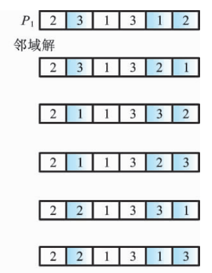

遗传算法求解柔性作业车间调度问题
================================

Reference

---------

-  《柔性作业车间调度智能算法及其应用》高亮 张国辉 王晓娟 著

FJSP的染色体编码

----------------

1. | **染色体编码的意义**

   | 染色体编码是遗传算法关键，需确保合法性、可行性等，直接影响遗传操作效率、求解速度与精度.

     差的编码需修补，降低执行效率.

2. | **FJSP编码对象**

   | 针对FJSP的两个子问题：机器选择（确定工序加工机器）和工序排序（确定机器上工序加工顺序及时序）进行编码.

3. **现有编码方法**

   -  **集成编码**\ ：基因位\ :math:`(h,j,i)`\ 表示工序任务，总长为工序总数\ :math:`T_a`.

      易表达，但遗传操作易产非法解，改进困难.

   -  **分段编码**\ ：染色体分两部分（如\ :math:`A/B`\ ）对应机器选择和工序排序，长度均为\ :math:`T_a`.

      部分方法易产非法解需修补，改进后效果提升但求解效率受影响.

4. **MSOS整数编码**

   -  **结构**\ ：分机器选择（MS）和工序排序（OS），适用于T-FJSP和P-FJSP.

      |alt text|

   -  **机器选择部分**\ ：长度\ :math:`T_a`\ ，基因用整数表示工序所选机器在可选集中的顺序编号，保证可行解，无需因问题类型转换编码.

   -  **工序排序部分**\ ：基于工序编码，长度\ :math:`T_a`\ ，基因用工件号表示加工顺序.

   -  示例说明：

      -  | P-FJSP 实例 \| 工件 \| 工序 \| :math:`M_1` \| :math:`M_2` \|

           :math:`M_3` \| :math:`M_4` \| :math:`M_5` \|

         | \|——\|——-\|———\|———\|———\|———\|———\|

         | \| :math:`J_1` \| :math:`O_{11}` \| 2 \| 6 \| 5 \| 3 \| 4 \|

         | \| :math:`J_1` \| :math:`O_{12}` \| — \| 8 \| — \| 4 \| — \|

         | \| :math:`J_2` \| :math:`O_{21}` \| 3 \| — \| 6 \| — \| 5 \|

         | \| :math:`J_2` \| :math:`O_{22}` \| 4 \| 6 \| 5 \| — \| — \|

         | \| :math:`J_2` \| :math:`O_{23}` \| — \| 7 \| 11 \| 5 \| 8 \|

      -  机器选择部分：

         -  工件 $ J_1 $的工序 $ O\_{11} $ 有 5

            台机器可选，对应的“4”表示在可选机器集中选择第 4

            台机器，即在机器 $ M_4 $ 上加工.

         -  工件 $ J_1 $的工序 $ O\_{12} $ 有 2 台机器可选（机器 $ M_2 $

            和 $ M_4 $），图中对应的“1”表示选择可选机器集中的第 1

            台机器，即在机器 $ M_2 $ 上加工.

      -  工序排序部分：

         -  第一个“2”表示工件 $ J_2 $ 的工序 $ O\_{21} $；

         -  第二个“2”表示工件 $ J_2 $ 的工序 $ O\_{22} $；

            依此类推，转换成各工件工序的加工顺序为 $ O\_{21}

            :raw-latex:`\to `O\_{22} :raw-latex:`\to `O\_{11}

            :raw-latex:`\to `O\_{12} :raw-latex:`\to `O\_{23} $.

      .. figure:: image-1.png

         :alt: alt text

         alt text

FJSP的染色体解码

----------------

1. **调度类型**

   -  **活动调度**\ ：不推迟其他操作或破坏优先顺序，无闲置操作可提前加工.

   -  **半活动调度**\ ：不改变机器加工顺序，无操作可提前加工.

   -  **非延迟调度**\ ：存在工件等待加工时，对应机器不闲置.

   -  关系：活动调度包含于半活动调度，非延迟调度包含于活动调度.

      对正规性能指标（如最大完工时间），优化算法搜索活动调度集可保证最优解存在且提升效率；非正规指标（如提前/拖期惩罚），最优解可能在半活动调度集.

2. **染色体解码步骤（以MSOS编码为例）**

   -  | **步骤1：机器选择部分解码**

      | 转换机器选择部分为机器顺序矩阵 $ J_M $ 和时间顺序矩阵 $ T $. $

        J_M(j,h) $ 表示工件 $ J_j $ 工序 $ O\_{jh} $ 的机器号，$ T(j,h)

        $ 表示对应加工时间.

      -  示例：P-FJSP染色体机器选择部分[4 1 2 2 4]，转换为 $ J_M =

         .. raw:: latex

            \begin{bmatrix}4 & 2 \\ 3 & 2 & 5\end{bmatrix}

         :math:`，` T =

         .. raw:: latex

            \begin{bmatrix}3 & 8 \\ 6 & 6 & 8\end{bmatrix}

         $，即 $ J_1 $ 的 $ O\_{12} $ 在 $ M_2 $ 加工，时间为8.

   -  **步骤2：工序排序部分解码（工序插入法）**

      (1) | **读取基因转换工序**

          | 读取工序排序部分的一个基因，转换成相应工序 $ O\_{jk} $.

      (2) | **获取加工机器和时间**

          | 通过机器顺序矩阵 $ :raw-latex:`\boldsymbol{J_M}` $

            和时间顺序矩阵 $ :raw-latex:`\boldsymbol{T}` $，得到工序 $

            O\_{jk} $ 的加工机器 $ M_i = J_M(j,h) $ 和加工时间 $ p\_{jk}

            = T(j,h) $.

      (3) | **确定加工开始时间**

      -  若工序 $ O\_{jk} $ 是机器 $ M_i $ 上第一道加工工序，或为工件 $

         J_j $ 的第 1 道工序：

         -  若是工件 $ J_j $ 第 1 道工序，直接从机器 $ M_i $

            的零时刻加工.

         -  若是机器 $ M_i $ 首工序，直接从上道工序 $ O\_{j(k-1)} $

            结束时间开始加工.

      -  否则，找到机器 $ M_i $ 上所有间隔空闲时间段

         :math:`[TS_i, TE_i]`\ ，按式 $ t_a =

         :raw-latex:`\max`(c\_{j(k-1)}, TS_i) $ 计算工序 $ O\_{jk} $

         最早开始加工时间 $ t_a $，确保满足工件加工工序的顺序约束.

         :math:`TS_i` 表示间隔时间段的开始时间，\ :math:`TE_i`

         表示间隔空闲时间段的结束时间

      (4) **判断插入条件**

      -  按是否有 $ t_a + p\_{jk} :raw-latex:`\leq `TE_i $

         判断间隔空闲时间段是否满足插入条件：

         -  若满足，插入当前空闲时间段（如图(a) 所示）.

         -  若不满足，按式 $ t_b = :raw-latex:`\max`(c\_{j(k-1)}, LM_i)

            $ 在机器 $ M_i $ 上进行加工（$ LM_i $ 表示当前机器 $ M_i $

            最后一道工序的结束时间，如图(b) 所示）.

         .. figure:: image-2.png

            :alt: alt text

            alt text

      (5) **循环判断**

      -  判断工序排序部分的染色体是否读取完毕; 若满足，结束;

         否则，转回步骤（1）继续.

FJSP的初始化

------------

1. | **初始化的重要性与现有问题**

   | 种群初始化是进化算法的关键环节，直接影响遗传算法的求解速度与质量.

     FJSP需处理机器选择和工序排序，现有随机初始化方法生成的初始解质量低，机器负荷不均衡；其他方法（如AL）存在资源消耗大、算法复杂等问题.

2. **GLR机器选择方法**

   -  **全局选择（GS）**

      -  | **目标**\ ：平衡机器负荷，确保最短加工机器优先被选.

      -  **步骤**\ ：设置机器负荷数组并初始化为零→随机选工件及首道工序→计算可选机器加工时间与数组值总和→选时间最短机器，更新数组→重复直至所有工件工序选择完毕.

         .. figure:: image-3.png

            :alt: alt text

            alt text

   -  **局部选择（LS）**

      -  | **目标**\ ：保证单个工件工序优先选择加工时间最短或机器负荷最小的机器.

      -  **步骤**\ ：初始化机器负荷数组→选首个工件及首道工序→计算时间和（不更新数组）→选机器并更新数组→完成工件所有工序后重置数组为零→循环处理剩余工件.

         .. figure:: image-4.png

            :alt: alt text

            alt text

   -  **随机选择（RS）**

      -  **目标**\ ：保证初始种群多样性，使种群分散于解空间.

      -  **步骤**\ ：选工件及首道工序→在可选机器集中随机生成顺序号，设置为基因位值→循环处理工件所有工序→重复直至所有工件完成.

交叉操作

--------

1. | **交叉操作的目的与原则**

   | 交叉操作旨在通过父代个体生成新个体，高效搜索解空间，降低有效模式破坏概率.

     设计时需满足可行性、特征有效继承性等，避免冗余信息，单点点交叉等特征是关键保证.

2. **机器选择部分（均匀交叉）**

   -  **步骤**\ ：

   (1) 在区间\ :math:`[1, T_a]`\ 内随机生成整数\ :math:`r`\ ；

   (2) 再随机生成\ :math:`r`\ 个互不相等的整数；

   (3) 按整数位置，将父代染色体\ :math:`P_1`\ 和\ :math:`P_2`\ 对应基因复制到子代\ :math:`C_1`\ 和\ :math:`C_2`\ ，保持位置与顺序；

   (4) 将\ :math:`P_1`\ 和\ :math:`P_2`\ 剩余基因依次复制到\ :math:`C_2`\ 和\ :math:`C_1`.

   -  **示例**\ ： |image1|

3. **工序排序部分（改进POX交叉）**

   -  **步骤**\ ：

   (1) 随机划分工件集\ :math:`\{J_1, J_2, \cdots, J_n\}`\ 为Jobset1和Jobset2；

   (2) 复制父代\ :math:`P_1`\ 、\ :math:`P_2`\ 中属于Jobset1:raw-latex:`\Jobset`2的工件到子代\ :math:`C_1` :math:`C_2`\ ，保持位置与顺序；

   (3) 将\ :math:`P_1`\ 、\ :math:`P_2`\ 中不属于Jobset1:raw-latex:`\Jobset`2的工件复制到\ :math:`C_2` :math:`C_1`\ ，保持顺序.

   -  **示例**\ ：5个工件中划分包含\ :math:`J_1`\ 、\ :math:`J_3`\ 的工件集，通过复制对应部分生成新个体，继承父代优良特征.

      |image2|

变异操作

--------

1. | **变异操作的目的**

   | 变异操作通过随机改变染色体基因生成新个体，增加种群多样性，同时影响遗传算法（GA）的局部搜索能力，对解空间进行小范围扰动探索

2. | **机器选择部分的变异**

   | 为保留个体信息与机器顺序，采用以下方式：

   -  **步骤 1**\ ：在变异染色体中随机选择 $ r $ 个位置.

   -  **步骤

      2**\ ：依次选择每一个位置，将该位置的机器设置为当前工序可选机器集中加工时间最短的机器.

3. | **工序排序部分的变异（邻域搜索变异）**

   | 机器选择部分（MS）不变时，通过邻域搜索优化工序排序：

   -  **步骤 1**\ ：在变异染色体中随机选择 $ r $

      个不同基因，并生成其排序的所有邻域.

   -  **步骤 2**\ ：评价所有邻域的适应值，选出最佳个体作为子代. |image3|

选择操作

--------

-  **作用**\ ：让高性能个体以更高概率生存，避免有效基因丢失，保持种群规模，加快全局收敛性与计算效率。

-  **常用方法**\ ：轮盘赌选择、种子选择、锦标赛选择等。

-  **锦标赛选择流程**\ ：

   从种群中选择 $ k $

   个个体进行适应度比较，将适应度高的个体插入交叉池，重复此过程直至填满交叉池。该方法收敛性和计算复杂性表现更优。

3.2.7 改进遗传算法的求解步骤

~~~~~~~~~~~~~~~~~~~~~~~~~~~~

1. **参数设置**\ ：

   设置种群规模 $ P_s $、迭代次数 $ P\_{num} $、变异概率 $ G\_{ps}

   $，以及全局选择（GS）、局部选择（LS）、随机选择（RS）的种群比例 $

   P\_{GS}、P\_{LS}、P\_{RS} $。

2. **种群初始化**\ ：

   按 GS、LS、RS 比例，利用 GLR 初始化方法生成初始种群，确保初始解质量。

3. **适应度评价**\ ：

   计算种群中每个染色体个体的适应度值（目标值），判断是否满足终止条件（如达到目标值、迭代次数或计算时间），满足则输出最优解，否则继续。

4. **选择操作**\ ：

   执行锦标赛选择操作，选取下一代个体。

5. **交叉操作**\ ：

   对选中个体按交叉策略进行交叉（如机器选择部分均匀交叉，工序排序部分改进

   POX 交叉）。

6. **变异操作**\ ：

   对满足变异概率的个体，按变异策略处理（机器选择部分选最短加工时间机器，工序排序部分基于邻域搜索变异）。

7. **循环迭代**\ ：

   返回步骤 3，重复评价、选择、交叉、变异过程，直至满足终止条件。

   :alt: alt text

   alt text

