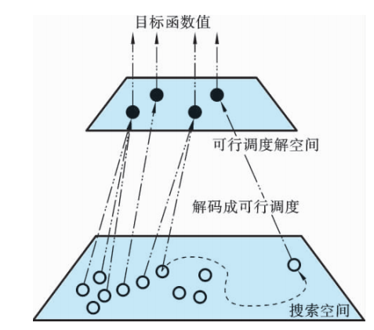

# 变邻域遗传算法求解柔性作业车间调度问题

## Reference

- 《柔性作业车间调度智能算法及其应用》高亮 张国辉 王晓娟 著
- https://people.idsia.ch/~luca/fjsp.pdf

## 混合优化算法优化策略
 
1. **算法特性与混合逻辑**  
   - **遗传算法（GA）**：具备全局优化、隐含并行特性，擅长全局搜索，但局部搜索能力不足.   
   - **变邻域搜索（VNS）**：针对复杂组合优化问题，通过系统化变换邻域结构避免局部最优，依赖初始解与邻域质量.   
   - **混合目的**：GA局部搜索弱，VNS依赖初始解，二者结合设计混合算法GAVNS，互补增强全局与局部搜索能力，平衡搜索的广泛性与集中性.   

2. **混合结构与策略**  
   - **嵌入混合结构**：将VNS嵌入GA，GA提供高质量初始解并引导搜索方向，VNS对优质解邻域集中搜索.   
   - **外部记忆库保优**：评价种群个体时，保存一定比例优良个体至外部记忆库. 交叉阶段按概率执行两种方式：搜索初期，为加速收敛，采用记忆库与种群个体交叉；迭代后期，为避免早熟，采用种群内个体交叉. 变异后对个体进行VNS搜索，以优解替换劣解，生成新种群. 

    

## 初始化
参考[遗传算法求解柔性作业车间调度问题](../GA_FJSP/README.md)

## 记忆库保优策略
 
1. **传统遗传算法局限与记忆库引入**  
   传统遗传算法中进行交叉操作的个体都是从种群中选取的，这只是个体从种群
中获取更新信息的一种方式. 在这种信息交换机制中，个体过于“贪婪”地获取更新
信息，算法容易早熟. 为保护进化中的优良个体，利用记忆库保留搜索过程中的优质解，改善信息共享机制的局限性.   

2. **海明距离概念**  
   - 柔性作业车间调度问题中，搜索空间到可行解目标函数值的映射是多对一关系（如不同调度方案对应相同最大完工时间）.   

        

   - 引入海明距离（简称 $ H $ 距离），指两个编码中不同位数的个数. 例如，两编码海明距离为 $ 2 $，即 $ H=2 $，用于区分目标函数值相同但调度方案不同的个体.   

        

3. **记忆库更新规则**  
   新优良个体插入记忆库时：  
   - 先比较目标函数值，若优于记忆库个体则替换；  
   - 若目标函数值相同，进一步比较机器选择部分的海明距离：  
     - 海明距离为零，不替换；  
     - 海明距离非零，替换记忆库中最差个体.   
   通过此过程，确保记忆库保留目标函数值优且调度方案具多样性的个体. 

## 遗传操作
选择操作、交叉操作、变异操作参考[遗传算法求解柔性作业车间调度问题](../GA_FJSP/README.md)

## 变邻域搜索

### 邻域结构

1. 移动一道工序邻域结构
