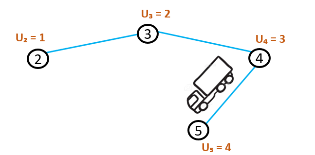
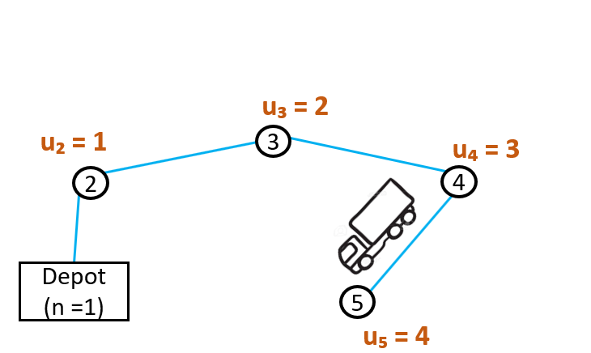

# 旅行商问题（Travelling salesman problem , TSP）

## Reference

- https://en.wikipedia.org/wiki/Travelling_salesman_problem
- https://how-to.aimms.com/Articles/332/332-Miller-Tucker-Zemlin-formulation.html
- http://www.dei.unipd.it/~fisch/ricop/OR2/compact_TSP_MTZ.pdf

## 1 问题概述

**旅行商问题（Travelling Salesman Problem, TSP）** 是一个经典的组合优化问题，其核心目标是寻找一条最短路径，使得旅行商能够访问所有给定的城市一次且仅一次，最终回到起点. 这一问题在数学、计算机科学、物流管理等领域具有重要意义，也被广泛研究. 

**旅行商问题（TSP）的问题目标与约束**  
TSP是一个经典的组合优化问题，其核心定义可分为以下两部分：

**问题目标**  
- **核心目标**：在给定的城市集合中，寻找一条闭合路径（回路），使得总行程距离最短.   
- **关键要求**：  
  1. 路径必须是闭合的，即起点和终点为同一城市.   
  2. 总行程距离（或时间、成本等）需最小化. 

**问题约束**  
- **基本约束**：  
  1. **每个城市必须被访问且仅访问一次**（哈密尔顿回路约束）.   
  2. 路径中不允许重复访问城市或跳过任何城市.   
- **扩展约束（根据实际场景）**：  
  - **对称性约束**：在对称TSP中，城市间往返距离相同（如无向图）.   
  - **非对称性约束**：在非对称TSP中，往返距离可能不同（如有向图）.   

**数学模型**
- **图论表示**：将城市视为图中的顶点，城市间的距离视为边的权重. TSP可转化为在图中寻找最短的哈密尔顿回路（即经过所有顶点一次的回路）. 
- **数学公式**：  
  设城市集合为 $ V = \{v_1, v_2, \dots, v_n\} $，距离矩阵为 $ D = [d_{ij}] $，其中 $ d_{ij} $ 表示城市 $ i $ 到 $ j $ 的距离. 目标是找到排列 $ \pi $，使得总距离 $ \sum_{i=1}^{n} d_{\pi(i), \pi(i+1)} $ 最小（其中 $ \pi(n+1) = \pi(1) $）. 

**计算复杂度**
- **NP难问题**：TSP属于NP难问题，意味着对于大规模实例（如100个以上城市），传统算法（如穷举法）无法在合理时间内找到最优解. 其时间复杂度为 $ O(n!) $，随城市数量增长呈指数级爆炸. 

**解决方法**
1. **精确算法**（适用于小规模问题）：
   - **动态规划**：利用状态压缩存储中间结果，时间复杂度 $ O(n^2 \cdot 2^n) $. 
   - **分支定界法**：通过剪枝缩小搜索空间，但最坏情况下仍为指数级. 

2. **启发式算法**（近似最优解）：
   - **贪心算法**：每次选择最近未访问的城市，但结果可能较差. 
   - **遗传算法**：模拟自然选择，通过交叉、变异等操作优化路径. 
   - **模拟退火**：在解空间中随机搜索，允许一定概率接受较差解以跳出局部最优. 
   - **蚁群优化**：模拟蚂蚁觅食行为，通过信息素引导路径选择. 

3. **近似算法**：
   - **Christofides算法**：通过构造最小生成树和匹配，保证解的近似比为1.5，时间复杂度 $ O(n^3) $. 

**实际应用**
- **物流与运输**：优化配送路线，降低成本. 
- **制造业**：电路板钻孔路径规划. 
- **生物学**：DNA测序中的序列拼接. 
- **计算机网络**：数据传输中的路由优化. 

**研究进展**
- **大规模问题**：通过分布式计算和优化算法（如LKH算法），已能求解数万城市的实例. 
- **机器学习**：利用深度强化学习（如神经组合优化）自动生成路径策略. 
- **量子计算**：探索量子退火机对TSP的加速潜力. 

## 2 问题数学公式表达

旅行商问题（TSP）可被表述为一个整数线性规划问题. 目前已知多种表述形式，其中两种值得关注的是米勒-塔克-泽姆林（MTZ）公式和丹齐格-富尔克森-约翰逊（DFJ）公式. DFJ公式的约束性更强，不过MTZ公式在特定场景中仍有用处.   

这两种公式的共同之处在于：用数字 $ 1, \dots, n $ 标记城市，且将 $ c_{ij} > 0 $ 定义为从城市 $ i $ 到城市 $ j $ 的成本（距离）. 公式中的主要变量为：  
$$ 
x_{ij}= 
\begin{cases} 
1 & \text{路径从城市 } i \text{ 到城市 } j \\ 
0 & \text{否则} 
\end{cases} 
$$  
由于这些是 $ 0/1 $ 变量，公式成为整数规划问题；其余约束均为纯线性. 特别地，规划的目标是最小化旅行路线总长度：  
$$
\sum_{i=1}^{n}\sum_{\substack{j \neq i, \\ j=1}}^{n}c_{ij}x_{ij}
$$  
若没有额外约束，$ \{x_{ij}\}_{i,j} $ 会遍历边集的所有子集，这与旅行路线的边集差异极大，甚至会得出所有 $ x_{ij} = 0 $ 的无意义最小值. 因此，两种公式均包含约束：每个顶点恰好有一条入边和一条出边，这可表示为 $ 2n $ 个线性方程：  
$$
\sum_{\substack{i=1, \\ i \neq j}}^{n}x_{ij}=1 \ （j=1, \ldots, n）；\quad \sum_{\substack{j=1, \\ j \neq i}}^{n}x_{ij}=1 \ （i=1, \ldots, n）
$$  
这些约束确保所选边集局部符合旅行路线特征，但仍可能出现违反“一条路线访问所有顶点”这一全局要求的解——因为所选边可能构成多条路线，每条仅访问部分顶点. 可以说，正是这一全局要求让TSP成为难题. MTZ与DFJ公式的差异，体现在如何将这一最终要求（**子线路消除约束**）转化为线性约束. 

### 米勒-塔克-泽姆林公式（MTZ公式）

#### 公式背后的思想 
MTZ公式引入了一个额外变量 $ u_i $，除 depot（调度中心）外，每个节点都有对应的 $ u_i $ 值. 若车辆从节点 $ i $ 驶向节点 $ j $，则 $ u_j $ 的值必须大于 $ u_i $.   

因此，每次访问新节点时，$ u_i $ 的值都会增加.   

车辆访问节点 5 后，下一个节点的 $ u_i $ 值也应更大. 例如，车辆无法从节点 5 回到节点 2，因为节点 2 的 $ u_i $ 值更小. 这确保了车辆不会绕圈行驶——若绕圈，就无法让每个 $ u_i $ 值都大于前一个. 由于调度中心（depot）没有 $ u_i $ 值，如果车辆在调度中心开始和结束，可以绕一圈行驶.  

此时，车辆可从节点 5 驶回调度中心，且 $ u_j $ 始终大于 $ u_i $. 因此，唯一被允许的绕圈是经过调度中心的情况，其他绕圈都会形成子回路，而 MTZ 公式会消除这些子回路. 

#### 子线路消除约束

由于线性规划更适用非严格不等式（$\geq$），需施加约束：若 $ x_{ij} = 1 $，则 $ u_j \geq u_i + 1 $. 仅要求 $ u_j \geq u_i + x_{ij} $ 不可行，因 $ x_{ij} = 0 $时，$ u_j \geq u_i $可能是不对的. 为此，MTZ 公式使用 $ n(n - 1) $ 个线性约束：  对所有不同的 $ i, j \in \{2, \dots, n\} $，有：  
$$ u_i - u_j + 1 \leq (n - 1)(1 - x_{ij}) $$  
常数项 $ n - 1 $ 提供松弛量，使 $ x_{ij} = 0 $ 时，$ u_j $ 与 $ u_i $ 无关联关系.      

最终，TSP 的 MTZ 公式为以下整数线性规划问题：  
$$
\begin{alignat*}{3}
\min & \quad \sum_{i=1}^{n} \sum_{\substack{j \neq i, \\ j=1}}^{n} c_{ij}x_{ij} \\
\text{约束条件：} & \quad x_{ij} \in \{0,1\} & & \quad i,j = 1, \dots, n; \\
& \quad \sum_{\substack{i=1, \\ i \neq j}}^{n} x_{ij} = 1 & & \quad j = 1, \dots, n; \\
& \quad \sum_{\substack{j=1, \\ j \neq i}}^{n} x_{ij} = 1 & & \quad i = 1, \dots, n; \\
& \quad u_i - u_j + 1 \leq (n - 1)(1 - x_{ij}) & & \quad 2 \leq i \neq j \leq n; \\
& \quad 2 \leq u_i \leq n & & \quad 2 \leq i \leq n.
\end{alignat*}
$$  
第一组等式要求每个城市恰好从另一城市到达，第二组等式要求每个城市恰好出发至另一城市. 最后约束确保仅存在一条覆盖所有城市的路线，而非多条不相交但共同覆盖城市的路线. 

### 丹齐格－富尔克森－约翰逊公式（DFJ公式） 
用数字 $ 1, \dots, n $ 标记城市，并定义：  
$$ 
x_{ij}= 
\begin{cases} 
1 & \text{路径从城市 } i \text{ 到城市 } j \\ 
0 & \text{否则} 
\end{cases} 
$$  
设 $ c_{ij} > 0 $ 为从城市 $ i $ 到城市 $ j $ 的距离. 于是，旅行商问题（TSP）可表述为如下整数线性规划问题：  
$$
\begin{alignat*}{3}
\min & \quad \sum_{i=1}^{n} \sum_{\substack{j \neq i, \\ j=1}}^{n} c_{ij}x_{ij} \\
\text{约束条件：} & \quad \sum_{\substack{i=1, \\ i \neq j}}^{n} x_{ij} = 1 & & \quad j = 1, \dots, n; \\
& \quad \sum_{\substack{j=1, \\ j \neq i}}^{n} x_{ij} = 1 & & \quad i = 1, \dots, n; \\
& \quad \sum_{i \in Q} \sum_{\substack{j \neq i, \\ j \in Q}} x_{ij} \leq |Q| - 1 & & \quad \forall Q \subsetneq \{1, \dots, n\},\ |Q| \geq 2.
\end{alignat*}
$$  
DFJ公式的最后一个约束——称为**子回路消除约束**——确保没有合适的子集 $ Q $ 能形成子回路，因此最终解是单一回路，而非多个小回路的并集. 直观来说，对于城市的每个真子集 $ Q $，该约束要求 $ Q $ 中的边数少于城市数：若 $ Q $ 中的边数与城市数相等，就表示 $ Q $ 中的城市形成了一个子回路. 由于这会导致约束数量呈指数级增长，实际中需用**行生成法**求解.

- 使用MTZ公式的TSP问题有$O(n^2)$个约束，$O(n^2)$个0-1变量以及$O(n)$个连续变量. 
- 使用DFJ公式的TSP问题有$O(2^n)$个约束，$O(n^2)$个0-1变量. 
