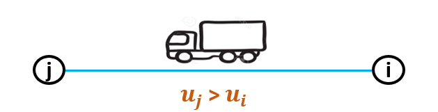
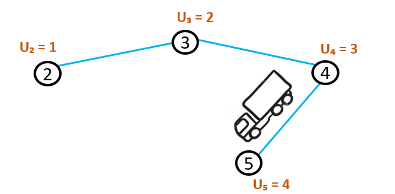
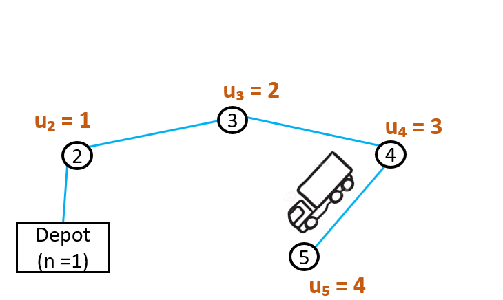

旅行商问题（Travelling salesman problem , TSP）
===============================================

Reference
---------

-  https://en.wikipedia.org/wiki/Travelling_salesman_problem
-  https://how-to.aimms.com/Articles/332/332-Miller-Tucker-Zemlin-formulation.html
-  http://www.dei.unipd.it/~fisch/ricop/OR2/compact_TSP_MTZ.pdf

1 问题概述
----------

**旅行商问题（Travelling Salesman Problem, TSP）**
是一个经典的组合优化问题，其核心目标是寻找一条最短路径，使得旅行商能够访问所有给定的城市一次且仅一次，最终回到起点.
这一问题在数学、计算机科学、物流管理等领域具有重要意义，也被广泛研究.

| **旅行商问题（TSP）的问题目标与约束**
| TSP是一个经典的组合优化问题，其核心定义可分为以下两部分：

| **问题目标**
| -
  **核心目标**\ ：在给定的城市集合中，寻找一条闭合路径（回路），使得总行程距离最短.
| - **关键要求**\ ：
| 1. 路径必须是闭合的，即起点和终点为同一城市.
| 2. 总行程距离（或时间、成本等）需最小化.

| **问题约束**
| - **基本约束**\ ：
| 1. **每个城市必须被访问且仅访问一次**\ （哈密尔顿回路约束）.
| 2. 路径中不允许重复访问城市或跳过任何城市.
| - **扩展约束（根据实际场景）**\ ：
| - **对称性约束**\ ：在对称TSP中，城市间往返距离相同（如无向图）.
| - **非对称性约束**\ ：在非对称TSP中，往返距离可能不同（如有向图）.

| **数学模型** -
  **图论表示**\ ：将城市视为图中的顶点，城市间的距离视为边的权重.
  TSP可转化为在图中寻找最短的哈密尔顿回路（即经过所有顶点一次的回路）. -
  **数学公式**\ ：
| 设城市集合为 $ V = {v_1, v_2, :raw-latex:`\dots`, v_n} $，距离矩阵为 $
  D = [d\_{ij}] $，其中 $ d\_{ij} $ 表示城市 $ i $ 到 $ j $ 的距离.
  目标是找到排列 $ :raw-latex:`\pi `$，使得总距离 $
  :raw-latex:`\sum`\ *{i=1}^{n} d*\ {:raw-latex:`\pi`(i),
  :raw-latex:`\pi`(i+1)} $ 最小（其中 $ :raw-latex:`\pi`(n+1) =
  :raw-latex:`\pi`(1) $）.

**计算复杂度** -
**NP难问题**\ ：TSP属于NP难问题，意味着对于大规模实例（如100个以上城市），传统算法（如穷举法）无法在合理时间内找到最优解.
其时间复杂度为 $ O(n!) $，随城市数量增长呈指数级爆炸.

**解决方法** 1. **精确算法**\ （适用于小规模问题）： -
**动态规划**\ ：利用状态压缩存储中间结果，时间复杂度 $ O(n^2
:raw-latex:`\cdot 2`^n) $. -
**分支定界法**\ ：通过剪枝缩小搜索空间，但最坏情况下仍为指数级.

2. **启发式算法**\ （近似最优解）：

   -  **贪心算法**\ ：每次选择最近未访问的城市，但结果可能较差.
   -  **遗传算法**\ ：模拟自然选择，通过交叉、变异等操作优化路径.
   -  **模拟退火**\ ：在解空间中随机搜索，允许一定概率接受较差解以跳出局部最优.
   -  **蚁群优化**\ ：模拟蚂蚁觅食行为，通过信息素引导路径选择.

3. **近似算法**\ ：

   -  **Christofides算法**\ ：通过构造最小生成树和匹配，保证解的近似比为1.5，时间复杂度
      $ O(n^3) $.

**实际应用** - **物流与运输**\ ：优化配送路线，降低成本. -
**制造业**\ ：电路板钻孔路径规划. - **生物学**\ ：DNA测序中的序列拼接. -
**计算机网络**\ ：数据传输中的路由优化.

**研究进展** -
**大规模问题**\ ：通过分布式计算和优化算法（如LKH算法），已能求解数万城市的实例.
- **机器学习**\ ：利用深度强化学习（如神经组合优化）自动生成路径策略. -
**量子计算**\ ：探索量子退火机对TSP的加速潜力.

2 问题数学公式表达
------------------

旅行商问题（TSP）可被表述为一个整数线性规划问题.
目前已知多种表述形式，其中两种值得关注的是米勒-塔克-泽姆林（MTZ）公式和丹齐格-富尔克森-约翰逊（DFJ）公式.
DFJ公式的约束性更强，不过MTZ公式在特定场景中仍有用处.

| 这两种公式的共同之处在于：用数字 $ 1, :raw-latex:`\dots`, n $
  标记城市，且将 $ c\_{ij} > 0 $ 定义为从城市 $ i $ 到城市 $ j $
  的成本（距离）. 公式中的主要变量为：
| 

  .. math::

      
     x_{ij}= 
     \begin{cases} 
     1 & \text{路径从城市 } i \text{ 到城市 } j \\ 
     0 & \text{否则} 
     \end{cases} 
| 由于这些是 $ 0/1 $ 变量，公式成为整数规划问题；其余约束均为纯线性.
  特别地，规划的目标是最小化旅行路线总长度：
| 

  .. math::


     \sum_{i=1}^{n}\sum_{\substack{j \neq i, \\ j=1}}^{n}c_{ij}x_{ij}
| 若没有额外约束，$ {x\_{ij}}\ *{i,j} $
  会遍历边集的所有子集，这与旅行路线的边集差异极大，甚至会得出所有 $
  x*\ {ij} = 0 $ 的无意义最小值.
  因此，两种公式均包含约束：每个顶点恰好有一条入边和一条出边，这可表示为
  $ 2n $ 个线性方程：
| 

  .. math::


     \sum_{\substack{i=1, \\ i \neq j}}^{n}x_{ij}=1 \ （j=1, \ldots, n）；\quad \sum_{\substack{j=1, \\ j \neq i}}^{n}x_{ij}=1 \ （i=1, \ldots, n）
| 这些约束确保所选边集局部符合旅行路线特征，但仍可能出现违反“一条路线访问所有顶点”这一全局要求的解——因为所选边可能构成多条路线，每条仅访问部分顶点.
  可以说，正是这一全局要求让TSP成为难题.
  MTZ与DFJ公式的差异，体现在如何将这一最终要求（\ **子线路消除约束**\ ）转化为线性约束.

米勒-塔克-泽姆林公式（MTZ公式）
~~~~~~~~~~~~~~~~~~~~~~~~~~~~~~~

公式背后的思想
^^^^^^^^^^^^^^

MTZ公式引入了一个额外变量 $ u_i $，除
depot（调度中心）外，每个节点都有对应的 $ u_i $ 值. 若车辆从节点 $ i $
驶向节点 $ j $，则 $ u_j $ 的值必须大于 $ u_i $.



   alt text

因此，每次访问新节点时，$ u_i $ 的值都会增加.



   alt text

车辆访问节点 5 后，下一个节点的 $ u_i $ 值也应更大. 例如，车辆无法从节点
5 回到节点 2，因为节点 2 的 $ u_i $ 值更小.
这确保了车辆不会绕圈行驶——若绕圈，就无法让每个 $ u_i $ 值都大于前一个.
由于调度中心（depot）没有 $ u_i $
值，如果车辆在调度中心开始和结束，可以绕一圈行驶.



   alt text

此时，车辆可从节点 5 驶回调度中心，且 $ u_j $ 始终大于 $ u_i $.
因此，唯一被允许的绕圈是经过调度中心的情况，其他绕圈都会形成子回路，而
MTZ 公式会消除这些子回路.

子线路消除约束
^^^^^^^^^^^^^^

| 由于线性规划更适用非严格不等式（\ :math:`\geq`\ ），需施加约束：若 $
  x\_{ij} = 1 $，则 $ u_j :raw-latex:`\geq `u_i + 1 $. 仅要求 $ u_j
  :raw-latex:`\geq `u_i + x\_{ij} $ 不可行，因 $ x\_{ij} = 0
  :math:`时，` u_j :raw-latex:`\geq `u_i $可能是不对的. 为此，MTZ
  公式使用 $ n(n - 1) $ 个线性约束： 对所有不同的 $ i, j
  :raw-latex:`\in `{2, :raw-latex:`\dots`, n} :math:`，有：`\ $ u_i -
  u_j + 1 :raw-latex:`\leq `(n - 1)(1 - x\_{ij}) $$
| 常数项 $ n - 1 $ 提供松弛量，使 $ x\_{ij} = 0 $ 时，$ u_j $ 与 $ u_i $
  无关联关系.

| 最终，TSP 的 MTZ 公式为以下整数线性规划问题：
| 

  .. math::


     \begin{alignat*}{3}
     \min & \quad \sum_{i=1}^{n} \sum_{\substack{j \neq i, \\ j=1}}^{n} c_{ij}x_{ij} \\
     \text{约束条件：} & \quad x_{ij} \in \{0,1\} & & \quad i,j = 1, \dots, n; \\
     & \quad \sum_{\substack{i=1, \\ i \neq j}}^{n} x_{ij} = 1 & & \quad j = 1, \dots, n; \\
     & \quad \sum_{\substack{j=1, \\ j \neq i}}^{n} x_{ij} = 1 & & \quad i = 1, \dots, n; \\
     & \quad u_i - u_j + 1 \leq (n - 1)(1 - x_{ij}) & & \quad 2 \leq i \neq j \leq n; \\
     & \quad 2 \leq u_i \leq n & & \quad 2 \leq i \leq n.
     \end{alignat*}
| 第一组等式要求每个城市恰好从另一城市到达，第二组等式要求每个城市恰好出发至另一城市.
  最后约束确保仅存在一条覆盖所有城市的路线，而非多条不相交但共同覆盖城市的路线.

丹齐格－富尔克森－约翰逊公式（DFJ公式）
~~~~~~~~~~~~~~~~~~~~~~~~~~~~~~~~~~~~~~~

| 用数字 $ 1, :raw-latex:`\dots`, n $ 标记城市，并定义：
| 

  .. math::

      
     x_{ij}= 
     \begin{cases} 
     1 & \text{路径从城市 } i \text{ 到城市 } j \\ 
     0 & \text{否则} 
     \end{cases} 
| 设 $ c\_{ij} > 0 $ 为从城市 $ i $ 到城市 $ j $ 的距离.
  于是，旅行商问题（TSP）可表述为如下整数线性规划问题：
| 

  .. math::


     \begin{alignat*}{3}
     \min & \quad \sum_{i=1}^{n} \sum_{\substack{j \neq i, \\ j=1}}^{n} c_{ij}x_{ij} \\
     \text{约束条件：} & \quad \sum_{\substack{i=1, \\ i \neq j}}^{n} x_{ij} = 1 & & \quad j = 1, \dots, n; \\
     & \quad \sum_{\substack{j=1, \\ j \neq i}}^{n} x_{ij} = 1 & & \quad i = 1, \dots, n; \\
     & \quad \sum_{i \in Q} \sum_{\substack{j \neq i, \\ j \in Q}} x_{ij} \leq |Q| - 1 & & \quad \forall Q \subsetneq \{1, \dots, n\},\ |Q| \geq 2.
     \end{alignat*}
| DFJ公式的最后一个约束——称为\ **子回路消除约束**——确保没有合适的子集 $
  Q $ 能形成子回路，因此最终解是单一回路，而非多个小回路的并集.
  直观来说，对于城市的每个真子集 $ Q $，该约束要求 $ Q $
  中的边数少于城市数：若 $ Q $ 中的边数与城市数相等，就表示 $ Q $
  中的城市形成了一个子回路.
  由于这会导致约束数量呈指数级增长，实际中需用\ **行生成法**\ 求解.

-  使用MTZ公式的TSP问题有\ :math:`O(n^2)`\ 个约束，\ :math:`O(n^2)`\ 个0-1变量以及\ :math:`O(n)`\ 个连续变量.
-  使用DFJ公式的TSP问题有\ :math:`O(2^n)`\ 个约束，\ :math:`O(n^2)`\ 个0-1变量.
