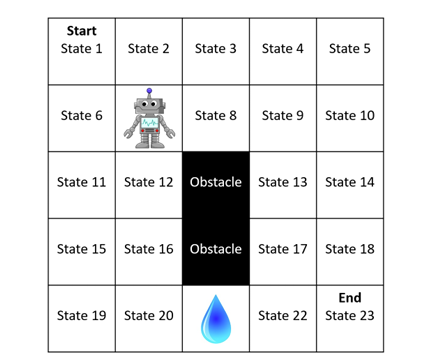
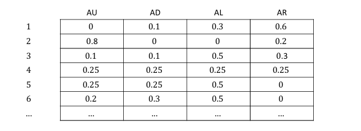

# 马尔科夫决策过程（Markov Decision Process, MDP）

## Reference

- https://people.cs.umass.edu/~bsilva/courses/CMPSCI_687/Fall2022/Lecture_Notes_v1.0_687_F22.pdf

## 符号说明

- **集合、元素、变量与函数**：集合用花体大写字母（如 $\mathcal{X}$ ） ，元素用小写字母（如 $x\in\mathcal{X}$ ） ，随机变量用大写字母（如 $X$ ） ，函数用小写字母（如 $f$ ） . 函数 $f:\mathcal{X}\to\mathcal{Y}$ 表示 $f$ 的定义域为 $\mathcal{X}$ ，值域为 $\mathcal{Y}$ ； $|\mathcal{X}|$ 表示集合 $\mathcal{X}$ 的基数， $|x|$ 表示 $x$ 的绝对值 . 
- **矩阵与向量**：矩阵用大写字母（如 $A$ ） ，向量用小写字母（如 $b$ ） ， $A^{\top}$ 表示矩阵 $A$ 的转置 ，向量默认是列向量， $\|b\|$ 表示向量 $b$ 的 $l^{2}$ 范数（欧几里得范数）.  
- **数集**： $\mathbb{N}_{>0}$ 表示不含 0 的自然数集， $\mathbb{N}_{\geq0}$ 表示含 0 的自然数集 . 
- **定义符号**： $:=$ 表示“被定义为” ，也可能会用 $\triangleq$ . 
- **函数表示**：对于 $f:\mathcal{X}\times\mathcal{Y}\to\mathcal{Z}$ ， $f(\cdot,y)$ 表示函数 $g:\mathcal{X}\to\mathcal{Z}$ ，满足 $g(x)=f(x,y)$ . 
- **集合、序列与元组表示**：集合用大括号（如 $\{1,2,3\}$ ） ，序列和元组用小括号（如 $(x_1,x_2,\cdots)$ ） . 该论文符号表示是 Sutton 和 Barto 书籍第一版和第二版符号的混合，与其他资料不同 .  

## 一个简单环境

首先先介绍一下 687 - Gridworld 这个简单环境，用于强化学习相关研究 ：
- **环境设置**：是一个网格状环境，机器人位置为状态，无朝向概念，有起始状态（State 1）和终止状态（State 23 ），还有障碍和水所在状态格，共 24 个状态（含特殊状态 $s_{\infty}$ ）. 
- **动作**：包括上移（AU ）、下移（AD ）、左移（AL ）、右移（AR ）. 
- **环境动力学**：机器人按指定方向移动概率 0.8 ，以 0.05 概率右转、0.05 概率左转、0.1 概率不移动；撞到障碍也不移动. 
- **奖励机制**：进入水所在状态得 -10 奖励，进入目标状态得 +10 奖励，其他状态 0 奖励；在水状态停留也算进入，再得 -10 奖励；奖励折扣参数 $\gamma = 0.9$ .  

- **状态数量**: 后续会描述一个特殊状态 $s_{\infty}$ ，该状态被纳入 687 - Gridworld 中. 因此，687 - Gridworld 实际有 24 个状态，而不是 23 个，用数学符号表示为 $|\mathcal{S}| = 24$ .

## 用数学方法描述智能体与环境

为了对学习进行推理，我们将使用数学来描述环境（很快也会描述智能体）. 在众多可用于描述环境的数学模型（如部分可观测马尔可夫决策过程（POMDPs）、分布式部分可观测马尔可夫决策过程（DEC - POMDPs）、半马尔可夫决策过程（SMDPs）等）中，我们最初将聚焦于马尔可夫决策过程（MDPs）. 尽管它们看似简单，但我们会发现它们能涵盖广泛的、真实且有趣的问题，包括那些乍一看似乎超出其范围的问题（例如，智能体使用可能不完整且含噪声的传感器来观测状态的问题）. 此外，一个常见的误解是强化学习仅与马尔可夫决策过程有关. 但事实并非如此：马尔可夫决策过程只是对强化学习问题中的环境进行形式化的一种方式. 
- 马尔可夫决策过程（MDP）是对环境以及我们希望智能体学习内容的一种数学规范. 
- 令 $ t \in \mathbb{N}_{\geq0}$  为时间步（智能体 - 环境循环的迭代次数）. 
- 令 $ S_t$  为 $ t$  时刻环境的状态.  
- 令 $ A_t$  为 $ t$  时刻智能体采取的行动.  
- 令 $ R_t \in \mathbb{R}$  为 $ t$  时刻智能体获得的奖励. 也就是说，当环境状态为 $ S_t$  ，智能体采取行动 $ A_t$  ，且环境转移到状态 $ S_{t + 1}$  时，智能体获得奖励 $ R_t$  . 这与其他一些资料不同，在那些资料中该奖励被称为 $ R_{t + 1}$  . 

文献中有许多关于马尔可夫决策过程的定义，它们有一些共同的术语. 在每种情况下，马尔可夫决策过程都是一个元组. 以下是四个例子：
1. $ (\mathcal{S}, \mathcal{A}, p, R)$ 
2. $ (\mathcal{S}, \mathcal{A}, p, R, \gamma)$ 
3. $ (\mathcal{S}, \mathcal{A}, p, R, d_0, \gamma)$ 
4. $ (\mathcal{S}, \mathcal{A}, p, d_R, d_0, \gamma)$ 

我们稍后将讨论这些定义之间的差异，但首先让我们定义每个术语. 请注意，这些定义中的独特术语是：$ \mathcal{S}, \mathcal{A}, p, d_R, R, d_0$  和 $ \gamma$ . 我们在下面定义每一个：
- $ \mathcal{S}$  是环境所有可能状态的集合. 在时刻 $ t$  的状态 $ S_t$  总是在 $ \mathcal{S}$  中取值. 现在我们假设 $ |\mathcal{S}| < \infty$  ——即状态集是有限的. 我们称 $ \mathcal{S}$  为“状态集”. 
- $ \mathcal{A}$  是智能体可以采取的所有可能行动的集合. 在时刻 $ t$  的行动 $ A_t$  总是在 $ \mathcal{A}$  中取值. 现在我们假设 $ |\mathcal{A}| < \infty$  . 
- $ p$  被称为转移函数，它描述环境状态如何变化.  $ p: \mathcal{S} \times \mathcal{A} \times \mathcal{S} \to [0,1]$  . 对于所有 $ s \in \mathcal{S}$ ，$ a \in \mathcal{A}$ ，$ s' \in \mathcal{S}$  和 $ t \in \mathbb{N}_{\geq0}$ ：$ p(s, a, s') := \Pr(S_{t+1} = s' | S_t = s, A_t = a)$  . 此后，当我们写量词（如 $ \exists$  和 $ \forall$  ）时，我们会省略集合——这些从上下文应该是清楚的. 如果对于所有的 $ s$ ，$ a$  和 $ s'$ ，$ p(s, a, s') \in \{0,1\}$ ，我们就说转移函数是确定性的. 
- $ d_R$  描述奖励是如何生成的. 直观地说，它是给定 $ S_t$ 、$ A_t$  和 $ S_{t+1}$  时 $ R_t$  的条件分布. 也就是说，$ R_t \sim d_R(S_t, A_t, S_{t+1})$  . 现在我们假设奖励是有界的——对于所有 $ t \in \mathbb{N}_{\geq0}$  和某个常数 $ R_{\max} \in \mathbb{R}$ ，总是有 $ |R_t| \leq R_{\max}$  . 
- $ R$  是一个被称为奖励函数的函数，它由 $ d_R$  隐式定义. 其他资料通常定义一个MDP包含 $ R$  而不是 $ d_R$  . 形式上 $ R: \mathcal{S} \times \mathcal{A} \to \mathbb{R}$  ，并且对于所有的 $ s$ ，$ a$  和 $ t$ ，$ R(s, a) := \mathbb{E}[R_t | S_t = s, A_t = a]$  . 尽管奖励函数 $ R$  没有精确地定义奖励 $ R_t$  是如何生成的（因此用 $ R$  代替 $ d_R$  来定义一个MDP在某种程度上是不完整的），但它通常是推理一个智能体应该如何行动所必需的全部. 请注意，尽管 $ R$  是一个大写字母，但它是一个函数. 这也是由于这种符号表示的悠久历史，并且还因为我们稍后在写 $ (s, a, r, s', a')$  时会用 $ r$  来表示一个特定的奖励. 
- $ d_0$  是初始状态分布： $ d_0: \mathcal{S} \to [0,1]$  ，并且对于所有的 $ s$ ：$ d_0(s) = \Pr(S_0 = s)$  . 
- $ \gamma \in [0,1]$  是一个被称为奖励折扣参数的参数，我们稍后会讨论它. 

现在回顾我们前面列出的定义MDP的四种常见方式. 这些不同的定义在定义环境的精确程度上有所不同. 定义 $ (\mathcal{S}, \mathcal{A}, p, R, \gamma)$  包含了我们推理智能体最优行为所需的所有术语. 定义 $ (\mathcal{S}, \mathcal{A}, p, R)$  实际上仍然包含 $ \gamma$  ，只是它使 $ \gamma$  隐含了. 也就是说，这个定义假设 $ \gamma$  仍然存在，但没有把它写成MDP定义中的术语之一. 另一方面，定义 $ (\mathcal{S}, \mathcal{A}, p, d_R, d_0, \gamma)$  完全指定了环境的行为方式. 

当考虑包含 $ R$  而不是 $ d_R$  时，这种区别最为明显. 正如我们稍后将会看到的，由 $ R$  描述的期望奖励是推理什么行为是最优的所需要的全部. 然而，要完全刻画奖励在环境中是如何生成的，我们必须指定 $ d_R$  . 

正如我们用数学定义了环境一样，我们现在用数学定义智能体. 一个策略 $ \pi$  是一个决策规则——智能体选择行动的一种方式. 形式上，一个策略 $ \pi$  是一个函数：$ \pi: \mathcal{S} \times \mathcal{A} \to [0,1]$  ，并且对于所有 $ s \in \mathcal{S}$ ，$ a \in \mathcal{A}$  和 $ t \in \mathbb{N}_{\geq0}$ ，$ \pi(s, a) := \Pr(A_t = a | S_t = s)$  . 因此，一个策略是给定状态下行动的条件分布. 也就是说，$ \pi$  不是一个分布，而是行动集上的分布的集合——每个状态一个. 有无限数量的可能策略，但确定性策略（对于所有的 $ s$  和 $ a$ ，$ \pi(s, a) \in \{0,1\}$  的策略）的数量是有限的. 我们用 $ \Pi$  表示所有策略的集合. 下图展示了687 - 网格世界的一个策略示例.  表格中的每个单元格表示在每个状态（由行指定）下采取动作（由列指定）的概率. 在这种形式下，$\Pi$ 是所有元素非负且每行元素之和为1的 $|\mathcal{S}| \times |\mathcal{A}|$ 矩阵的集合.  

到目前为止，总结一下智能体与环境之间的交互过程如下（其中 $ R_t \sim d_R(S_t, A_t, S_{t+1})$  表示 $ R_t$  是根据 $ d_R$  采样的）：
- $ S_0 \sim d_0$  
- $ A_0 \sim \pi(S_0, \cdot)$  
- $ S_1 \sim p(S_0, A_0, \cdot)$  
- $ R_0 \sim d_R(S_0, A_0, S_1)$  
- $ A_1 \sim \pi(S_1, \cdot)$  
- $ S_2 \sim p(S_1, A_1, \cdot)$  
- … 

伪代码：
算法1：智能体 - 环境交互的一般流程
1. $ S_0 \sim d_0$ ；
2. 对于 $ t = 0$  到 $ \infty$  执行
3. $ A_t \sim \pi(S_t, \cdot)$ ；
4. $ S_{t + 1} \sim p(S_t, A_t, \cdot)$ ；
5. $ R_t \sim d_R(S_t, A_t, S_{t + 1})$ ；

请注意，我们定义奖励使得 $ R_0$  是第一个奖励，而Sutton和Barto（1998）定义奖励使得 $ R_1$  是第一个奖励. 我们这样做是因为 $ S_0$ 、$ A_0$  和 $ t = 0$  是第一个状态、行动和时间，所以让 $ R_1$  作为第一个奖励会不一致. 此外，这使得后续的索引更一致. 然而，当将课程笔记与书籍进行比较时，一定要考虑到这种符号差异. 

智能体的目标：找到一个策略，$ \pi^*$ ，称为最优策略. 直观地说，一个最优策略使智能体将获得的期望总奖励最大化. 

目标函数：$ J: \Pi \to \mathbb{R}$ ，其中对于所有$\pi \in \Pi$ 
$$ 
 J(\pi) := \mathbb{E}\left[\sum_{t = 0}^{\infty} R_t \bigg| \pi \right] \tag{1}
$$  .  

注：稍后我们会修正这个定义——如果你快速浏览想找 $ J$  的正确定义，它在（3）式. 

注：期望和概率可以基于事件来条件设定. 策略 $ \pi$  并非一个事件. 在上述 $ J$  的定义中对 $ \pi$  进行条件设定，例如当我们写 $ A_t \sim \pi(S_t, \cdot)$  时，意味着所有动作（即抽取的分布或数值）都根据 $ \pi$  来确定，除非明确指定了其他情况. 

最优策略：最优策略 $ \pi^*$  是满足以下条件的任何策略：
$$ \pi^* \in \underset{\pi \in \Pi}{\text{arg max}}\  J(\pi) \tag{2} $$

注：在很久之后，我们会用一种不同且更严格的方式来定义最优策略. 

奖励折扣：如果你今天可以得到一块饼干，或者在课程最后一天得到两块饼干，你会选哪个？很多人会选今天的一块饼干，即便实际上之后能得到更多. 这表明我们得到的奖励在遥远的未来价值更低，相比近期获得的奖励. 奖励折扣参数 $ \gamma$  让我们能够在目标函数中纳入这种基于奖励在未来多远发生的折扣机制. 

回想一下 $ \gamma \in [0, 1]$  . 我们将目标函数 $ J$  重新定义为：
$$ J(\pi) := \mathbb{E}\left[ \sum_{t = 0}^{\infty} \gamma^t R_t \,\Bigg|\, \pi \right] \tag{3} $$
对所有 $ \pi \in \Pi$  都成立. 所以，$ \gamma < 1$  意味着在之后时刻发生的奖励对智能体来说价值更低——一个奖励 $ r$  在未来 $ t$  个时间步的效用是 $ \gamma^t r$  . 引入 $ \gamma$  还能确保 $ J(\pi)$  有界，并且稍后我们会看到，较小的 $ \gamma$  值会让马尔可夫决策过程（MDP）更易于解决，有助于寻找或近似最优策略. 

总而言之，智能体的目标是使用包含奖励折扣的 $ J$  的定义（即（3）式），找到（或近似找到）如（2）式所定义的最优策略 $ \pi^*$  . 

**性质1（最优策略的存在性）**：如果 $|S| < \infty$，$|A| < \infty$，$R_{max} < \infty$ 且 $\gamma < 1$ ，那么存在一个最优策略. 

我们稍后将证明性质1. 

当我们引入“687 - 网格世界”时，我们说当智能体到达状态23（我们称之为目标状态）时，智能体与环境的交互就会终止. 这种终止状态的概念可以用我们对MDP的定义来编码. 具体来说，我们可以定义一个终止吸收状态，记为 $s_{\infty}$ . 一旦智能体进入 $s_{\infty}$（$s_{\infty}$ 是吸收态），智能体将永远持续从 $s_{\infty}$ 转移回 $s_{\infty}$ . 从 $s_{\infty}$ 到 $s_{\infty}$ 的转移总是产生奖励0. 实际上，当智能体进入终止状态时，过程就结束了. 此时无需再做决策（因为所有动作都有相同的结果），也没有奖励可获取. 因此，当智能体进入 $s_{\infty}$ 时，一个情节就结束了. 注意，终止状态是可选的 —— MDP不一定需要有终止状态. 而且，可能存在一些状态，它们唯一的需求就是转移到 $s_{\infty}$ ，但我们并不称这些为终止状态. 还要注意 $s_{\infty}$ 是 $S$ 的一个元素. 既然我们已经定义了MDP，这就意味着智能体在 $s_{\infty}$ 中选择动作. 最后，尽管终止状态是已定义的，但目标状态并未定义 —— “687 - 网格世界” 中的目标概念只是为了我们的直观理解. 

当智能体到达 $s_{\infty}$ 时，当前试验（称为一个情节）结束，新的情节开始. 这意味着 $t$ 重置为0，从 $d_0$ 中采样初始状态 $S_0$ ，然后新的情节开始（智能体选择 $A_0$ ，获得奖励 $R_0$ ，并转移到状态 $S_1$ ）. 智能体被告知此事发生了，因为这个重置可能会改变其行为（例如，它可能会清除某种短期记忆）. 

对于“687 - 网格世界”，我们假设 $s_{\infty} \in S$ ，并且状态23总是以奖励0转移到 $s_{\infty}$ . 因此，“687 - 网格世界” 有24个状态.  
