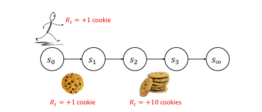

# 贝尔曼方程

## Reference

- https://people.cs.umass.edu/~bsilva/courses/CMPSCI_687/Fall2022/Lecture_Notes_v1.0_687_F22.pdf

## 价值函数
首先我们将介绍价值函数，这是一种能帮助我们利用环境MDP结构的工具. 需注意，价值函数本身并非一个完整的智能体.  

### 状态-价值函数
状态-价值函数 $v^{\pi}: \mathcal{S} \to \mathbb{R}$ 对所有状态 $s$ 定义如下：
$$ 
v^{\pi}(s) := \mathbb{E} \left[ \sum_{k=0}^{\infty} \gamma^{k} R_{t + k} \,\middle\vert\, S_{t} = s, \pi \right]\tag{1}. 
$$
使用 $G_{t}$ 符号，我们有等价定义（被要求给出状态价值函数定义时，你可以用这个）：
$$ 
v^{\pi}(s) := \mathbb{E} \left[ G_{t} \,\middle\vert\, S_{t} = s, \pi \right]. 
$$
通俗来讲，$v^{\pi}(s)$ 是智能体从状态 $s$ 出发并遵循策略 $\pi$ 时的期望折扣回报 . 注意这个量取决于策略 $\pi$ . 更通俗地说，$v^{\pi}(s)$ 衡量了使用策略 $\pi$ 时，智能体处于状态 $s$ 的 “好坏” 程度 . 我们称 $v^{\pi}(s)$ 为状态 $s$ 的价值. 

例如，考虑下图所示的马尔可夫决策过程（MDP）. 对于这个MDP：
$$
v^{\pi_1}(s_1) = 0 
$$
$$
v^{\pi_1}(s_2) = 12\gamma^0 = 12 
$$
$$
v^{\pi_1}(s_3) = 0\gamma^0 + 12\gamma^1 = 6 
$$
$$
v^{\pi_1}(s_4) = 0\gamma^0 + 0\gamma^1 + 12\gamma^2 = 3 
$$
$$
v^{\pi_1}(s_5) = 0\gamma^0 + 0\gamma^1 + 0\gamma^2 + 12\gamma^3 = 1.5 
$$
$$
v^{\pi_1}(s_6) = 0 
$$

$$
v^{\pi_2}(s_1) = 0 
$$
$$
v^{\pi_2}(s_2) = 0\gamma^0 + 0\gamma^1 + 0\gamma^2 + 2\gamma^3 = 1/4 
$$
$$
v^{\pi_2}(s_3) = 0\gamma^0 + 0\gamma^1 + 2\gamma^2 = 1/2 
$$
$$
v^{\pi_2}(s_4) = 0\gamma^0 + 2\gamma^1 = 1 
$$
$$
v^{\pi_2}(s_5) = 2\gamma^0 = 2 
$$
$$
v^{\pi_2}(s_6) = 0 
$$ 

**说明**：一个简单的马尔可夫决策过程，我们称之为 “链状” MDP . 强化学习文献中有许多 “链状” MDP，这并非标准的一种 . 在每个状态下，智能体可以选择向左（L）或向右（R）移动，且转移函数在执行这些转移时是确定性的 . 在状态 $s_1$ 和 $s_6$ 中，两个动作都会导致转移到 $s_{\infty}$ . 除了智能体从 $s_2$ 转移到 $s_1$ 时奖励为 +12，以及从 $s_5$ 转移到 $s_6$ 时奖励为 +2 之外，其余奖励始终为零 . 初始状态分布未指定 . 为简化起见，设 $\gamma = 0.5$ . 我们将考虑这个MDP的两种策略 . 第一种 $\pi_1$ 总是选择向左的动作，而第二种 $\pi_2$ 总是选择向右的动作 . 

注意，在公式(1)的右侧使用了 $t$ ，尽管它并未出现在左侧 . 这是因为对于所有的 $t$ ，右侧的值都是相同的 . 我们可以如下证明：
$
v^{\pi}(s) := \mathbb{E} \left[ \sum_{k=0}^{\infty} \gamma^{k} R_{t + k} \,\mid\, S_{t} = s, \pi \right]\\
= \sum_{k=0}^{\infty} \gamma^{k} \mathbb{E} \left[ R_{t + k} \,\mid\, S_{t} = s, \pi \right]\\
= \mathbb{E} \left[ R_{t} \,\mid\, S_{t} = s, \pi \right] + \gamma \mathbb{E} \left[ R_{t + 1} \,\mid\, S_{t} = s, \pi \right] + \gamma^{2} \mathbb{E} \left[ R_{t + 2} \,\mid\, S_{t} = s, \pi \right] + \cdots  \\
= \sum_{a \in \mathcal{A}} \Pr(A_{t} = a \,\mid\, S_{t} = s, \pi) \mathbb{E} \left[ R_{t} \,\mid\, S_{t} = s, A_{t} = a, \pi \right]  \\
 \quad + \gamma \sum_{a \in \mathcal{A}} \Pr\left(A_{t} = a \,\mid\, S_{t} = s, \pi\right) \sum_{s' \in \mathcal{S}} \Pr(S_{t + 1} = s' \,\mid\, S_{t} = s, A_{t} = a, \pi)  \\
 \quad \times \sum_{a' \in \mathcal{A}} \Pr(A_{t + 1} = a' \,\mid\, S_{t + 1} = s', S_{t} = s, A_{t} = a, \pi)  \\
 \quad \times \mathbb{E} \left[ R_{t + 1} \,\mid\, S_{t + 1} = s', A_{t + 1} = a', S_{t} = s, A_{t} = a, \pi \right]  \\
 \quad \cdots  \\
= \sum_{a \in \mathcal{A}} \pi(s, a) R(s, a)  \\
 \quad + \gamma \sum_{a \in \mathcal{A}} \pi(s, a) \sum_{s' \in \mathcal{S}} p(s, a, s') \sum_{a' \in \mathcal{A}} \pi(s', a') R(s', a')  \\
 \quad + \gamma^{2} \sum_{a \in \mathcal{A}} \pi(s, a) \sum_{s' \in \mathcal{S}} p(s, a, s') \sum_{a' \in \mathcal{A}} \pi(s', a') \sum_{s'' \in \mathcal{S}} p(s', a', s'') \sum_{a'' \in \mathcal{A}} \pi(s'', a'') R(s'', a'')  \\
 \quad \cdots 
$

其中 $\times$ 表示标量乘法，分两行书写 . 注意在最后一个表达式的任何项中都没有出现 $t$ ，所以无论 $t$ 取何值，$v^{\pi}(s)$ 的值都相同 . 因此，以下定义是等价的：
$$
v^{\pi}(s) := \mathbb{E} \left[ \sum_{k=0}^{\infty} \gamma^{k} R_{t + k} \,\middle\vert\, S_{t} = s, \pi \right] 
$$
$$
v^{\pi}(s) := \mathbb{E} \left[ G \,\middle\vert\, S_{0} = s, \pi \right] 
$$
$$
v^{\pi}(s) := \mathbb{E} \left[ \sum_{t=0}^{\infty} \gamma^{t} R_{t} \,\middle\vert\, S_{0} = s, \pi \right]. 
$$ 

### 动作-价值函数
动作-价值函数，也称为状态-动作价值函数或 Q 函数，定义如下：
$$
q^{\pi}: \mathcal{S} \times \mathcal{A} \to \mathbb{R} 
$$
$$
q^{\pi}(s, a) := \mathbb{E}[G_{t} \mid S_{t} = s, A_{t} = a, \pi]. 
$$
对于所有的状态 $s$ 和动作 $a$ . 回想一下，基于策略 $\pi$ 进行条件设定意味着在所有时刻 $t$ ，若未特别指定 $A_{t}$ ，则 $A_{t} \sim \pi(S_{t}, \cdot)$  . 这里 $A_{t}$ 已被指定，所以基于 $\pi$ 的条件设定仅适用于时刻 $t$ 之外的时间步 . 也就是说，$q^{\pi}(s, a)$ 是智能体在状态 $s$ 采取动作 $a$ ，并在之后遵循策略 $\pi$ 时的期望折扣回报 . $q^{\pi}$ 的等价定义如下： 
$$
q^{\pi}(s, a) := \mathbb{E} \left[ \sum_{k = 0}^{\infty} \gamma^{k} R_{t + k} \,\middle\vert\, S_{t} = s, A_{t} = a, \pi \right]
$$
$$
q^{\pi}(s, a) := \mathbb{E}[G \mid S_{0} = s, A_{0} = a, \pi]
$$
$$
q^{\pi}(s, a) := \mathbb{E} \left[ \sum_{t = 0}^{\infty} \gamma^{t} R_{t} \,\middle\vert\, S_{0} = s, A_{0} = a, \pi \right]. 
$$
对于前面图片所示的链状马尔可夫决策过程（MDP）：
$$
q^{\pi_{1}}(s_{1}, L) = 0
$$
$$
q^{\pi_{1}}(s_{1}, R) = 0 
$$
$$
q^{\pi_{1}}(s_{2}, L) = 12\gamma^{0} = 12 
$$
$$
q^{\pi_{1}}(s_{2}, R) = 0\gamma^{0} + 0\gamma^{1} + 12\gamma^{2} = 3 
$$
$$
q^{\pi_{1}}(s_{3}, L) = 0\gamma^{0} + 12\gamma^{1} = 6 
$$
$$
q^{\pi_{1}}(s_{3}, R) = 0\gamma^{0} + 0\gamma^{1} + 0\gamma^{2} + 12\gamma^{3} = 1.5 
$$
注意，如果 $s$ 是终止吸收状态，那么 $q^{\pi}(s, a)$ 和 $v^{\pi}(s)$ 始终都为零. 另外，要特别注意$q^{\pi_{1}}(s_{2}, R)$，它展示了 $q$ 值中常被忽略的一个微妙之处, 即智能体从状态 $s_2$ 出发，先采取向右的动作，然后采取向左的动作回到 $s_2$ . 当它再次处于 $s_2$ 时，又采取向左的动作. 从这个意义上讲，$q$ 函数考虑的是未遵循固定策略的智能体的行为. 关于这个主题的更多内容，可参考贝勒马雷等人（2016 年）的研究，其中对这种 “不一致性” 有进一步讨论.  

## 关于 $v^{\pi}$ 的贝尔曼方程
贝尔曼方程是值函数的一种递归表达式，是值函数满足的一种一致性条件. 具体而言，状态 - 值函数的贝尔曼方程可从状态 - 值函数的定义推导得出：

$$
\begin{align*}
v^{\pi}(s) &:= \mathbb{E}\left[\sum_{k = 0}^{\infty} \gamma^{k} R_{t + k} \big| S_{t} = s, \pi\right]\\
&= \mathbb{E}\left[R_{t} + \sum_{k = 1}^{\infty} \gamma^{k} R_{t + k} \big| S_{t} = s, \pi\right]\\
&= \mathbb{E}\left[R_{t} + \gamma\sum_{k = 1}^{\infty} \gamma^{k - 1} R_{t + k} \big| S_{t} = s, \pi\right]\\
&\stackrel{(a)}{=} \sum_{a \in \mathcal{A}} \pi(s, a)R(s, a) + \mathbb{E}\left[\gamma\sum_{k = 0}^{\infty} \gamma^{k} R_{t + k + 1} \big| S_{t} = s, \pi\right]\\
&\stackrel{(b)}{=} \sum_{a \in \mathcal{A}} \pi(s, a)R(s, a) + \sum_{a \in \mathcal{A}} \pi(s, a) \sum_{s' \in \mathcal{S}} p(s, a, s') \\
&\quad\times \mathbb{E}\left[\gamma\sum_{k = 0}^{\infty} \gamma^{k} R_{t + k + 1} \big| S_{t} = s, A_{t} = a, S_{t + 1} = s', \pi\right]\\
&\stackrel{(c)}{=} \sum_{a \in \mathcal{A}} \pi(s, a)R(s, a) + \sum_{a \in \mathcal{A}} \pi(s, a) \sum_{s' \in \mathcal{S}} p(s, a, s') \\
&\quad\times \gamma\mathbb{E}\left[\sum_{k = 0}^{\infty} \gamma^{k} R_{t + k + 1} \big| S_{t + 1} = s', \pi\right]\\
&\stackrel{(d)}{=} \sum_{a \in \mathcal{A}} \pi(s, a)R(s, a) + \sum_{a \in \mathcal{A}} \pi(s, a) \sum_{s' \in \mathcal{S}} p(s, a, s') \gamma v^{\pi}(s')\\
&= \sum_{a \in \mathcal{A}} \pi(s, a) \sum_{s' \in \mathcal{S}} p(s, a, s') \left(R(s, a) + \gamma v^{\pi}(s')\right).
\end{align*}
$$
其中 $\times$ 表示标量乘法，分两行书写. (a) 源于将求和的索引从 1 改为 0 ，但将所有的 $k$ 变为 $k + 1$ ；(b) 来自全概率定律，它允许我们对 $A_{t}$ 求和；(c) 遵循马尔可夫性质；(d) 来自状态 - 值函数的定义（见(1)）. 

这个最终表达式给出了 $v^{\pi}$ 的贝尔曼方程：
$$
v^{\pi}(s) = \sum_{a \in \mathcal{A}} \pi(s, a) \sum_{s' \in \mathcal{S}} p(s, a, s') \left(R(s, a) + \gamma v^{\pi}(s')\right).
$$  

理解 $v^{\pi}$ 的贝尔曼方程的另一种方式是考虑如下展开：
$$
\begin{align*}
v^{\pi}(s) &= \mathbb{E}\left[R_{t} + \gamma R_{t + 1} + \gamma^{2} R_{t + 2} + \cdots \big| S_{t} = s, \pi\right]\\
&= \mathbb{E}\left[R_{t} + \gamma (R_{t + 1} + \gamma R_{t + 2} + \cdots) \big| S_{t} = s, \pi\right]\\
&= \mathbb{E}\left[R_{t} + \gamma v^{\pi}(S_{t + 1}) \big| S_{t} = s, \pi\right]\\
&= \sum_{a \in \mathcal{A}} \pi(s, a) \sum_{s' \in \mathcal{S}} p(s, a, s') \left(R(s, a) + \gamma v^{\pi}(s')\right).
\end{align*}
$$

考虑为这门课程创建的“饼干马尔可夫决策过程（MDP）”领域，如下图所示（它不是标准领域）. 显然 $v^{\pi}(s_{3}) = 0$ . 然后我们可以用两种不同的方法计算 $v^{\pi}(s_{2})$ . 第一种方法是使用值函数的定义（在这种情况下状态转移是确定性的）：
$$
v^{\pi}(s_{2}) = R_{2} + \gamma R_{3} = 10 + \gamma 0 = 10.
$$  

第二种方法是使用贝尔曼方程（以及在这种情况下状态转移是确定性的这一性质）：
$$
v^{\pi}(s_{2}) = R_{2} + \gamma v^{\pi}(s_{3}) = 10 + \gamma 0 = 10.
$$  

图片说明：“饼干马尔可夫决策过程”. 在策略 $\pi$ 下，智能体总是从状态 $s_{0}$ 开始，并沿着状态线移动. 当从状态 $s_{0}$ 转移到 $s_{1}$ 时，智能体获得奖励 +1 ；当从 $s_{2}$ 转移到 $s_{3}$ 时，获得奖励 +10 . 所有其他转移的奖励为 0 . 

同样，我们可以使用值函数的定义或贝尔曼方程来计算 $v^{\pi}(s_{1})$ ：
$$
v^{\pi}(s_{1}) = R_{1} + \gamma R_{2} + \gamma^{2} R_{3} = 0 + \gamma 10 + \gamma^{2} 0 = \gamma 10.
$$ 
$$
v^{\pi}(s_{1}) = R_{1} + \gamma v^{\pi}(s_{2}) = 0 + \gamma 10.
$$ 

我们也可以用两种方法计算 $v^{\pi}(s_{0})$ ：
$$
v^{\pi}(s_{0}) = R_{0} + \gamma R_{1} + \gamma^{2} R_{2} + \gamma^{3} R_{3} = 1 + \gamma 0 + \gamma^{2} 10 + \gamma^{3} 0 = 1 + \gamma^{2} 10.
$$  
$$
v^{\pi}(s_{0}) = R_{0} + \gamma v^{\pi}(s_{1}) = 1 + \gamma \gamma 10 = 1 + \gamma^{2} 10.
$$  

注意，使用贝尔曼方程计算状态值已经比从值函数的定义计算状态值更容易. 这是因为贝尔曼方程只需要考虑未来一步，而值函数的定义必须考虑直到情节结束的整个状态序列. 当处理具有随机策略、转移函数和奖励的更大问题时，这种差异将变得更加明显. 贝尔曼方程将越来越有用，因为从值函数的定义计算状态值需要考虑从当前状态到情节结束可能出现的每一个事件序列，这在计算上可能是不可行的. 

为了对贝尔曼方程有更多直观理解，想象当前状态是 $s$ . 我们可以将贝尔曼方程看作是将预期回报分解为两部分：我们在下一个时间步获得的即时奖励，以及我们最终到达的下一个状态的值. 即，
$$
v^{\pi}(s) = \mathbb{E}\left[\underbrace{R(s, A_{t})}_{\text{即时奖励}} + \gamma\underbrace{v^{\pi}(S_{t + 1})}_{\text{下一个状态的值}} \big| S_{t} = s, \pi\right].
$$ 

这应该是有意义的，因为下一个状态的值是我们从下一个状态将获得的预期折扣奖励总和，所以将预期即时奖励与从下一个状态获得的预期折扣奖励总和相加，就得到了从当前状态开始的预期折扣奖励总和.  

## 最优值函数
最优值函数 $v^{*}$ 是一个函数 $v^{*} : \mathcal{S} \to \mathbb{R}$，定义如下：
$$
v^{*}(s) := \max_{\pi \in \Pi} v^{\pi}(s).
$$ 
注意，对于每个状态，$v^{*}$ “采用” 能使 $v^{\pi}(s)$ 最大化的策略 $\pi$ . 因此，$v^{*}$ 不一定与特定策略相关联 —— 根据所评估的状态 $s$ 不同，$v^{*}(s)$ 可以是与不同策略相关的值函数. 

考虑为策略定义的关系 $\geq$ 如下：
当且仅当对于 $\forall s \in \mathcal{S}$，$v^{\pi}(s) \geq v^{\pi'}(s)$ 时，$\pi \geq \pi'$ . 

注意，此关系在策略集合上产生了一个偏序. 这不是策略集合上的全序，因为可能存在两个策略 $\pi$ 和 $\pi'$ ，使得 $\pi \ngeq \pi'$ 且 $\pi' \ngeq \pi$ . 

我们现在给出一个与之前定义不同的最优策略定义. 具体来说，最优策略 $\pi^{*}$ 是任何至少与所有其他策略一样好的策略. 即，当且仅当
$$
\forall \pi \in \Pi, \pi^{*} \geq \pi.
$$  
时，$\pi^{*}$ 是一个最优策略. 

特别要指出的是，由于 $\geq$ 仅产生偏序，此时这种最优策略是否存在可能并不明确. 

稍后我们将证明，对于所有状态数 $|S| < \infty$、动作数 $|A| < \infty$、最大奖励 $R_{\max} < \infty$ 且折扣因子 $\gamma < 1$ 的马尔可夫决策过程，在这个最优策略定义下至少存在一个最优策略 $\pi^{*}$ . 也就是说，这个最优策略定义以及(17) 中的最优策略定义都满足性质1. 根据(114) 中 $v^{*}$ 的定义，对于所有最优策略 $\pi^{*}$ ，都有 $v^{*} = v^{\pi^{*}}$ . 

我们现在有了两种不同的最优策略定义. 这两种定义在强化学习研究中都很常见. (17) 中的定义常见于关注策略优化的论文，如基于生物地理学优化（BBO）算法以及计算策略梯度 $J(\theta)$ 的算法（我们将在后面更多地讨论这些策略梯度算法）. (116) 中给出的定义常见于理论强化学习论文以及强调值函数应用的论文. 

另外，注意即使 $\pi^{*}$ 不唯一，最优值函数 $v^{*}$ 也是唯一的 —— 所有最优策略都具有相同的状态 - 值函数. 

正如我们定义了最优状态 - 值函数一样，我们可以定义最优动作 - 值函数 $q^{*} : \mathcal{S} \times \mathcal{A} \to \mathbb{R}$，其中
$$
q^{*}(s, a) := \max_{\pi \in \Pi} q^{\pi}(s, a).
$$  

与最优状态 - 值函数类似，对于所有最优策略 $\pi$ ，都有 $q^{*} = q^{\pi}$ .  

## 关于 $v^{*}$ 的贝尔曼最优性方程
关于 $v^{*}$ 的贝尔曼最优性方程是 $v^{*}$ 的一种递归表达式. 我们稍后将证明，它只对最优策略成立. 

为了得到 $v^{\pi}$ 的递归表达式，我们可以设想如果存在一个具有值函数 $v^{*}$ 的最优策略 $\pi^{*}$ 会怎样. 我们可以从这个策略 $\pi^{*}$ 的贝尔曼方程入手：
$$
v^{*}(s) = \sum_{a \in \mathcal{A}} \pi^{*}(s, a) \sum_{s' \in \mathcal{S}} p(s, a, s') [R(s, a) + \gamma v^{*}(s')].
$$  

注意，在状态 $s$ 下，$\pi^{*}$ 会选择使 $q^{*}(s, a)$ 最大化的动作 $a$ . 所以，我们无需考虑所有可能的动作 $a$ ，而只需考虑那些能使(120) 中的 $q^{*}(s, a)$ 项最大化的动作. 因此，
$$
v^{*}(s) = \max_{a \in \mathcal{A}} \underbrace{\sum_{s' \in \mathcal{S}} p(s, a, s') [R(s, a) + \gamma v^{*}(s')]}_{q^{*}(s,a)}.
$$  

上述方程就是关于 $v^{*}$ 的贝尔曼最优性方程. 我们称一个策略 $\pi$ 满足贝尔曼最优性方程，当且仅当对于所有状态 $s \in \mathcal{S}$ ：
$$
v^{\pi}(s) = \max_{a \in \mathcal{A}} \sum_{s' \in \mathcal{S}} p(s, a, s') [R(s, a) + \gamma v^{\pi}(s')].
$$

一个可能的误解是我们“正式推导”出了贝尔曼最优性方程. 其实并非如此 —— 我们并没有证明存在一个策略 $\pi^{*}$ 使得 $v^{\pi^{*}} = v^{*}$ ，这是我们推导贝尔曼最优性方程时所用到的一个性质. 相反，此时我们应将贝尔曼最优性方程看作是一个策略可能满足也可能不满足的方程. 贝尔曼最优性方程对我们有用是因为：1）如果一个策略 $\pi$ 满足贝尔曼最优性方程，那么它就是一个最优策略；2）如果状态集和动作集是有限的，奖励有界，且 $\gamma < 1$ ，那么存在一个满足贝尔曼最优性方程的策略 $\pi$ . 有了这两个结论，我们就能证明最优策略 $\pi^{*}$ 的存在性. 

一旦我们证明了这些结论，就能得出：所有最优策略都满足贝尔曼最优性方程，存在至少一个最优策略，并且所有最优策略的值函数 $v^{\pi}$ 都等于 $v^{*}$ . 

与关于 $v^{*}$ 的贝尔曼最优性方程类似，我们可以将关于 $q^{*}$ 的贝尔曼最优性方程定义为：
$$
q^{*}(s, a) = \sum_{s' \in \mathcal{S}} p(s, a, s') \left[R(s, a) + \gamma \max_{a' \in \mathcal{A}} q^{*}(s', a')\right].
$$  

我们现在建立一系列推理中的第一个环节，这将有助于我们证明最优策略的存在性：

**定理1**：如果一个策略 $\pi$ 满足贝尔曼最优性方程，那么 $\pi$ 是一个最优策略. 

**证明**：根据 $\pi$ 满足贝尔曼最优性方程这一假设，我们有对于所有状态 $s$ ：
$$
v^{\pi}(s) = \max_{a \in \mathcal{A}} \sum_{s' \in \mathcal{S}} p(s, a, s') [R(s, a) + \gamma v^{\pi}(s')].
$$  

再次应用关于 $v^{\pi}(s')$ 的贝尔曼最优性方程，我们可以展开上述方程：
$$
v^{\pi}(s) = \max_{a \in \mathcal{A}} \sum_{s' \in \mathcal{S}} p(s, a, s') \left[R(s, a) + \gamma \left(\max_{a' \in \mathcal{A}} \sum_{s'' \in \mathcal{S}} p(s', a', s'') (R(s', a') + \gamma v^{\pi}(s''))\right)\right]
$$  

我们可以不断重复这个过程，一直用贝尔曼最优性方程替换最后的 $v^{\pi}$ 项. 如果我们能无限次地这样做，就可以从表达式中完全消去 $\pi$ . 考虑一下这个表达式会变成什么样：如果 $s$ 对应时刻 $t$ 的状态，$R(s, a)$ 是第一个奖励，$R(s', a')$ 是第二个奖励（已被 $\gamma$ 折扣 ）. 我们最终会得到一个 $R(s'', a'')$ 项，它会被 $\gamma^{2}$ 折扣. $p$ 项描述的是状态转移动态. 所以，暂且不考虑动作是如何选择的，这个表达式就是预期折扣奖励总和. 现在，在计算这个预期折扣奖励总和时，动作是如何选择的呢？在每个时刻 $t$ ，选择的动作是能使未来折扣奖励总和最大化的动作（前提是未来选择的动作也能使未来折扣奖励总和最大化）. 

现在考虑任意策略 $\pi'$ . 如果我们把每个 $\max_{a \in \mathcal{A}}$ 都换成 $\sum_{a \in \mathcal{A}} \pi'(s, a)$ 会怎样呢？这个表达式会变大还是变小呢？我们认为这个表达式不会变大. 也就是说，对于任意策略 $\pi'$ ：

$$
\begin{align*}
v^{\pi}(s) &= \max_{a \in \mathcal{A}} \sum_{s' \in \mathcal{S}} p(s, a, s') \left[R(s, a) + \gamma \left(\max_{a' \in \mathcal{A}} \sum_{s'' \in \mathcal{S}} p(s', a', s'') (R(s', a') + \gamma \cdots )\right)\right]\\
&\geq \sum_{a \in \mathcal{A}} \pi'(s, a) \sum_{s' \in \mathcal{S}} p(s, a, s') \left[R(s, a) + \gamma \left(\sum_{a' \in \mathcal{A}} \pi'(s', a') \sum_{s'' \in \mathcal{S}} p(s', a', s'') (R(s', a') + \gamma \cdots )\right)\right].
\end{align*}
$$

如果你不明白为什么这是对的，可以考虑任意有限集 $\mathcal{X}$ 、该集合上的任意分布 $\mu$ 以及任意函数 $f : \mathcal{X} \to \mathbb{R}$ . 你可以验证以下性质成立：
$$
\max_{x \in \mathcal{X}} f(x) \geq \sum_{x \in \mathcal{X}} \mu(x) f(x).
$$  

我们只是反复应用了这个性质，其中 $\mathcal{X}$ 是 $\mathcal{A}$ ，$\mu$ 是 $\pi(s, \cdot)$ ，$x$ 是 $a$ ，$f$ 是上述表达式中关于 $a$ 的剩余部分. 

继续证明，对于所有状态 $s \in \mathcal{S}$ 和所有策略 $\pi' \in \Pi$ ，我们有：
$$
\begin{align*}
v^{\pi}(s) &= \max_{a \in \mathcal{A}} \sum_{s' \in \mathcal{S}} p(s, a, s') \left[R(s, a) + \gamma \left(\max_{a' \in \mathcal{A}} \sum_{s'' \in \mathcal{S}} p(s', a', s'') (R(s', a') + \gamma \cdots )\right)\right]\\
&\geq \mathbb{E}[G_{t} | S_{t} = s, \pi']\\
&= v^{\pi'}(s).
\end{align*}
$$

因此，对于所有状态 $s \in \mathcal{S}$ 和所有策略 $\pi' \in \Pi$ ，$v^{\pi}(s) \geq v^{\pi'}(s)$ ，即对于所有策略 $\pi' \in \Pi$ ，我们有 $\pi \geq \pi'$ ，所以 $\pi$ 是一个最优策略.   $\square$ 

注意，这个定理并没有证明最优策略的存在性，因为我们没有证明存在一个满足贝尔曼最优性方程的策略.  