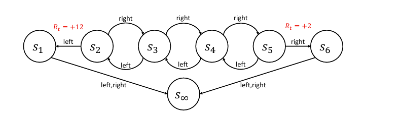

# 贝尔曼方程

## Reference

- https://people.cs.umass.edu/~bsilva/courses/CMPSCI_687/Fall2022/Lecture_Notes_v1.0_687_F22.pdf

## 价值函数
首先我们将介绍价值函数，这是一种能帮助我们利用环境MDP结构的工具. 需注意，价值函数本身并非一个完整的智能体.  

### 状态-价值函数
状态-价值函数 $v^{\pi}: \mathcal{S} \to \mathbb{R}$ 对所有状态 $s$ 定义如下：
$$ 
v^{\pi}(s) := \mathbb{E} \left[ \sum_{k=0}^{\infty} \gamma^{k} R_{t + k} \,\middle\vert\, S_{t} = s, \pi \right]\tag{1}. 
$$
使用 $G_{t}$ 符号，我们有等价定义（被要求给出状态价值函数定义时，你可以用这个）：
$$ 
v^{\pi}(s) := \mathbb{E} \left[ G_{t} \,\middle\vert\, S_{t} = s, \pi \right]. 
$$
通俗来讲，$v^{\pi}(s)$ 是智能体从状态 $s$ 出发并遵循策略 $\pi$ 时的期望折扣回报 . 注意这个量取决于策略 $\pi$ . 更通俗地说，$v^{\pi}(s)$ 衡量了使用策略 $\pi$ 时，智能体处于状态 $s$ 的 “好坏” 程度 . 我们称 $v^{\pi}(s)$ 为状态 $s$ 的价值. 

例如，考虑下图所示的马尔可夫决策过程（MDP）. 对于这个MDP：
$$
v^{\pi_1}(s_1) = 0 
$$
$$
v^{\pi_1}(s_2) = 12\gamma^0 = 12 
$$
$$
v^{\pi_1}(s_3) = 0\gamma^0 + 12\gamma^1 = 6 
$$
$$
v^{\pi_1}(s_4) = 0\gamma^0 + 0\gamma^1 + 12\gamma^2 = 3 
$$
$$
v^{\pi_1}(s_5) = 0\gamma^0 + 0\gamma^1 + 0\gamma^2 + 12\gamma^3 = 1.5 
$$
$$
v^{\pi_1}(s_6) = 0 
$$

$$
v^{\pi_2}(s_1) = 0 
$$
$$
v^{\pi_2}(s_2) = 0\gamma^0 + 0\gamma^1 + 0\gamma^2 + 2\gamma^3 = 1/4 
$$
$$
v^{\pi_2}(s_3) = 0\gamma^0 + 0\gamma^1 + 2\gamma^2 = 1/2 
$$
$$
v^{\pi_2}(s_4) = 0\gamma^0 + 2\gamma^1 = 1 
$$
$$
v^{\pi_2}(s_5) = 2\gamma^0 = 2 
$$
$$
v^{\pi_2}(s_6) = 0 
$$ 

**说明**：一个简单的马尔可夫决策过程，我们称之为 “链状” MDP . 强化学习文献中有许多 “链状” MDP，这并非标准的一种 . 在每个状态下，智能体可以选择向左（L）或向右（R）移动，且转移函数在执行这些转移时是确定性的 . 在状态 $s_1$ 和 $s_6$ 中，两个动作都会导致转移到 $s_{\infty}$ . 除了智能体从 $s_2$ 转移到 $s_1$ 时奖励为 +12，以及从 $s_5$ 转移到 $s_6$ 时奖励为 +2 之外，其余奖励始终为零 . 初始状态分布未指定 . 为简化起见，设 $\gamma = 0.5$ . 我们将考虑这个MDP的两种策略 . 第一种 $\pi_1$ 总是选择向左的动作，而第二种 $\pi_2$ 总是选择向右的动作 . 

注意，在公式(1)的右侧使用了 $t$ ，尽管它并未出现在左侧 . 这是因为对于所有的 $t$ ，右侧的值都是相同的 . 我们可以如下证明：
$
v^{\pi}(s) := \mathbb{E} \left[ \sum_{k=0}^{\infty} \gamma^{k} R_{t + k} \,\mid\, S_{t} = s, \pi \right]\\
= \sum_{k=0}^{\infty} \gamma^{k} \mathbb{E} \left[ R_{t + k} \,\mid\, S_{t} = s, \pi \right]\\
= \mathbb{E} \left[ R_{t} \,\mid\, S_{t} = s, \pi \right] + \gamma \mathbb{E} \left[ R_{t + 1} \,\mid\, S_{t} = s, \pi \right] + \gamma^{2} \mathbb{E} \left[ R_{t + 2} \,\mid\, S_{t} = s, \pi \right] + \cdots  \\
= \sum_{a \in \mathcal{A}} \Pr(A_{t} = a \,\mid\, S_{t} = s, \pi) \mathbb{E} \left[ R_{t} \,\mid\, S_{t} = s, A_{t} = a, \pi \right]  \\
 \quad + \gamma \sum_{a \in \mathcal{A}} \Pr\left(A_{t} = a \,\mid\, S_{t} = s, \pi\right) \sum_{s' \in \mathcal{S}} \Pr(S_{t + 1} = s' \,\mid\, S_{t} = s, A_{t} = a, \pi)  \\
 \quad \times \sum_{a' \in \mathcal{A}} \Pr(A_{t + 1} = a' \,\mid\, S_{t + 1} = s', S_{t} = s, A_{t} = a, \pi)  \\
 \quad \times \mathbb{E} \left[ R_{t + 1} \,\mid\, S_{t + 1} = s', A_{t + 1} = a', S_{t} = s, A_{t} = a, \pi \right]  \\
 \quad \cdots  \\
= \sum_{a \in \mathcal{A}} \pi(s, a) R(s, a)  \\
 \quad + \gamma \sum_{a \in \mathcal{A}} \pi(s, a) \sum_{s' \in \mathcal{S}} p(s, a, s') \sum_{a' \in \mathcal{A}} \pi(s', a') R(s', a')  \\
 \quad + \gamma^{2} \sum_{a \in \mathcal{A}} \pi(s, a) \sum_{s' \in \mathcal{S}} p(s, a, s') \sum_{a' \in \mathcal{A}} \pi(s', a') \sum_{s'' \in \mathcal{S}} p(s', a', s'') \sum_{a'' \in \mathcal{A}} \pi(s'', a'') R(s'', a'')  \\
 \quad \cdots 
$

其中 $\times$ 表示标量乘法，分两行书写 . 注意在最后一个表达式的任何项中都没有出现 $t$ ，所以无论 $t$ 取何值，$v^{\pi}(s)$ 的值都相同 . 因此，以下定义是等价的：
$$
v^{\pi}(s) := \mathbb{E} \left[ \sum_{k=0}^{\infty} \gamma^{k} R_{t + k} \,\middle\vert\, S_{t} = s, \pi \right] 
$$
$$
v^{\pi}(s) := \mathbb{E} \left[ G \,\middle\vert\, S_{0} = s, \pi \right] 
$$
$$
v^{\pi}(s) := \mathbb{E} \left[ \sum_{t=0}^{\infty} \gamma^{t} R_{t} \,\middle\vert\, S_{0} = s, \pi \right]. 
$$ 

### 动作-价值函数
动作-价值函数，也称为状态-动作价值函数或 Q 函数，定义如下：
$$
q^{\pi}: \mathcal{S} \times \mathcal{A} \to \mathbb{R} 
$$
$$
q^{\pi}(s, a) := \mathbb{E}[G_{t} \mid S_{t} = s, A_{t} = a, \pi]. 
$$
对于所有的状态 $s$ 和动作 $a$ . 回想一下，基于策略 $\pi$ 进行条件设定意味着在所有时刻 $t$ ，若未特别指定 $A_{t}$ ，则 $A_{t} \sim \pi(S_{t}, \cdot)$  . 这里 $A_{t}$ 已被指定，所以基于 $\pi$ 的条件设定仅适用于时刻 $t$ 之外的时间步 . 也就是说，$q^{\pi}(s, a)$ 是智能体在状态 $s$ 采取动作 $a$ ，并在之后遵循策略 $\pi$ 时的期望折扣回报 . $q^{\pi}$ 的等价定义如下： 
$$
q^{\pi}(s, a) := \mathbb{E} \left[ \sum_{k = 0}^{\infty} \gamma^{k} R_{t + k} \,\middle\vert\, S_{t} = s, A_{t} = a, \pi \right] \tag{74}
$$
$$
q^{\pi}(s, a) := \mathbb{E}[G \mid S_{0} = s, A_{0} = a, \pi] \tag{75}
$$
$$
q^{\pi}(s, a) := \mathbb{E} \left[ \sum_{t = 0}^{\infty} \gamma^{t} R_{t} \,\middle\vert\, S_{0} = s, A_{0} = a, \pi \right]. 
$$
对于图9所示的链状马尔可夫决策过程（MDP）：
$$
q^{\pi_{1}}(s_{1}, L) = 0
$$
$$
q^{\pi_{1}}(s_{1}, R) = 0 
$$
$$
q^{\pi_{1}}(s_{2}, L) = 12\gamma^{0} = 12 
$$
$$
q^{\pi_{1}}(s_{2}, R) = 0\gamma^{0} + 0\gamma^{1} + 12\gamma^{2} = 3 
$$
$$
q^{\pi_{1}}(s_{3}, L) = 0\gamma^{0} + 12\gamma^{1} = 6 
$$
$$
q^{\pi_{1}}(s_{3}, R) = 0\gamma^{0} + 0\gamma^{1} + 0\gamma^{2} + 12\gamma^{3} = 1.5 
$$
注意，如果 $s$ 是终止吸收状态，那么 $q^{\pi}(s, a)$ 和 $v^{\pi}(s)$ 始终都为零. 另外，要特别注意$q^{\pi_{1}}(s_{2}, R)$，它展示了 $q$ 值中常被忽略的一个微妙之处, 即智能体从状态 $s_2$ 出发，先采取向右的动作，然后采取向左的动作回到 $s_2$ . 当它再次处于 $s_2$ 时，又采取向左的动作. 从这个意义上讲，$q$ 函数考虑的是未遵循固定策略的智能体的行为. 关于这个主题的更多内容，可参考贝勒马雷等人（2016 年）的研究，其中对这种 “不一致性” 有进一步讨论.  