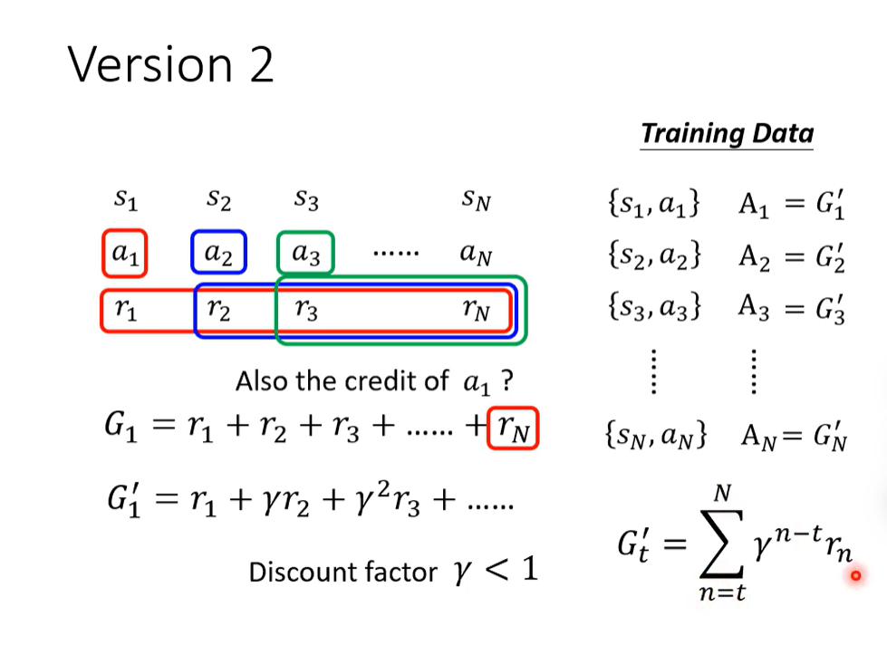
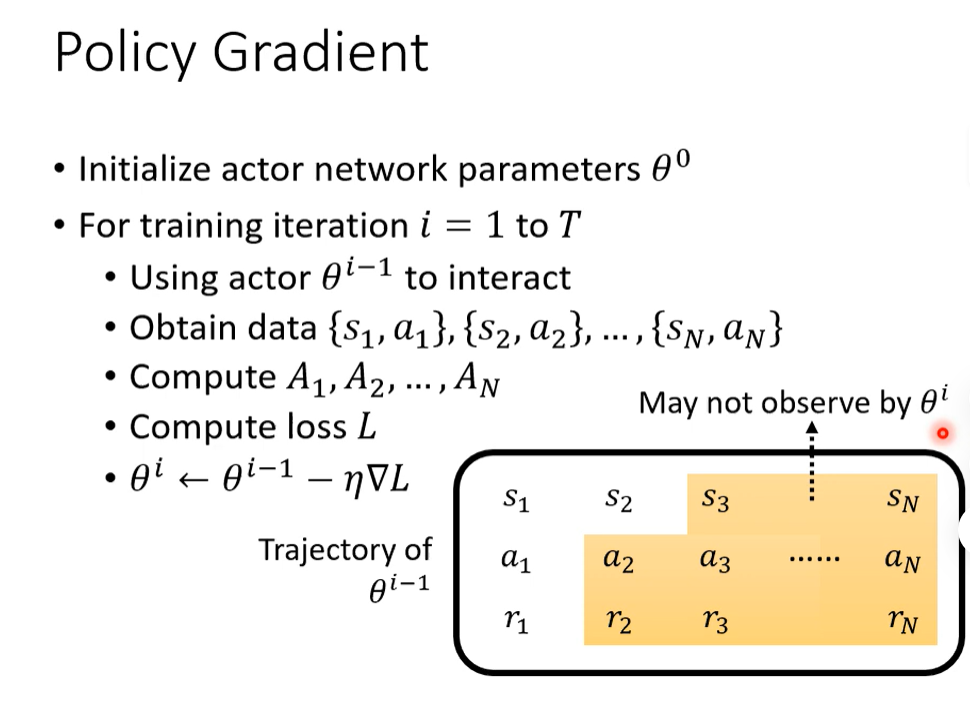

# 概述强化学习（李宏毅）

## Reference

- https://www.youtube.com/watch?v=XWukX-ayIrs&list=PLJV_el3uVTsMhtt7_Y6sgTHGHp1Vb2P2J&index=29

# What is RL

network: CNN, RNN or transformer

action选取使用sample，增加随机性，以应对多变的环境

确定network的参数让R越大越好，
env, reward, actor都有随机性

## Policy Gradient

给予适当的loss来控制actor

Training Data 怎么来？$s$和$a$的关系对如何组成

这个版本没有考虑长远reward

如果序列很长，$a_1$可能与$r_N$无关，引入衰减因子

好坏是相对的，需要标准化

如何设置baseline

不同rl的方法就区别在$A$的计算方法

更新一次之后，就要重新收集资料，非常花时间，而且这个资料收集受限于$\theta^{i-1}$，不一定使用于$\theta^{i}$

要让actor尝试尽可能多的action，这样才能让actor知道哪些行为好，哪些行为不好，这就是为什么action需要sample的原因

