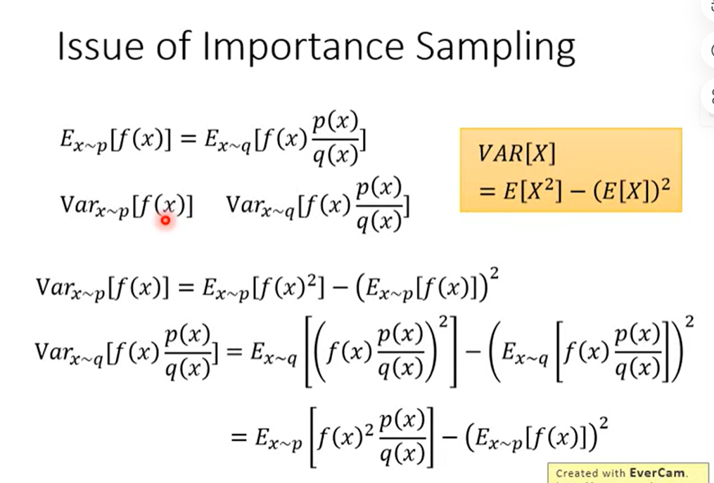

# Deep Reinforcement Learning, 2018（李宏毅）

## Reference

- https://www.youtube.com/watch?v=z95ZYgPgXOY&list=PLJV_el3uVTsODxQFgzMzPLa16h6B8kWM_&index=1

## Policy Gradient

basic components: actor$\theta$,environment,reward

actor影响$p_{\theta}$

## Proximal Policy Optimization (PPO)

$p(x)$和$q(x)$不能差别太多，否则方差差距会很大

如何让$p(x)$和$q(x)$不相差太多，添加散度约束

## Q-learning

$V^{\pi}(s)$是一个需要估计的函数，蒙特卡洛估计类似回归估计

蒙特卡洛计算$G$要花费很多时间

MC和TD的方法各有优劣

只要Q函数能计算出来，那么就一定可以找到比$\pi$更好的$\pi'$，证明：

训练左边的网络用于回归右边网络的值，左边的网络参数更新$N$次后，更新右边的网络

